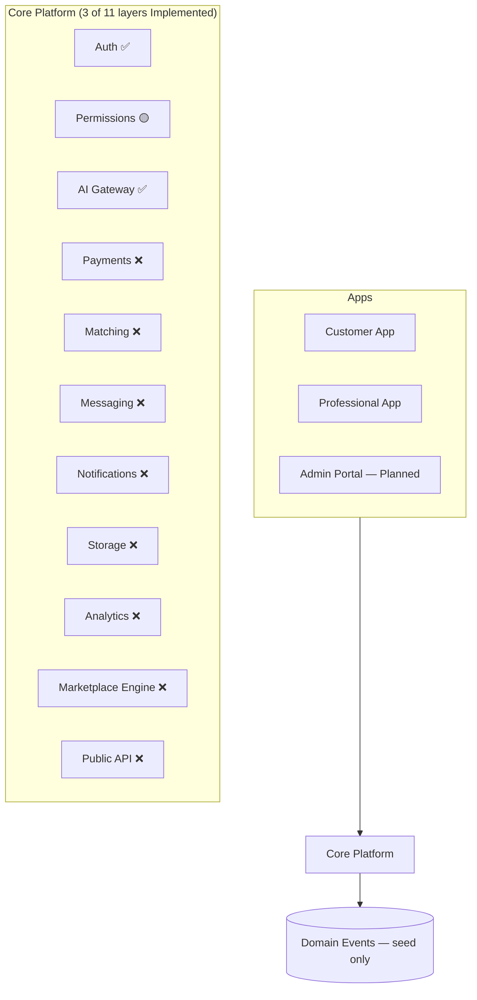
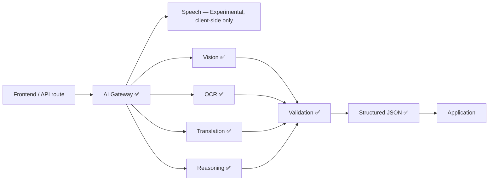

# MASTER_CONTEXT.md

> Single Source of Truth for the Klussie Platform — an executive overview.
> Detailed specs belong in the linked documents below, not in this file.
> Every AI assistant, developer, or architect working on Klussie reads this
> first.

**This document owns:** the current state of the project — status,
priorities, risks, debt, decisions. It does not own product philosophy
(`PRODUCT_CONSTITUTION.md`) or code-level rules (`ENGINEERING_STANDARDS.md`).

### 30-second briefing (for AI sessions)

- **What Klussie is:** AI-powered marketplace connecting customers with
  trusted service professionals — not a handyman app, a multi-vertical
  "operating system for trusted services." (§5)
- **Current milestone:** Phase 1 — Foundation, In Progress. (§2)
- **Current priorities:** Core Platform extraction, Design System
  migration, event-bus wiring. Full list: (§8)
- **Biggest technical debt:** no automated tests, no TypeScript, `App.jsx`
  at 2,823 lines. Full list: (§12)
- **Biggest project risks:** no payment system, no automated tests,
  single-maintainer project. Full list: (§13)
- **Protected architecture:** never bypass the AI Gateway, never expose AI
  keys client-side, never put business logic in UI. Full list: (§17)
- **Next implementation task:** event-bus wiring into existing
  request/quote/message flows. (§9)

### Document map

| Document | Purpose | Status |
|---|---|---|
| `MASTER_CONTEXT.md` | This file — executive overview | Implemented |
| `PRODUCT_CONSTITUTION.md` | Permanent product philosophy | Implemented |
| `ENGINEERING_STANDARDS.md` | Enforceable code rules + scorecard | Implemented |
| `design/DESIGN_SYSTEM.md` | Visual and interaction design direction (constitution tier — see `design/README.md` for the full companion-doc set) | Implemented |
| `ARCHITECTURE.md` | Detailed system architecture | Planned |
| `AI_ARCHITECTURE.md` | AI Gateway internals, prompt/eval framework | Planned |
| `API_SPEC.md` | API contracts (internal + future public API) | Planned |
| `SECURITY.md` | Threat model, security posture | Planned |
| `MONETIZATION.md` | Revenue model, commission structure | Planned |
| `ROADMAP.md` | Full phase-by-phase roadmap | Planned — exists only as an unpublished architecture-review artifact, not yet committed to this repo |

Don't link to a `Planned` row as if it exists. When a section below needs
detail that belongs in one of them, treat it as a reason to write that
document next, not a reason to inline the detail here.

---

## Table of contents

1. [Executive Summary](#1-executive-summary)
2. [Current Milestone](#2-current-milestone)
3. [Current State](#3-current-state)
4. [Repository Health](#4-repository-health)
5. [Product Vision](#5-product-vision)
6. [Architecture Overview](#6-architecture-overview)
7. [Core Systems](#7-core-systems)
8. [Current Priorities](#8-current-priorities)
9. [Current Blockers](#9-current-blockers)
10. [Engineering Rules](#10-engineering-rules)
11. [Product Rules](#11-product-rules)
12. [Technical Debt](#12-technical-debt)
13. [Risks](#13-risks)
14. [KPIs](#14-kpis)
15. [Decision Log](#15-decision-log)
16. [Open Decisions](#16-open-decisions)
17. [Protected Decisions](#17-protected-decisions)
18. [AI Session Instructions](#18-ai-session-instructions)
19. [North Star](#19-north-star)

---

## 1. Executive Summary

Klussie is an AI-powered operating system for trusted professional
services — not a handyman app. A customer describes a problem by text,
speech, or photo; AI understands it, builds a structured work order,
matches a professional, and manages the job through completion and
payment. No category picker, no jargon, no manually comparing providers.

**Mission:** remove every barrier between a customer with a problem and the
professional who can solve it. Full vision: §5.

---

## 2. Current Milestone

```
Current Milestone     Phase 1 — Foundation
Status                In Progress
Current Objective     Core Platform extraction + Design System migration
Current Branch        phase-1-ui-redesign (2 commits, not pushed)
Next Deliverable      Event-bus wiring into existing request/quote/message
                       flows, then Phase 2 (Testing, CI, TypeScript, Release
                       Strategy)
Last Updated          2026-08-05
```

Implemented in Phase 1 so far: authenticated + rate-limited AI Gateway
(`reason()`/`translate()`), least-privilege server auth, domain-event seed
(`emit_domain_event`), audit log, feature-flags table, prompt library
(`/ai/*/prompt.md`), a 14-component Design System with real usages,
`PRODUCT_CONSTITUTION.md`, and `ENGINEERING_STANDARDS.md`.

---

## 3. Current State

Ground truth, as of this writing. Where any other section or document
disagrees with this table, this table wins.

| Area | Reality |
|---|---|
| Frontend | Vite + React 19, plain JS/JSX (TypeScript: Planned, Phase 2), hand-written CSS via custom properties (no Tailwind, no Framer Motion) |
| Backend | Vercel Node serverless functions (`api/*.js`) — not Supabase Edge Functions. Supabase used for Postgres, Auth, Storage, Realtime only |
| AI | `@anthropic-ai/sdk` routed through the AI Gateway (`api/_lib/aiGateway.js`). Speech is client-side Web Speech API — Experimental, not yet routed through the Gateway |
| Payments | Planned. Commission is a display-only constant on a demo invoice; no integration implemented |
| Auth | Implemented — Supabase Auth, email/password. Every AI endpoint requires a session and is rate-limited |
| Repository structure | See [`README.md`](../README.md#repository-structure) for the canonical layout — not duplicated here. Current layout does **not** match the target described in §6 |
| Testing | Planned — no test suite implemented |
| Core Platform | 3 of 11 layers Implemented (Auth, AI Gateway) or In Progress (Permissions). 8 layers Planned: Payments, Matching, Messaging, Notifications, Storage, Analytics, Marketplace Engine, API |

---

## 4. Repository Health

> Most rows below are status labels, not measured percentages — there's no
> instrumentation yet (§7, Analytics Engine is Planned). Where a number is a
> verified fact (e.g. test coverage) it's shown as one; nothing here is
> invented for the sake of looking precise. "Owner" is unassigned throughout
> — this is currently a single-maintainer project with no team structure.

| Area | Current | Target | Trend | Owner |
|---|---|---|---|---|
| Architecture | In Progress — 3/11 Core Platform layers implemented | All 11 layers implemented, nothing bypasses Core Platform | New baseline | Unassigned |
| Documentation | In Progress — 3 of 9 Document Map rows implemented | Remaining Document Map rows implemented | New baseline | Unassigned |
| Security | In Progress — auth, RLS, rate limiting, least-privilege implemented | Pen-tested, `SECURITY.md` implemented | New baseline | Unassigned |
| Performance | Planned — not yet profiled | Defined once profiling implemented | New baseline | Unassigned |
| Accessibility | Planned — not yet audited | Constitution Rule 6 formally verified | New baseline | Unassigned |
| Testing | Planned — 0% coverage, no test suite implemented | Defined in Phase 2 | New baseline | Unassigned |
| Design System | In Progress — 14 components implemented, most of `App.jsx` unmigrated | Full adoption, dark mode, white-label tokens | New baseline | Unassigned |
| AI | In Progress — AI Gateway, intake, translation implemented | Full capability routing + eval automation | New baseline | Unassigned |
| Marketplace Engine | In Progress — SQL-function matching implemented, no ranking/geo | Real Marketplace Engine implemented | New baseline | Unassigned |
| Payment Engine | Planned — no integration implemented | Stripe Connect implemented | New baseline | Unassigned |
| Developer Experience | In Progress — one 2,823-line file, no types, no tests | Modular, typed, tested | New baseline | Unassigned |
| Deployment | Implemented — working Vercel pipeline, both apps | CI gate before deploy implemented | New baseline | Unassigned |
| Infrastructure | Planned — no queue, no cache, single region | Defined once scale requires it (§16) | New baseline | Unassigned |

---

## 5. Product Vision

Klussie should become the global operating system for trusted professional
services — not just home repairs. The same marketplace engine should
eventually power:

Home Services · Cleaning · Security · Transport · Property Management ·
Healthcare · Pet Care · Business Services · Enterprise Facility Management

**Core philosophy:** AI first · trust first · accessibility first ·
configuration over hardcoding · backend before frontend · scalability
before complexity · documentation is part of the product.

**Design direction:** locked, 2026-08-05 — see
[`design/DESIGN_SYSTEM.md`](./design/DESIGN_SYSTEM.md) for the full brief (brand
personality, color/typography/motion rules, component litmus test). Short
version: evolve the existing warm identity (forest/sage/amber, Fraunces
display type, generous whitespace), reduce heavy borders and paper effects,
increase breathing room and subtle motion. Never move toward a colder
SaaS-dashboard register — that direction was considered and explicitly
rejected (ADR-006).

The **Product Principles** that justify *why* any of this gets built —
Trust, Simplicity, Conversion, Retention, Scalability, Marketplace
Liquidity — are permanent and owned by `PRODUCT_CONSTITUTION.md`. How
progress against them is measured is §14, KPIs, which is this document's
job because it evolves.

---

## 6. Architecture Overview

> 🎯 **Target architecture — not yet built.** See §3 for what exists today.



Nothing bypasses Core Platform once a layer exists for that concern (§17).
✅ = Implemented, 🟡 = In Progress, ❌ = Planned.



No frontend component or endpoint talks to an AI provider directly — every
call routes through the AI Gateway (`api/_lib/aiGateway.js`), so a provider
swap for one capability never touches another. Deeper detail belongs in
`AI_ARCHITECTURE.md` (Planned — Document Map).

---

## 7. Core Systems

Core Systems are user-facing capability groupings, built from the Core
Platform layers in §6. The two taxonomies don't map one-to-one yet —
tracked as an open decision (§16).

| System | Status |
|---|---|
| AI Understanding Engine | In Progress — text/voice/photo intake and translation implemented; video and live-camera analysis Planned |
| Trust Engine | In Progress — reviews and reputation score implemented; identity/insurance/background verification Planned |
| Marketplace Engine | In Progress — SQL-function matching implemented; ranking/availability/geo Planned |
| Payment Engine | Planned |
| Communication Engine | In Progress — chat and live translation implemented; push/email/SMS Planned |
| Analytics Engine | Planned |

Full specs belong in `ARCHITECTURE.md` / `AI_ARCHITECTURE.md` once written
(Document Map).

---

## 8. Current Priorities

1. Finish Phase 1: event-bus wiring into existing flows, real Permissions
   layer.
2. Migrate remaining `App.jsx` inline UI onto the Design System.
3. Move commission math and trust-score computation out of `App.jsx` and
   into a Core Platform module.
4. Begin Phase 2: testing framework, incremental TypeScript, release
   strategy.

New product features are secondary to the above.

---

## 9. Current Blockers

What's actually stopping Phase 2 from starting, not just "not done yet":

- **No test suite implemented** — Phase 2 can't be verified as done
  without one, and there's no harness to build tests against incrementally.
- **No TypeScript convention decided** — incremental migration needs a
  starting order first (§16, Open Decisions).
- **No CI pipeline implemented** — nothing currently gates a merge or
  deploy automatically; adding tests without CI to run them is only half
  the fix.
- **Event bus is only 2/9 wired** — Release Strategy and Disaster Recovery
  (later phases) assume domain events are reliably emitted; today most
  aren't.

---

## 10. Engineering Rules

Enforceable version + live scorecard: [`ENGINEERING_STANDARDS.md`](./ENGINEERING_STANDARDS.md).

Summary: no component over 300 lines · no function over 40 lines ·
everything typed (Planned, starts Phase 2) · everything documented ·
everything reusable · no duplicated code · no inline SQL · no inline
prompts · no magic numbers. (Business logic in UI is a Protected Decision,
§17, not repeated here.)

---

## 11. Product Rules

Enforceable version: [`PRODUCT_CONSTITUTION.md`](./PRODUCT_CONSTITUTION.md),
which owns two complementary things:

- **Product Principles** — the permanent *why* behind every decision
  (Trust, Simplicity, Conversion, Retention, Scalability, Marketplace
  Liquidity).
- **Rules** — the enforceable law built on those principles, including
  Rule 10: every feature must serve a Principle **and** be expected to
  move a Product KPI (§14 — the evolving *how it's measured* layer this
  document owns).

Principles and KPIs are not alternatives. A feature needs a reason
(Principle) and a measurable target (KPI) before it ships — see §14.

---

## 12. Technical Debt

| Severity | Item | Impact | Recommended Fix | Phase | Priority |
|---|---|---|---|---|---|
| 🔴 Critical | No automated tests | Every change risks a silent regression in production | Stand up a test runner + critical-path coverage | Phase 2 | P0 |
| 🟠 High | No TypeScript | Type errors reach production undetected | Incremental adoption, smallest/most-depended-on files first | Phase 2 | P1 |
| 🟠 High | `App.jsx` at 2,823 lines | High change-collision risk, slow review, slow onboarding | Split into feature modules as each area gets touched | Phase 1→2 | P1 |
| 🟠 High | No payment system | No real revenue path | Stripe Connect integration | Phase 4 | P1 |
| 🟡 Medium | Commission math + trust score inline in `App.jsx` | Violates §17 Protected Decisions; hard to reuse/test | Move to a Core Platform module | Phase 1 | P2 |
| 🟡 Medium | Design System migration incomplete | Visual inconsistency, duplicated markup | Migrate remaining screens opportunistically | Phase 1 | P2 |
| 🟡 Medium | `pro_matches_request()` is a bare SQL function | No ranking/availability/geo, limits match quality | Build the real Marketplace Engine | Phase 5 | P2 |
| 🟢 Low | Browser Web Speech API for voice intake | Inconsistent quality across browsers/mobile | Evaluate Whisper or similar | Phase 9 | P3 |
| 🟢 Low | Categories/services hardcoded seed data | Adding a service needs a deploy, not a config change | Marketplace Engine configurable taxonomy | Phase 5 | P3 |

---

## 13. Risks

Project/business risk — not a restatement of §12; see there for engineering
detail.

**High**
- No revenue path yet — payments are entirely Planned, not implemented.
- No automated tests — a bad deploy could reach production unnoticed.
- Single-maintainer project — no redundancy on any system.

**Medium**
- No professional verification behind `is_certified` — trust/liability
  exposure if an unverified pro causes harm.
- No notifications outside an open tab — drop-off risk between AI intake
  and a pro's response.
- Hardcoded categories slow expansion into new verticals/countries.

**Low**
- Design-language direction undecided (§16) — cosmetic, not blocking.

---

## 14. KPIs

How progress against the Product Principles (`PRODUCT_CONSTITUTION.md`,
§11) is measured. Unlike Principles, KPIs are expected to evolve. None of
these are instrumented in production yet — the Analytics Engine (§7) is
Planned. "Current" is honestly "not yet measured," not a placeholder for an
invented number.

| KPI | Target | Current |
|---|---|---|
| Time to first booking | < 60 seconds | Not yet instrumented |
| AI understanding accuracy | > 95% | Not yet instrumented (spot-checked during dev only) |
| First-time fix rate | > 90% | Not yet instrumented |
| Professional response time | < 5 minutes | Not yet instrumented |
| Average booking completion | > 85% | Not yet instrumented |
| NPS | > 70 | Not yet instrumented |
| Customer retention | > 60% | Not yet instrumented |
| Professional retention | > 80% | Not yet instrumented |

---

## 15. Decision Log

ADR-style. All entries below are dated 2026-08-04 because that's genuinely
when each decision was made this session — not backfilled for variety.

**ADR-001 — Adopt a capability-based AI Gateway**
Decision: `reason()`/`translate()` capability functions, not one monolithic
AI client. · Reason: speech/vision/reasoning/translation must be
independently swappable per provider without touching call sites. · Date:
2026-08-04 · Status: Implemented · Owner: Unassigned · Related:
`api/_lib/aiGateway.js`, §6.

**ADR-002 — Keep the warm "paper ticket" design language for now**
Decision: default to the existing warm identity rather than a colder
register. · Reason: keeps shipping; aligns with the manifesto's trust
framing. · Date: 2026-08-04 · Status: Superseded by ADR-006 · Owner:
Unassigned · Related: `design/DESIGN_SYSTEM.md`.

**ADR-003 — Postgres-backed rate limiting instead of Redis**
Decision: count rows in `ai_usage_log` within a time window. · Reason: no
extra infrastructure needed at current scale. · Date: 2026-08-04 · Status:
Implemented · Owner: Unassigned · Related: `api/_lib/rateLimit.js`.

**ADR-004 — Route domain events through `emit_domain_event()` RPC**
Decision: a security-definer SQL function, not direct table writes. ·
Reason: keeps `audit_log`/`domain_events` locked down under RLS while still
allowing controlled writes. · Date: 2026-08-04 · Status: Implemented ·
Owner: Unassigned · Related: `supabase/migrations/0010_phase1_foundation.sql`.

**ADR-005 — Move Testing/CI/Disaster Recovery ahead of Payments in the
roadmap**
Decision: Phase 2 = Testing/CI, Phase 3 = Disaster Recovery, Phase 4 =
Payments. · Reason: once real money moves, every later change becomes
higher-risk — the safety net comes first. · Date: 2026-08-04 · Status:
Implemented (sequencing decision, reflected in phase ordering throughout
this document) · Owner: Unassigned · Related: architecture roadmap
(Document Map — Planned as `ROADMAP.md`).

**ADR-006 — Design Direction Lock: evolve the warm identity, reject the
cooler SaaS-dashboard register**
Decision: the product had started drifting toward a generic SaaS/dashboard
aesthetic; direction is locked to evolve the existing warm "paper ticket"
identity (reduce heavy borders and paper effects, increase whitespace and
subtle motion) rather than move toward Linear/Vercel-Dashboard/GitHub-style
cooler registers. · Reason: brand personality must stay warm, human,
trustworthy, premium, calm — never corporate, cold, or "AI-first" visually.
· Date: 2026-08-05 · Status: Implemented (governance; component-level
implementation not yet started, see `design/README.md`'s Document Map) ·
Owner: Unassigned · Related: `design/DESIGN_SYSTEM.md`, `PRODUCT_CONSTITUTION.md`'s
Design Constitution. Supersedes ADR-002.

---

## 16. Open Decisions

- Core Systems (§7) vs. Core Platform layers (§6): formalize a 1:1 mapping,
  or define Core Systems as explicit compositions of multiple layers?
- Stripe Connect: Standard, Express, or Custom?
- TypeScript migration order: file-by-file or domain-by-domain?
- Search provider for the Marketplace Engine: Postgres full-text vs.
  Algolia/Meilisearch?
- Push notification provider: web push, FCM, or OneSignal?
- Image/video CDN: stay on Supabase Storage, or move to
  Cloudinary/Cloudflare Images?
- Queue provider for async jobs — is one needed yet, or does everything
  stay synchronous?
- Cache layer — is Redis/Upstash needed, or does that wait for real scale
  pressure?

Resolve here before implementing — don't relitigate in every session.

---

## 17. Protected Decisions

Never violate these without an explicit, documented decision overriding
them (add an ADR to §15 if one ever does):

- Never remove or bypass the AI Gateway.
- Never expose AI provider keys client-side.
- Never bypass Core Platform once a concern has a Core Platform module for
  it.
- Never move business logic into UI components.
- Never hardcode categories or services once the Marketplace Engine's
  configurable taxonomy exists — today's hardcoded seed data is a tracked
  exception, not a precedent.
- Never call payment, matching, or messaging providers directly from
  components.
- Never write to `audit_log` or `domain_events` directly — only through
  `emit_domain_event()` or an equivalent security-definer function.
- Never use the Supabase service-role key in a user-facing request path.
- Every capability-gated feature ships behind a Feature Flag.
- Every new UI element uses the Design System.
- Never redesign the product simply because something looks more modern —
  see `design/DESIGN_SYSTEM.md`'s Final Rule (ADR-006).
- Never give AI a visual theme (no purple, neon, glowing borders, robot
  aesthetics, sci-fi language) — AI stays invisible in the UI.
- Never mix icon families — Lucide only.

---

## 18. AI Session Instructions

1. Read `MASTER_CONTEXT.md`.
2. Read `PRODUCT_CONSTITUTION.md`.
3. Read `ENGINEERING_STANDARDS.md`.
4. For anything touching UI: read `design/DESIGN_SYSTEM.md`, then
   `design/README.md` for which companion document applies —
   `design/DESIGN_GOVERNANCE.md` owns how that folder's own process
   works.
5. Read the current roadmap (§2, and the architecture roadmap for phase
   detail).
6. Review the existing code before proposing changes.
7. Explain proposed changes before implementing.
8. Implement only the approved milestone — not adjacent scope.
9. Update documentation, including this file, if reality changed.
10. Stop.

Never redesign an existing system without justification. Never trust a
"current state" claim in any document without checking §3 first — it
drifts, and the code is always the tiebreaker.

---

## 19. North Star

Success: a customer opens Klussie, describes a problem, books a trusted
professional, pays securely, and leaves satisfied — within one minute,
without choosing a category, without technical jargon, without wondering
if they picked the right professional.

When someone needs professional help anywhere in the world, their first
instinct should be: **"I'll open Klussie."**

---

*Version 1.5 — 2026-08-05 (AI Session Instructions: added the design-docs read step)*
