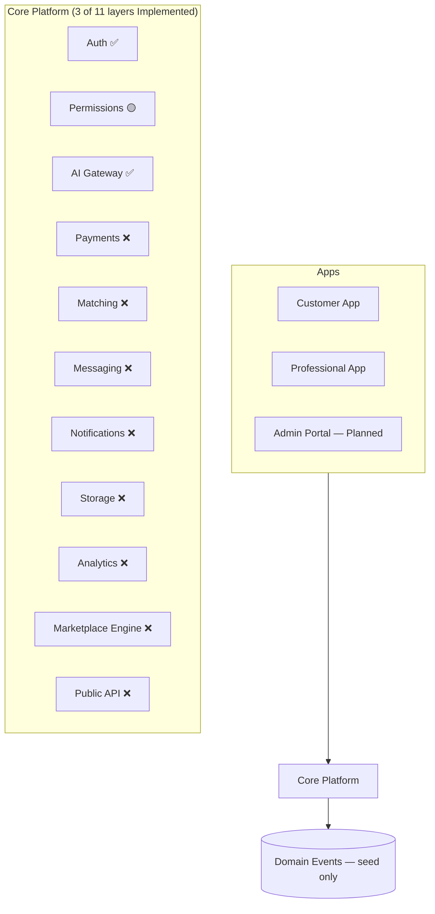
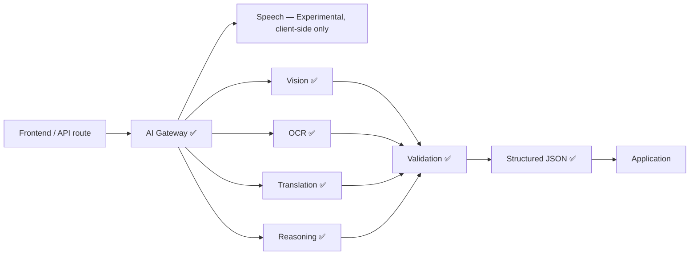

# MASTER_CONTEXT.md

> Single Source of Truth for the Klussie Platform — an executive overview.
> Detailed specs belong in the linked documents below, not in this file.
> Every AI assistant reads [`AI_CONTEXT.md`](./AI_CONTEXT.md) first, then
> this document, in every session, before anything else.

**This document owns:** the current state of the project — status,
priorities, risks, debt, decisions. It does not own product philosophy
(`PRODUCT_CONSTITUTION.md`) or code-level rules (`ENGINEERING_STANDARDS.md`).

### 30-second briefing (for AI sessions)

- **What Klussie is:** AI-powered marketplace connecting customers with
  trusted service professionals — not a handyman app, a multi-vertical
  "operating system for trusted services." (§5)
- **What to build next:** [`IMPLEMENTATION_ROADMAP.md`](./IMPLEMENTATION_ROADMAP.md)
  is the only source of truth. How to build it:
  [`../ENGINEERING.md`](../ENGINEERING.md).
- **Current milestone:** Epic 08 — Document Engine, **in progress**
  (6/9 packages). Documents, declared types, version history (ADR-0028's
  shape, a third time), attachment (scoped to real subjects), and
  independent sharing all exist. `profiles.avatar_url` deliberately
  excluded — checked against `DATABASE_ARCHITECTURE.md` §15's own
  definition of a document, found not to fit, corrected rather than
  built as the roadmap's own one-liner originally said. Live verification
  is **Pending** — written and structurally tested, not yet run against
  a database. Epic 07 — Asset Engine — **complete** (8/8 packages);
  Epics 03, 05 and 06 also complete. None of Epics 03/05/06/07/08
  verified against a live database (gate 10 open on all — see §12). (§2)
- **The architecture is frozen.** `PLATFORM_DOMAIN_MODEL`,
  `DATABASE_ARCHITECTURE`, `SYSTEM_ARCHITECTURE` and
  `SUPABASE_ARCHITECTURE` change only by ADR. Klussie is a **Property
  Intelligence Platform**; the marketplace is one module inside it.
- **Biggest technical debt:** no payment system; 31 user-facing
  components without render tests; TypeScript adopted but not at scale.
  ~~No CI~~ closed in Epic 00. Full list: (§12)
- **Biggest project risks:** no revenue path; **no restore drill has ever
  been performed** (ADR-0017); single-maintainer project. Full list:
  (§13)
- **Protected architecture:** never bypass the AI Gateway, never expose AI
  keys client-side, never put business logic in UI, **never branch on
  workspace type**. Full list: (§17)
- **Before touching production data:** take a backup —
  [`operations/DISASTER_RECOVERY.md`](./operations/DISASTER_RECOVERY.md) §5.
  Klussie is on the Free plan and has no automatic backups.

### Document map

| Document | Purpose | Status |
|---|---|---|
| `AI_CONTEXT.md` | Fast-onboarding briefing every AI session reads first | Implemented |
| `MASTER_CONTEXT.md` | This file — executive overview | Implemented |
| `READING_GUIDES.md` | Role-based reading order (CEO/Product/Design/Frontend/Backend/AI/DevOps/QA) | Implemented |
| `IMPLEMENTATION_READINESS_REVIEW.md` | Point-in-time audit of doc-set integrity before Phase 9's execution roadmap | Implemented |
| `IMPLEMENTATION_ROADMAP.md` | **The master engineering plan — the only source of truth for what to build next.** 27 epics, work-package standard, completion gates, migration pattern. Supersedes the two rows below for execution purposes | Implemented |
| `../ENGINEERING.md` | **The engineering operating manual** — workflow, branch/commit conventions, verification gates, deviation procedure. First thing an engineer reads before touching code | Implemented |
| `../implementation/` | Engineering workspace — templates (work package, Definition of Done, review, rollback, ADR workflow, epic completion) and per-epic trackers | Implemented |
| `EXECUTION_ROADMAP.md` | 10-epic execution sequence bridging documentation to implementation | **Superseded** by `IMPLEMENTATION_ROADMAP.md`; retained as history |
| `architecture/EPIC_03_CONVERSATION_EXPERIENCE_PLAN.md` | Epic 03's 12 work packages — scope, dependencies, files, acceptance, complexity, risks | Implemented |
| `product/PRODUCT_CONSTITUTION.md` | Permanent product philosophy | Implemented |
| `engineering/ENGINEERING_STANDARDS.md` | Enforceable code rules + scorecard | Implemented |
| `engineering/TESTING.md` | **The regression baseline** — what counts as a behavioural regression, all 59 user-facing flows, the coverage map, and the known defects preserved deliberately | Implemented |
| `operations/ENVIRONMENTS.md` · `DISASTER_RECOVERY.md` · `POSTGRES_TOOLS_WINDOWS.md` | Staging/production runbooks, the free-tier backup strategy, and client-tool setup | Implemented |
| `design/DESIGN_SYSTEM.md` | Visual and interaction design direction (constitution tier — see `design/README.md` for the full companion-doc set) | Implemented |
| `operations/AUTH_PROVIDER_SETUP.md` | External OAuth provider registration steps (Authentication UX Redesign, Phase 2) | Implemented |
| `architecture/ROADMAP.md` | Full phase-by-phase implementation roadmap (13 phases) | **Superseded** by `IMPLEMENTATION_ROADMAP.md`; retained as history |
| `product/HOMEPAGE_CONCEPTS.md` | Three original conversational-homepage concepts (A/B/C) | Implemented |
| `product/HOMEPAGE_DIRECTION.md` | The chosen homepage direction — C's foundation, B's restraint | Implemented |
| `product/EXPERIENCE_VISION.md` | 10-part experience spec for the conversational homepage | Implemented |
| `product/HOME_OPERATING_SYSTEM.md` | Long-term vision for "My Home" / post-booking relationship | Implemented |
| `product/PROPERTY_MEMORY.md` | Underlying philosophy of Digital Property Memory | Implemented |
| `adr/README.md` | Architecture Decision Records — index of all ADRs | Implemented |
| `features/README.md` | Feature-brief process, template, and index | Implemented |
| `architecture/PLATFORM_DOMAIN_MODEL.md` | **The platform's permanent domain model — highest-level architectural document, FROZEN at Version 1.0 (ADR-0015).** Owns what the platform *is*: 14 Platform Principles, the Capability Engine (§6), identity/workspace/capability, property–location–asset and the Digital Twin, Service Records, Workflows, the Execution Model, Property Memory, Workspace Knowledge, the Knowledge Graph and Provider Intelligence. Every other architectural document is subordinate to it; changes require an ADR | Implemented |
| `architecture/DATABASE_ARCHITECTURE.md` | **The data architecture implementing the domain model.** Owns aggregates vs projections, storage classes, tenancy and the crossing registry, the event backbone, and what every future migration must satisfy. No SQL — the physical schema is the next milestone | Implemented |
| `architecture/SYSTEM_ARCHITECTURE.md` | **The logical software architecture.** Owns the 24 platform engines, their ownership boundaries and contracts, engine communication, the event flow, and the AI/workflow/search/analytics/integration runtimes. No code, no APIs, no infrastructure | Implemented |
| `architecture/SUPABASE_ARCHITECTURE.md` | **The persistence blueprint.** Owns schema organisation, aggregate placement, UUID/mutability strategy, RLS philosophy, event partitioning, projection mechanics, and which Supabase service does what. No DDL — migrations are the next milestone | Implemented |
| `architecture/ARCHITECTURE.md` | Detailed system architecture — owns what is *currently built*, which will differ from `PLATFORM_DOMAIN_MODEL.md` for years by design | Implemented |
| `architecture/AI_ARCHITECTURE.md` | AI Gateway internals, prompt/eval framework | Implemented |
| `architecture/API_SPEC.md` | API contracts (internal + future public API) | Implemented |
| `engineering/SECURITY.md` | Threat model, security posture | Implemented |
| `product/MONETIZATION.md` | Revenue model, commission structure | Implemented |
| `design/` companion set | Tokens, components, layout, responsive, UX patterns, animation, accessibility, copy, iconography, illustration, governance, white-label — see `design/README.md` | Implemented |

Don't link to a `Planned` row as if it exists. When a section below needs
detail that belongs in one of them, treat it as a reason to write that
document next, not a reason to inline the detail here.

**Folder structure (Foundation Freeze, Phases 2, 4 & 5):** `docs/` is
organized by category — `design/`, `product/`, `architecture/`,
`engineering/`, `operations/`, `adr/`, and `features/` are active today.
`company/` is reserved for a later Foundation Freeze phase and doesn't
exist yet — don't create it speculatively.

**Known gap:** the original product manifesto (pasted early in this
project, before the current session's context window) is not recoverable
verbatim from any tool available to this AI session — it predates this
conversation and no artifact or file copy of it exists. If it needs to be
archived in the repository, it must be re-supplied by the founder rather
than reconstructed from memory or paraphrase.

---

## Table of contents

1. [Executive Summary](#1-executive-summary)
2. [Current Milestone](#2-current-milestone)
3. [Current State](#3-current-state)
4. [Repository Health](#4-repository-health)
5. [Product Vision](#5-product-vision)
6. [Architecture Overview](#6-architecture-overview)
7. [Core Systems](#7-core-systems)
8. [Current Priorities](#8-current-priorities)
9. [Current Blockers](#9-current-blockers)
10. [Engineering Rules](#10-engineering-rules)
11. [Product Rules](#11-product-rules)
12. [Technical Debt](#12-technical-debt)
13. [Risks](#13-risks)
14. [KPIs](#14-kpis)
15. [Decision Log](#15-decision-log)
16. [Open Decisions](#16-open-decisions)
17. [Protected Decisions](#17-protected-decisions)
18. [AI Session Instructions](#18-ai-session-instructions)
19. [North Star](#19-north-star)

---

## 1. Executive Summary

Klussie is an AI-powered operating system for trusted professional
services — not a handyman app. A customer describes a problem by text,
speech, or photo; AI understands it, builds a structured work order,
matches a professional, and manages the job through completion and
payment. No category picker, no jargon, no manually comparing providers.

**Mission:** remove every barrier between a customer with a problem and the
professional who can solve it. Full vision: §5.

---

## 2. Current Milestone

```
Current Milestone     IMPLEMENTATION_ROADMAP.md Epic 18 — Provider
                       Intelligence Engine
Status                COMPLETE — 3 of 3 work packages. Built
                       retroactively, on explicit instruction, after Epic
                       19. No client caller yet — pure addition. Live
                       verification Pending.
                       Record: implementation/epic-18/COMPLETION.md
Current Objective     BUILT RETROACTIVELY, ON EXPLICIT INSTRUCTION
                       ("built epic 18 first"), AFTER EPIC 19 — branched
                       off Epic 19's own tip rather than its chronological
                       position, the same shape Epic 04 held earlier this
                       session. The same class of gap Epic 19 found for
                       Notification — no schema, no engine role named for
                       Provider Intelligence anywhere in the frozen
                       documents — resolved DIFFERENTLY here, deliberately:
                       SYSTEM_ARCHITECTURE.md §9.3's own "Dependencies"
                       line names Marketplace directly, and join locality
                       (§7's own stated reason for schema grouping) puts
                       this epic's aggregate in `work`, owned by
                       klussie_engine_work, alongside Marketplace, Service
                       Record, Workflow, Maintenance and Conversation —
                       not in `platform` as Notification's cross-cutting
                       precedent would suggest. work.provider_decisions —
                       one row per decision, recommended_providers
                       required non-empty jsonb (explainability captured
                       WITH the recommendation, §9.3), selected/overridden
                       each a paired one-way outcome and STRUCTURALLY
                       MUTUALLY EXCLUSIVE (not (decided_at is not null and
                       overridden_at is not null)). select_provider()
                       verifies the chosen provider actually appears in
                       recommended_providers, refusing otherwise and
                       directing the caller to override_recommendation()
                       instead — which deliberately performs no such
                       check, since disagreeing with the recommendation is
                       the entire point of an override, but refuses a
                       blank p_reason (§14.4: "a decision, not a signal to
                       be weighed"). Needs ZERO NEW CROSS-SCHEMA GRANTS —
                       the first epic since 15 that doesn't — because
                       klussie_engine_work already reaches everything this
                       contract touches, a direct benefit of the
                       schema-placement choice. event_type minted
                       correctly from the start, the fourth epic in a row.
                       See COMPLETION.md §5.
Previous Milestone    Epic 19 — Notification Engine (2026-08-19, complete,
                       3/3 packages, no client caller yet — pure addition)
                       — platform.notifications/notification_deliveries,
                       platform.notification_preferences (the first
                       genuinely mutable aggregate this session built),
                       raise_notification()'s caller-supplied recipient
                       array. Record:
                       implementation/epic-19/COMPLETION.md
Current Branch        main (Epic 03 WP01–WP08 merged via PR #1 and #2); Epic
                       03 WP09–WP12 on branch/PR #3; Epic 05 on branch/PR #4
                       (stacked on #3); Epic 06 on branch/PR #5 (stacked on
                       #4); Epic 07 on branch/PR #6 (stacked on #5); Epic 08
                       on branch/PR #7 (stacked on #6); Epic 09 on
                       branch/PR #8 (stacked on #7); Epic 10 on branch/PR #9
                       (stacked on #8); Epic 04 on branch/PR #10 (stacked
                       on #9); Epic 11 on branch/PR #11 (stacked on #10);
                       Epic 12 on branch/PR #12 (stacked on #11); Epic 13
                       on branch/PR #13 (stacked on #12); Epic 14 on
                       branch/PR #14 (stacked on #13); Epic 15 on
                       branch/PR #15 (stacked on #14); Epic 16 on
                       branch/PR #16 (stacked on #15); Epic 17 on
                       branch/PR #17 (stacked on #16); Epic 19 on
                       branch/PR #18 (stacked on #17); Epic 18 on
                       branch/PR #? (stacked on #18/epic-19 — branched off
                       its tip, built retroactively)
Next Deliverable      Run every Pending diagnostic across Epics 03–19 and
                       18 against a real database — the standing P0 item
                       in §12's debt table. The actual behavioural switch
                       Epic 12 deliberately left open (dual-write the
                       scoped access grant, retire the five legacy
                       triggers, cut the live booking flow over) is gated
                       on the regression baseline (WP 00.08), not
                       ordinary implementation work. Epic 20 (Search
                       Engine) is next per the roadmap's own forward
                       sequencing.
Open from Epic 18     Live verification Pending. One diagnostic written
                       across three migrations, none run. Provider scores
                       (the projection half of §36 finding 2) not built —
                       named, deliberate. No live wiring — nothing calls
                       produce_recommendation() from any other engine's
                       own contract yet.
Open from Epic 19     Live verification Pending. One diagnostic written
                       across three migrations, none run. No live wiring —
                       nothing emits a notification yet from any other
                       engine's own contract, named, deliberate.
Open from Epic 17     Live verification Pending. One diagnostic written
                       across three migrations, none run. No live wiring
                       of src/lib/aiIntake.js/translate.js onto this
                       contract — named, deliberate (§5.1). No dedicated
                       table for recommendations, predictions or proposed
                       assets — named, deliberate (§5.5).
Open from Epic 16     Live verification Pending. One diagnostic written
                       across seven migrations, none run. asset_class rule
                       scope resolution not built — property.assets.type
                       has no stable taxonomy yet, named gap not built
                       around. Derived workspace-graph edges and inferred
                       world-graph edges not built — real cross-workspace
                       aggregation with no caller yet. The world graph is
                       empty until a real promotion happens — no
                       manufacturer/regulatory data ingestion exists
                       (§9.1's own named future expansion).
Open from Epic 15     Live verification Pending. One diagnostic written
                       across three migrations, none run — no longer
                       blocked from succeeding by the event_type defect
                       (fixed, §12). Document resolution and
                       asset/location lifecycle events absent from
                       Timeline until Epics 07/08 have real write
                       contracts — named gaps, not built around.
Open from Epic 14     Live verification Pending. One diagnostic written
                       across five migrations, none run. No real payment
                       provider integration — separately tracked
                       (MASTER_CONTEXT.md §12, P1, Stripe Connect, Phase
                       4). issue_marketplace_commission_invoice() not
                       wired to work.complete_engagement() — no live
                       cross-engine wiring exists anywhere yet.
Open from Epic 13     Live verification Pending. Two diagnostics written
                       across six migrations, none run. Location and
                       Service Record are not conversation subjects — both
                       real, plausible connections, neither named by
                       PLATFORM_DOMAIN_MODEL.md §15; recorded as candidates
                       for a future ADR (DESIGN_REVIEW.md §4 item 6), not
                       built. Team Collaboration capability not wired to
                       workspace-subject conversations — no live
                       capability-gating consumer exists anywhere yet.
Open from Epic 12     Live verification Pending. Two diagnostics written
                       across six migrations, none run, including the
                       backfill (real, structural implications for
                       existing data). The actual trigger retirement and
                       live cutover remain undone, deliberately — the
                       named boundary of this epic (COMPLETION.md §5.1).
                       The scoped access grant mechanism has no owner yet
                       (a future Workspace-engine consumer). Reputation
                       projection not built — no work.reviews aggregate
                       exists anywhere in the frozen architecture to
                       compute it from yet.
Open from Epic 11     Live verification Pending — the highest-stakes
                       instance of this standing gap so far. Two
                       diagnostics written across four migrations, none
                       run. property.document_attachments has no
                       service_record_id subject — named gap, not built
                       around (would mean editing an already-open Epic 08
                       migration from this epic's branch).
Open from Epic 04     Live verification Pending. Nothing in this epic run
                       against any database — two diagnostics written
                       across six migrations, none run, including the
                       backfill. No live consumer resolves capabilities
                       into a request context yet — named gap, not
                       silently built around.
Open from Epic 10     Live verification Pending. Nothing in this epic run
                       against any database — two diagnostics written
                       across four migrations, none run. ObligationDue/
                       ObligationOverdue events not emitted, no pg_cron
                       wiring — named gaps, not silently built around.
Open from Epic 09     Live verification Pending. Nothing in this epic run
                       against any database — two diagnostics written
                       across five migrations, none run. The five legacy
                       triggers are unchanged and still authoritative, by
                       design — Epic 12 retires them when
                       service_requests/quotes become workspace-scoped.
Open from Epic 08     Live verification Pending. Nothing in this epic run
                       against any database — eight diagnostics written
                       across eleven migrations, none run.
Open from Epic 07     Live verification Pending: RECONCILE_ASSETS.sql and
                       VERIFY_ASSET_DUAL_WRITE.sql written, structurally
                       tested, never run — seven diagnostics across this
                       epic, none run. household_items_id (bookkeeping
                       only) should retire alongside household_items
                       itself, whenever step 6 of the six-step pattern
                       reaches it.
Open from Epic 06     No structural guard stops a direct UPDATE bypassing
                       reparent_location() and leaving descendant paths
                       stale — a stated convention, not enforced. The same
                       gap now also exists for property.assets.location_id
                       (Epic 07's own carry-forward note).
Open from Epic 05     Nothing in this epic has been run against any database —
                       migrations 0039–0042, four SQL diagnostics, all
                       written, none run, same connection gap as Epic 03.
Open from Epic 03     Nothing from WP 03.09 onward has been seen exercised
                       against a live database: no working credentials for
                       either known test account (no new account created to
                       work around that), and no direct Postgres connection
                       (pooler host + password, or a linked Supabase CLI
                       project) — so VERIFY_WORKSPACE_ISOLATION_POLICIES.sql
                       (WP 03.10) and VERIFY_LIST_MY_WORKSPACES.sql (WP 03.12)
                       are both written but unrun. RoleSelectionScreen still
                       asks the classification question §27/Principle 3
                       forbid — a pre-existing, tracked,
                       deliberately-not-fixed-here gap (§12).
                       docs/architecture/ARCHITECTURE.md was not updated in
                       Epic 03 — closed in Epic 05. Production has none of
                       Epics 01–05 — see
                       operations/PRODUCTION_MIGRATION_0018_0029.md, written
                       for 0018–0029 only and not yet extended through 0042.
Open from Epic 02     The read switch has never been seen rendering (.env.local
                       does not point at a project this session can sign into);
                       ADR-0020/0021/0022 still Proposed; pro_profiles is not
                       redacted by erasure, a legal question; auth.users
                       deletion cascades into nine tables, violating §5 and
                       §11.4; step 6 is unreachable, so profiles and
                       profile_contacts both survive
Open from Epic 01     The audit write path was unallocated — partially closed by
                       WP 02.07, which wrote the first audit row; no
                       application-code path into the platform schema exists,
                       deliberately; partition ranges run to end-2027 and are
                       created by hand
Open from Epic 00     Branch protection not enabled on main (CI reports failure
                       without blocking merge); no restore drill performed
                       (ADR-0017, Free plan constraint); 31 user-facing
                       components still have no render test; no CI run has ever
                       been observed from this machine
Last Updated          2026-08-19 (Epic 18, built retroactively after Epic 19)
```

Implemented in Phase 1 so far: authenticated + rate-limited AI Gateway
(`reason()`/`translate()`), least-privilege server auth, domain-event seed
(`emit_domain_event`), audit log, feature-flags table, prompt library
(`/ai/*/prompt.md`), a 14-component Design System with real usages,
`PRODUCT_CONSTITUTION.md`, and `ENGINEERING_STANDARDS.md`.

---

## 3. Current State

Ground truth, as of this writing. Where any other section or document
disagrees with this table, this table wins.

| Area | Reality |
|---|---|
| Frontend | Vite + React 19, plain JS/JSX (TypeScript: Planned, Phase 2), hand-written CSS via custom properties (no Tailwind, no Framer Motion) |
| Backend | Vercel Node serverless functions (`api/*.js`) — not Supabase Edge Functions. Supabase used for Postgres, Auth, Storage, Realtime only |
| AI | `@anthropic-ai/sdk` routed through the AI Gateway (`api/_lib/aiGateway.js`). Speech is client-side Web Speech API — Experimental, not yet routed through the Gateway |
| Payments | Planned. Commission is a display-only constant on a demo invoice; no integration implemented |
| Auth | Implemented — Supabase Auth, email/password. Every AI endpoint requires a session and is rate-limited |
| Repository structure | See [`README.md`](../README.md#repository-structure) for the canonical layout — not duplicated here. Current layout does **not** match the target described in §6 |
| Platform schema | In Progress — Epic 01 created the ten engine-tier schemas, twelve roles, `platform.events`, `platform.audit_records`, `platform.emit_event()` and consumer cursor/quarantine storage. Still unused except by erasure, which wrote the first audit row (Epic 02 WP07). Applied to staging only — production is untouched |
| Identity | In Progress — Epic 02. `identity.identities` holds the person reference and personal attributes, backfilled from every profile and dual-written on signup **inside the auth transaction** (a trigger, not the client). Profile display now reads from it through two resolvers; erasure redacts across all three tables and deletes nothing. `public.profiles` and `public.profile_contacts` both remain, written and authoritative for application state and bilateral contact visibility — step 6 is unreachable ([ADR-0023](adr/0023-identity-display-resolution-versus-row-visibility.md)). Staging only |
| Testing | In Progress — Vitest + React Testing Library, **1393 tests across 141 files**, plus a regression baseline (`engineering/TESTING.md`) and SQL diagnostics — through Epic 03 WP08 run against staging; WP 03.09 onward, and all of Epics 04–17 and 19 (Epic 18 deliberately skipped; 04 complete, built retroactively; 12 complete, narrowed scope; 13 complete, reviewed before implementation; 15 complete, not a new engine — extends Property's own contract; 16 complete, the smallest correct slice of the Knowledge Graph; 17 complete, shares Epic 16's own schema and role; 19 complete, the first genuinely mutable aggregate this session has built), written but unrun (no DB connection this session, `MASTER_CONTEXT.md` §2 — two session-spanning defects Epics 15/16 found, and a real bug Epic 16 caught in its own work, were all fixed before this milestone closed, §12). CI gates lint/type-check/test/build, and — for the first time — **actually observed passing** on Epic 03's PR #3. 31 user-facing components still have no render test. Previously: 561 tests across 42 files. No E2E |
| Property Memory | In Progress — My Home V1 is derived entirely from existing rows (jobs, professionals, reviews, AI analyses, photos) via `src/lib/homeTimeline.js`, no new schema. My Items V1 is real storage (`household_items`, migration 0016) with manual entry and photos, and carries `source`/`ai_suggestion` so photo recognition can later propose values the owner confirms. Rooms, installations, documents and maintenance schedules remain Planned — no schema (ADR-0008) |
| Localization | Implemented — 10 locales (`nl`, `fr`, `de`, `en`, `es`, `ar`, `fa`, `tr`, `ru`, `zh`), two right-to-left. UI copy lives in three tables under `src/lib`; catalog names live in the database. Parity across all three tables is derived from `LANGS` and enforced by `homeStrings.test.js` |
| Core Platform | 3 of 11 layers Implemented (Auth, AI Gateway) or In Progress (Permissions). 8 layers Planned: Payments, Matching, Messaging, Notifications, Storage, Analytics, Marketplace Engine, API |

---

## 4. Repository Health

> Most rows below are status labels, not measured percentages — there's no
> instrumentation yet (§7, Analytics Engine is Planned). Where a number is a
> verified fact (e.g. test coverage) it's shown as one; nothing here is
> invented for the sake of looking precise. "Owner" is unassigned throughout
> — this is currently a single-maintainer project with no team structure.

| Area | Current | Target | Trend | Owner |
|---|---|---|---|---|
| Architecture | In Progress — 3/11 Core Platform layers implemented; the platform schema foundation and event backbone exist (Epic 01) and the Identity engine is real and read from (Epic 02) | All 11 layers implemented, nothing bypasses Core Platform | Improving | Unassigned |
| Documentation | Implemented — 23 of 23 Document Map rows implemented, integrity-audited (`IMPLEMENTATION_READINESS_REVIEW.md`); Foundation Freeze complete (9 of 9 phases) | Keep current as reality changes going forward; next structural addition is `company/`, whenever a real need for it exists | New baseline | Unassigned |
| Security | In Progress — auth, RLS, rate limiting, least-privilege implemented; `engineering/SECURITY.md` documents the full threat model and known gaps | Pen-tested | New baseline | Unassigned |
| Performance | Planned — not yet profiled | Defined once profiling implemented | New baseline | Unassigned |
| Accessibility | In Progress — `design/ACCESSIBILITY.md` audit done; Epic 03 added a global focus ring, a real focus trap + focus restoration on `Modal`, live regions, ARIA tablist semantics, and 44px touch targets on new surfaces. Older screens not re-audited | Constitution Rule 6 formally verified | Improving | Unassigned |
| Testing | In Progress — **1393 tests, 141 files**; all `src/lib` business logic, the homepage, both Property Memory surfaces, and Epics 01–17 and 19's (Epic 18 deliberately skipped; 04 complete, built retroactively; 12 complete, narrowed scope; 13 reviewed before implementation; 15 not a new engine, extends Property's own contract; 16 the smallest correct slice of the Knowledge Graph; 17 shares Epic 16's own schema and role; 19 the first genuinely mutable aggregate this session has built) schema/emission/consumer/workspace/property/location/asset/document/workflow/maintenance/capability/service-record/marketplace/conversation/billing/timeline/knowledge/intelligence/notification layers covered. SQL diagnostics verify the database posture against staging through Epic 03 WP08; WP 03.09 onward, and all of Epics 04–17 and 19, unrun (no DB connection this session). Every gate in Epics 01-17 and 19 was proven able to fail before being trusted — a discipline that found real defects in Epic 02, a near-miss in Epic 03 (WP 03.11's public-profile reads), a real `search_path`/extension-schema bug in Epic 06, a real foreign-key bug in Epic 07, a real scoping mistake in Epic 08's own roadmap one-liner, a real behavioural gap in Epic 09's booking-lifecycle definition, a real identifier-generation trap avoided in Epic 10, an identical trap caught mid-build in Epic 04's `grant_capability()`, a third occurrence in Epic 11's `create_service_record()`, a real cross-schema **privilege** violation in Epic 12's first draft (`work.grant_engagement_access()`, caught by reading the grants table rather than by testing), a **new class of bug entirely** in Epic 13 (`platform.events.workspace_id` resolution across a polymorphic subject), Epic 14 as the first epic since Epic 11 where the read-before-design pass surfaced only scope and naming findings, Epic 15's own **largest finding of the session**: every `emit_event()` call since Epic 06 used the wrong `event_type` format, 34 values across 7 epics, found and fixed across all seven affected branches, verified against `SYSTEM_ARCHITECTURE.md`'s own per-engine event lists rather than mechanically transformed, Epic 16's own **second, independent session-spanning defect**: `klussie_engine_work`/`klussie_engine_commerce` never held `USAGE` on schema `platform` despite holding `EXECUTE` on `platform.emit_event()` since Epic 01, fixed forward in one migration with no rebase required, and — in Epic 17 — a real bug caught **in Epic 16's own contract, before Epic 17 branched off it**: `rules_in_force()`/`declare_rule()` never checked `confirmed_at`, so an unconfirmed proposal (exactly what Epic 17's own `propose_rule()` produces) would have been treated as already binding — fixed on Epic 16's own branch first, so Epic 17 inherits the correction rather than needing its own patch, and Epic 19 as the first epic to build a genuinely mutable aggregate (`platform.notification_preferences`) after eighteen epics of append-only-or-immutable-except-guarded tables, and to resolve a real gap in the frozen schema table itself (no schema, no engine role named for Notification anywhere) by precedent rather than invention — see `implementation/epic-04/COMPLETION.md` §5.4 and §6, `implementation/epic-06/COMPLETION.md` §5, `implementation/epic-07/COMPLETION.md` §5, `implementation/epic-08/COMPLETION.md` §5, `implementation/epic-09/COMPLETION.md` §5.5, `implementation/epic-10/COMPLETION.md` §5.2, `implementation/epic-11/COMPLETION.md` §5.4/§6, `implementation/epic-12/COMPLETION.md` §5.2, `implementation/epic-13/COMPLETION.md` §5.1, `implementation/epic-14/COMPLETION.md` §6, `implementation/epic-15/COMPLETION.md` §6, `implementation/epic-16/COMPLETION.md` §5.1/§5.2/§5.3, `implementation/epic-17/COMPLETION.md` §5.2, and `implementation/epic-19/COMPLETION.md` §5.1. The feature components extracted from `App.jsx` (customer/pro/auth/profile) still have no render tests — their *rules* are tested, their markup is mostly not (WorkspaceSwitcher is the one exception, Epic 03) | Defined in Phase 2 | Improving | Unassigned |
| Design System | In Progress — 21 components implemented (Epic 03 added TrustStrip, UnfoldPanel/UnfoldItem, VoiceCapture, PhotoCapture, TextComposer, RecentWorkStrip, SegmentedTabs/TabPanel); most of `App.jsx` still unmigrated | Full adoption, dark mode, white-label tokens | Improving | Unassigned |
| AI | In Progress — AI Gateway, intake, translation implemented | Full capability routing + eval automation | New baseline | Unassigned |
| Marketplace Engine | In Progress — SQL-function matching implemented, no ranking/geo | Real Marketplace Engine implemented | New baseline | Unassigned |
| Payment Engine | Planned — no integration implemented | Stripe Connect implemented | New baseline | Unassigned |
| Developer Experience | In Progress — `App.jsx` down to 19 lines; the app is now organised by feature (`src/shell`, `src/auth`, `src/profile`, `src/customer`, `src/pro`, `src/messaging`, `src/requests`, `src/ui`, `src/home`) with every rule in `src/lib`. No component exceeds 300 lines. No types yet | Modular, typed, tested | Improving | Unassigned |
| Deployment | Implemented — Vercel pipeline plus a CI gate on lint, type-check, test and build (Epic 00). Branch protection not yet enabled | Merge blocked on CI | New baseline | Unassigned |
| Infrastructure | Planned — no queue, no cache, single region | Defined once scale requires it (§16) | New baseline | Unassigned |

---

## 5. Product Vision

Klussie should become the global operating system for trusted professional
services — not just home repairs. The same marketplace engine should
eventually power:

Home Services · Cleaning · Security · Transport · Property Management ·
Healthcare · Pet Care · Business Services · Enterprise Facility Management

**Core philosophy:** AI first · trust first · accessibility first ·
configuration over hardcoding · backend before frontend · scalability
before complexity · documentation is part of the product.

**Design direction:** locked, 2026-08-05 — see
[`design/DESIGN_SYSTEM.md`](./design/DESIGN_SYSTEM.md) for the full brief (brand
personality, color/typography/motion rules, component litmus test). Short
version: evolve the existing warm identity (forest/sage/amber, Fraunces
display type, generous whitespace), reduce heavy borders and paper effects,
increase breathing room and subtle motion. Never move toward a colder
SaaS-dashboard register — that direction was considered and explicitly
rejected (ADR-006).

The **Product Principles** that justify *why* any of this gets built —
Trust, Simplicity, Conversion, Retention, Scalability, Marketplace
Liquidity — are permanent and owned by `PRODUCT_CONSTITUTION.md`. How
progress against them is measured is §14, KPIs, which is this document's
job because it evolves.

---

## 6. Architecture Overview

> 🎯 **Target architecture — not yet built.** See §3 for what exists today.
>
> ⚠️ **Superseded as a description of the platform.** Since ADR-0013 and
> ADR-0014, what the platform *is* is owned by
> [`architecture/PLATFORM_DOMAIN_MODEL.md`](./architecture/PLATFORM_DOMAIN_MODEL.md).
> The eleven-layer list below mixes domain concerns (Payments, Matching),
> infrastructure adapters (Storage, Notifications) and delivery mechanisms
> (API), and contains no properties, assets, workspaces or capabilities —
> it is a useful *implementation checklist* and is retained as one. It is
> no longer a model of the architecture. Where the two disagree, the
> domain model wins.



Nothing bypasses Core Platform once a layer exists for that concern (§17).
✅ = Implemented, 🟡 = In Progress, ❌ = Planned.



No frontend component or endpoint talks to an AI provider directly — every
call routes through the AI Gateway (`api/_lib/aiGateway.js`), so a provider
swap for one capability never touches another. Deeper detail:
[`architecture/AI_ARCHITECTURE.md`](./architecture/AI_ARCHITECTURE.md).

---

## 7. Core Systems

Core Systems are user-facing capability groupings, built from the Core
Platform layers in §6. The two taxonomies don't map one-to-one yet —
tracked as an open decision (§16).

| System | Status |
|---|---|
| AI Understanding Engine | In Progress — text/voice/photo intake and translation implemented; video and live-camera analysis Planned |
| Trust Engine | In Progress — reviews and reputation score implemented; identity/insurance/background verification Planned |
| Marketplace Engine | In Progress — SQL-function matching implemented; ranking/availability/geo Planned |
| Payment Engine | Planned |
| Communication Engine | In Progress — chat and live translation implemented; push/email/SMS Planned |
| Analytics Engine | Planned |

Full specs: [`architecture/ARCHITECTURE.md`](./architecture/ARCHITECTURE.md) /
[`architecture/AI_ARCHITECTURE.md`](./architecture/AI_ARCHITECTURE.md).

---

## 8. Current Priorities

1. Finish Phase 1: event-bus wiring into existing flows, real Permissions
   layer.
2. Migrate remaining inline UI onto the Design System — now scoped per
   feature folder rather than "somewhere in `App.jsx`".
3. ~~Move commission math and trust-score computation out of `App.jsx`~~ —
   done in the Engineering Health sprint (`src/lib/billing.js`,
   `src/lib/pros.js`). Promoting them from `src/lib` to a Core Platform
   module is still open, and only matters once the server needs the same
   math.
4. Begin Phase 2: testing framework, incremental TypeScript, release
   strategy.

New product features are secondary to the above.

---

## 9. Current Blockers

What's actually stopping Phase 2 from starting, not just "not done yet":

- **No test suite implemented** — Phase 2 can't be verified as done
  without one, and there's no harness to build tests against incrementally.
- **No TypeScript convention decided** — incremental migration needs a
  starting order first (§16, Open Decisions).
- **No CI pipeline implemented** — nothing currently gates a merge or
  deploy automatically; adding tests without CI to run them is only half
  the fix.
- **Event bus is only 2/9 wired** — Release Strategy and Disaster Recovery
  (later phases) assume domain events are reliably emitted; today most
  aren't.

---

## 10. Engineering Rules

Enforceable version + live scorecard: [`ENGINEERING_STANDARDS.md`](./engineering/ENGINEERING_STANDARDS.md).

Summary: no component over 300 lines · no function over 40 lines ·
everything typed (Planned, starts Phase 2) · everything documented ·
everything reusable · no duplicated code · no inline SQL · no inline
prompts · no magic numbers. (Business logic in UI is a Protected Decision,
§17, not repeated here.)

---

## 11. Product Rules

Enforceable version: [`PRODUCT_CONSTITUTION.md`](./product/PRODUCT_CONSTITUTION.md),
which owns two complementary things:

- **Product Principles** — the permanent *why* behind every decision
  (Trust, Simplicity, Conversion, Retention, Scalability, Marketplace
  Liquidity).
- **Rules** — the enforceable law built on those principles, including
  Rule 10: every feature must serve a Principle **and** be expected to
  move a Product KPI (§14 — the evolving *how it's measured* layer this
  document owns).

Principles and KPIs are not alternatives. A feature needs a reason
(Principle) and a measurable target (KPI) before it ships — see §14.

---

## 12. Technical Debt

| Severity | Item | Impact | Recommended Fix | Phase | Priority |
|---|---|---|---|---|---|
| ✅ Closed | ~~No CI pipeline~~ — delivered in Epic 00 WP01/WP05 | Tests exist (404) but nothing runs them on a merge or deploy, so a regression still reaches production unnoticed | Add a CI gate on lint + test + build | Phase 2 | P0 |
| 🟡 Medium | No TypeScript **at scale** — toolchain landed in Epic 00 WP03/WP04 with one module converted; the rest is still JavaScript | Type errors reach production undetected | Incremental adoption, smallest/most-depended-on files first | Phase 2 | P1 |
| 🟠 High | **The Epic 02 read switch has never been seen rendering** | WP 02.06 moved every profile read onto the identity engine. It is verified value-by-value against staging and by 19 client assertions, but no profile, quote-card or onboarding surface was opened in a browser: `.env.local` points at production and staging's anon key was unavailable to that session | Point `.env.local` at staging and walk the `engineering/TESTING.md` §5 profile flows | Epic 02 | P1 |
| 🟠 High | **`public.pro_profiles` is not redacted by erasure** | For a `flexi` sole trader — most of this marketplace — `business_name` is frequently the person's own name, and a VAT number identifies an individual. Erasure leaves both. Redacting would erase a business's public record | A legal decision, not an implementation one. Needed before erasure is offered to anyone | Epic 02 | P1 |
| 🟠 High | **Deleting an `auth.users` row cascades into nine tables** | `public.profiles` is the parent of nine `on delete cascade` foreign keys and cascades from `auth.users` itself, so deleting one account destroys that person's requests, reviews and conversations — **and both sides of every message, including the other party's**. Violates `SUPABASE_ARCHITECTURE.md` §5 ("no cascading deletes anywhere") and §11.4. Predates Epic 02; erasure routes around it by never deleting | Drop the cascades when the epic that retires `profiles` runs | Legacy | P1 |
| 🟠 High | **Three ADRs are `Proposed`, not accepted** — [0020](adr/0020-events-partitioning-parameters.md), [0021](adr/0021-one-audit-table-with-nullable-workspace.md) and [0022](adr/0022-backfilled-identifiers-are-uuidv7-minted-in-sql.md) | All three were forced by questions the frozen documents left open, and all three are implemented. While `platform.events` and `platform.audit_records` are empty, changing either costs a `drop table` and a re-run; after the first written row it costs rewriting every partition of a table designed never to be rewritten | Accept, revise, or supersede — the decision is cheap now and expensive later. **The window closes when something starts writing rows**, which is not yet scheduled | Epic 01 | P1 |
| 🟡 Medium | **The audit write path is unallocated** | Epic 01's definition lists it under Backend alongside the emission helper and consumer scaffolding, and no work package built it. `SUPABASE_ARCHITECTURE.md` §8 correctly makes `platform.audit_records` writable by no application role, so as things stand nothing can write an audit record at all. Nothing needs to yet | A `SECURITY DEFINER` function owned by a role that can write, callable by engines that cannot — the same shape as `platform.emit_event()`. A WP 01.08, or folded into the epic that first needs it | Epic 01 | P2 |
| 🟠 High | **`RoleSelectionScreen` asks the exact question `PLATFORM_DOMAIN_MODEL.md` §27 forbids** | Principle 3 / §27: "The platform never asks a person to classify themselves... It is the wrong question because it is a question about *context*, asked as though it were a question about *identity*." `src/auth/RoleSelectionScreen.jsx` shows every new signup a one-time "how will you use klussie" choice (customer vs. professional) before anything else. Predates the Platform Domain Model freeze (ADR-0013); not introduced or worsened by Epic 03, and Epic 03's WP 03.12 (the workspace switcher) deliberately left it alone rather than redesigning onboarding in a work package scoped to add a switcher — see `IMPLEMENTATION_ROADMAP.md` §14 | A product decision, not an implementation one: replace the forced choice with "create an account, get a Personal Workspace, become a pro later when there's something real to put in it" (§27's own framing) — likely the same session that relocates the "Become a pro" entry point out of the topbar's `role` toggle for single-workspace users, which Epic 03 also left alone | Legacy, found during Epic 03 | P1 |
| ✅ Closed | ~~Every `emit_event()` call since Epic 06 used the wrong `event_type` format — 34 values across 7 epics, none matching `platform.events`' own `CHECK` constraint~~ — found and fixed | `0021_events.sql`'s constraint enforces ADR-0019's stated `<engine>.<aggregate>.<past-participle>` format. Every contract function actually written since (Epic 06's `LocationTreeChanged` through Epic 14's ten billing functions) used a bare PascalCase word instead — `'ObligationCreated'`, `'ConversationOpened'`, `'PaymentAuthorized'` and 31 others. Found while writing Epic 15's own diagnostic — the first time this session a real contract function chain was assembled with an eye toward actually running it. On explicit instruction: ADR-0019 stays authoritative and unmodified; every one of the 34 call sites, their test assertions, and affected `comment on function` prose were corrected across all 7 branches (06, 09, 10, 04, 11, 12, 13, 14), each verified against `SYSTEM_ARCHITECTURE.md`'s own per-engine "Events produced" list rather than mechanically transformed — catching two further real corrections along the way (Workflow's aggregate should be `workflow_instance` per the real table, not a mechanical lowercase of the frozen `WorkflowStarted`/`WorkflowTransitioned`; Capability's aggregate is `capability_grant` per §3's own ownership table, not bare `capability`). Each branch was rebased onto its corrected parent, re-tested in full (every epic's own recorded test count reproduced exactly), and re-pushed | Fixed on each affected branch; `implementation/epic-15/COMPLETION.md` §6 has the full mapping and rationale | Epic 06, 09, 10, 04, 11, 12, 13, 14, 15 | Closed |
| ✅ Closed | ~~`klussie_engine_work`/`klussie_engine_commerce` never held `USAGE` on schema `platform`, despite holding `EXECUTE` on `platform.emit_event()` since Epic 01~~ — found and fixed | Calling any schema-qualified function requires `USAGE` on its containing schema, not just `EXECUTE` on the function itself. Found while building Epic 16's own `platform.write_audit_record()` (WP 16.01) — checking every `USAGE on schema platform` grant against every `emit_event()` call site turned up two engine roles that never received it, despite both holding `EXECUTE` on `platform.emit_event()` since Epic 01. Six already-shipped contract functions across five epics (Workflow 0069, Maintenance 0074, Service Record 0084, Marketplace 0090, Conversation 0096, Billing 0101) would have failed with "permission denied for schema platform" the first time they ran against a real Postgres instance — independent of, and in addition to, the `event_type` finding above. Fixed forward in `0106_platform_schema_access_backfill.sql`, added to Epic 16's own migration sequence rather than by rebasing the six affected branches again: PostgreSQL only requires a `GRANT` to exist in the final cumulative migration state by the time a function is actually called, not on the same migration that defined it | `implementation/epic-16/COMPLETION.md` §5.1 has the full reasoning | Epic 09, 10, 11, 12, 13, 14, 16 | Closed |
| 🔴 Critical | **Epics 03–19, in build order (including the now-complete, retroactively-built Epic 18) — nothing from WP 03.09 onward has been exercised against a live database, and neither Epic 07's nor Epic 08's reconciliation gate (roadmap §3's hard gate) has ever actually run** | Same class of gap as the Epic 02 row above, now **nineteen epics deep**: Epic 07 is complete (8/8) with a live read switch (`fetchHouseholdItems`); Epic 08 is complete (9/9) with **two** live read switches; Epic 09 (5/5), Epic 10 (4/4), Epic 04 (6/6, built retroactively), Epic 11 (4/4), Epic 12 (6/6, narrowed scope), Epic 13 (6/6, reviewed before implementation), Epic 14 (5/5, the first real revenue path — see §2), Epic 15 (3/3, extends Property's own contract), Epic 16 (6/6, the smallest correct slice of the Knowledge Graph), Epic 17 (4/4, shares Epic 16's own schema and role), Epic 19 (3/3, the first genuinely mutable aggregate this session has built) and Epic 18 (3/3, built retroactively after Epic 19, needing zero new cross-schema grants) are all also complete — none has a read switch, but their write contracts and shadow-verification diagnostics are equally unrun — no longer additionally blocked by the event_type defect or the platform-schema-USAGE gap two rows above once named, both now fixed. Epic 11's own `VERIFY_SERVICE_RECORD_ISOLATION.sql` remains the single most consequential diagnostic in the repository to actually run. Epic 12's own backfill has real, structural implications for a large volume of existing marketplace data. `RECONCILE_ASSETS.sql` and `RECONCILE_DOCUMENTS.sql`, the checks roadmap §3 requires before any read-switch may be trusted, have never executed. Completing epics does not close this gap; it makes the gap matter more. No working credentials for either known test account, and no direct Postgres connection to run any of the ~48 `VERIFY_*.sql`/`RECONCILE_*.sql` diagnostics written since | Get a working `.env.local` (pointed at staging, with valid seeded-account credentials) and a direct Postgres connection. **Before any read switch or any engine's contract reaches an environment with real users**, run `RECONCILE_ASSETS.sql`, `VERIFY_ASSET_DUAL_WRITE.sql`, `RECONCILE_DOCUMENTS.sql`, `VERIFY_WORKFLOW_CONTRACT.sql`, `VERIFY_MAINTENANCE_CONTRACT.sql`, `VERIFY_CAPABILITY_CONTRACT.sql`, `VERIFY_SERVICE_RECORD_ISOLATION.sql`, `VERIFY_MARKETPLACE_CONTRACT.sql`, `VERIFY_MARKETPLACE_ISOLATION.sql`, `VERIFY_CONVERSATION_CONTRACT.sql`, `VERIFY_CONVERSATION_ISOLATION.sql`, `VERIFY_BILLING_CONTRACT.sql`, `VERIFY_TIMELINE_TWIN.sql`, `VERIFY_KNOWLEDGE_ENGINE.sql`, `VERIFY_INTELLIGENCE_ENGINE.sql`, `VERIFY_NOTIFICATION_ENGINE.sql`, `VERIFY_PROVIDER_INTELLIGENCE.sql`, and every other diagnostic since Epic 03, and confirm all pass | Epic 03, 04, 05, 06, 07, 08, 09, 10, 11, 12, 13, 14, 15, 16, 17, 18, 19 | **P0** |
| 🟠 High | No payment system | No real revenue path | Stripe Connect integration | Phase 4 | P1 |
| 🟡 Medium | No render tests on the extracted feature components | The Engineering Health sprint moved ~2,150 lines of JSX into `src/customer`, `src/pro`, `src/auth`, `src/profile` and `src/messaging` with their rules unit-tested but their markup unverified by any test. The move was checked by line-level diff, build, lint and manual smoke — not by assertions that survive the next change | Add render tests per feature folder, starting with the surfaces that spend money: `RequestDetailSheet`, `InvoiceSheet`, `ProProfile` | Phase 2 | P2 |
| 🟡 Medium | Literal `\uXXXX` escape text rendered in 12 places | JSX text content doesn't interpret backslash escapes, so customers see `€` where a euro sign belongs — in the invoice totals, the budget fields, the flexi tracker and the boost price. Preserved verbatim through the Engineering Health sprint because fixing it changes what a customer reads, which that sprint promised not to do | Replace each with the real character. Sites are commented in `ServiceSheet.jsx`, `QuoteFormSheet.jsx`, `AiIntakeSheet.jsx`, `InvoiceSheet.jsx`, `SendQuoteSheet.jsx`, `ProProfile.jsx`, `AppShell.jsx` | Phase 1 | P2 |
| 🟡 Medium | Design System migration incomplete | Visual inconsistency, duplicated markup | Migrate remaining screens opportunistically | Phase 1 | P2 |
| 🟡 Medium | `pro_matches_request()` is a bare SQL function | No ranking/availability/geo, limits match quality | Build the real Marketplace Engine | Phase 5 | P2 |
| 🟡 Medium | `awaiting_pro` status leaks to the UI untranslated | The status table in `src/lib/requestStatus.js` has no case for the status a directed request sits in (ADR-0012), so its fallback renders the raw enum value — a customer who used one-tap booking sees `awaiting_pro` in `RequestsList` and `RequestDetailSheet` in all 8 locales, and gets no timeline on the detail sheet at all | Add a `statusAwaitingPro` key across all 8 locales and a `PRESENTATION` entry for it; wording must not imply the job is booked, since ADR-0012 commits the customer, not the professional. Decide where it sits in `REQUEST_STATUS_ORDER` — the timeline gap is the same bug. Both fallbacks are now pinned by `requestStatus.test.js`, so the fix has one place to land | Phase 1 | P2 |
| 🟢 Low | Browser Web Speech API for voice intake | Inconsistent quality across browsers/mobile | Evaluate Whisper or similar | Phase 9 | P3 |
| 🟢 Low | Categories/services hardcoded seed data | Adding a service needs a deploy, not a config change | Marketplace Engine configurable taxonomy | Phase 5 | P3 |

---

## 13. Risks

Project/business risk — not a restatement of §12; see there for engineering
detail.

**High**
- No revenue path yet — payments are entirely Planned, not implemented.
- No CI — tests exist but nothing gates a merge or deploy on them.
- Single-maintainer project — no redundancy on any system.

**Medium**
- No professional verification behind `is_certified` — trust/liability
  exposure if an unverified pro causes harm.
- No notifications outside an open tab — drop-off risk between AI intake
  and a pro's response.
- Hardcoded categories slow expansion into new verticals/countries.

**Low**
- Design-language direction undecided (§16) — cosmetic, not blocking.

---

## 14. KPIs

How progress against the Product Principles (`PRODUCT_CONSTITUTION.md`,
§11) is measured. Unlike Principles, KPIs are expected to evolve. None of
these are instrumented in production yet — the Analytics Engine (§7) is
Planned. "Current" is honestly "not yet measured," not a placeholder for an
invented number.

| KPI | Target | Current |
|---|---|---|
| Time to first booking | < 60 seconds | Not yet instrumented |
| AI understanding accuracy | > 95% | Not yet instrumented (spot-checked during dev only) |
| First-time fix rate | > 90% | Not yet instrumented |
| Professional response time | < 5 minutes | Not yet instrumented |
| Average booking completion | > 85% | Not yet instrumented |
| NPS | > 70 | Not yet instrumented |
| Customer retention | > 60% | Not yet instrumented |
| Professional retention | > 80% | Not yet instrumented |

---

## 15. Decision Log

Full ADR bodies (Context/Decision/Consequences) now live in
[`adr/`](./adr/README.md) — extracted there in Foundation Freeze Phase 4
so this section doesn't duplicate a source of truth (Constitution Rule
8). This is the index; `adr/README.md` is the canonical one.

| ADR | Title | Status |
|---|---|---|
| [0001](./adr/0001-capability-based-ai-gateway.md) | Adopt a capability-based AI Gateway | Implemented |
| [0002](./adr/0002-warm-paper-ticket-design-language.md) | Keep the warm "paper ticket" design language for now | Superseded by 0006 |
| [0003](./adr/0003-postgres-backed-rate-limiting.md) | Postgres-backed rate limiting instead of Redis | Implemented |
| [0004](./adr/0004-domain-events-via-security-definer-rpc.md) | Route domain events through `emit_domain_event()` RPC | Implemented |
| [0005](./adr/0005-testing-ci-disaster-recovery-before-payments.md) | Move Testing/CI/Disaster Recovery ahead of Payments in the roadmap | Implemented |
| [0006](./adr/0006-design-direction-lock.md) | Design Direction Lock: evolve the warm identity, reject the cooler SaaS-dashboard register | Implemented |
| [0007](./adr/0007-conversational-homepage-ia.md) | Conversational-first homepage over marketplace/category-grid IA | Implemented (built, Epic 03) |
| [0008](./adr/0008-my-home-replaces-discover-tab.md) | "My Home" replaces the Discover tab, not a new tab | Implemented (built as homepage sections, not a nav destination — Epic 03) |
| [0009](./adr/0009-docs-folder-reorganization.md) | Reorganize `docs/` into category subfolders | Implemented |
| [0010](./adr/0010-defer-permissions-layer-formalization.md) | Defer formalizing the Permissions layer | Implemented |
| [0011](./adr/0011-trust-strip-shows-only-verified-signals.md) | The trust strip shows only signals backed by real data | Implemented (built, Epic 03 WP7) |
| [0012](./adr/0012-one-tap-booking-commits-the-customer-not-the-professional.md) | One-tap booking commits the customer, not the professional | Implemented (built, Epic 03 WP9) |
| [0013](./adr/0013-workspace-centred-platform-domain-model.md) | Adopt a workspace-centred platform domain model | Implemented (domain model; no application code yet) |
| [0014](./adr/0014-capability-model-as-the-platform-organising-concept.md) | The Capability Model is the platform's organising concept | Implemented (domain model; no application code yet) |
| [0015](./adr/0015-service-records-digital-twin-workflows-and-execution-strategies.md) | Service Records, Digital Twin, Knowledge Graph, Workflows, Execution Strategies — **platform architecture frozen at Version 1.0** | Implemented (domain model; no application code yet) |
| [0016](./adr/0016-operate-production-on-free-plan-without-automatic-backups.md) | Operate production on the Free plan, without automatic backups | Superseded by 0017 |
| [0017](./adr/0017-free-tier-disaster-recovery-strategy.md) | A self-managed disaster recovery strategy on the Free plan — native `pg_dump`, no Docker, no plan upgrade | Accepted |
| [0018](./adr/0018-restore-mode-suspend-triggers-during-logical-restore.md) | Restore Mode — suspend platform triggers during logical restores | **Proposed** — recorded, not implemented; revisit after the first drill |
| [0019](./adr/0019-canonical-platform-event-envelope.md) | The canonical platform Event Envelope — 13 fields, immutable, carried by every domain event | Accepted — **completes Platform Architecture v1.0**; resolves the sole P0 from the pre-Epic-01 red team review |

---

## 16. Open Decisions

- Core Systems (§7) vs. Core Platform layers (§6): formalize a 1:1 mapping,
  or define Core Systems as explicit compositions of multiple layers?
- Stripe Connect: Standard, Express, or Custom?
- TypeScript migration order: file-by-file or domain-by-domain?
- Search provider for the Marketplace Engine: Postgres full-text vs.
  Algolia/Meilisearch?
- Push notification provider: web push, FCM, or OneSignal?
- Image/video CDN: stay on Supabase Storage, or move to
  Cloudinary/Cloudflare Images?
- Queue provider for async jobs — is one needed yet, or does everything
  stay synchronous?
- Cache layer — is Redis/Upstash needed, or does that wait for real scale
  pressure?

Resolve here before implementing — don't relitigate in every session.

---

## 17. Protected Decisions

Never violate these without an explicit, documented decision overriding
them (add an ADR to §15 if one ever does):

- Never remove or bypass the AI Gateway.
- Never expose AI provider keys client-side.
- Never bypass Core Platform once a concern has a Core Platform module for
  it.
- Never move business logic into UI components.
- Never hardcode categories or services once the Marketplace Engine's
  configurable taxonomy exists — today's hardcoded seed data is a tracked
  exception, not a precedent.
- Never call payment, matching, or messaging providers directly from
  components.
- Never write to `audit_log` or `domain_events` directly — only through
  `emit_domain_event()` or an equivalent security-definer function.
- Never use the Supabase service-role key in a user-facing request path.
- Every capability-gated feature ships behind a Feature Flag.
- Every new UI element uses the Design System.
- Never redesign the product simply because something looks more modern —
  see `design/DESIGN_SYSTEM.md`'s Final Rule (ADR-006).
- Never give AI a visual theme (no purple, neon, glowing borders, robot
  aesthetics, sci-fi language) — AI stays invisible in the UI.
- Never mix icon families — Lucide only.

---

## 18. AI Session Instructions

Enforceable version — the actual checklist every session follows — now
lives in [`AI_CONTEXT.md`](./AI_CONTEXT.md), the first document any AI
session reads (Foundation Freeze Phase 6). Not duplicated here per
Constitution Rule 8, one source of truth.

Short version: read `AI_CONTEXT.md`, then this document, then
`product/PRODUCT_CONSTITUTION.md` and `engineering/ENGINEERING_STANDARDS.md`;
review existing code before proposing changes; explain before
implementing; implement only the approved scope; update docs if reality
changed; stop.

---

## 19. North Star

Success: a customer opens Klussie, describes a problem, books a trusted
professional, pays securely, and leaves satisfied — within one minute,
without choosing a category, without technical jargon, without wondering
if they picked the right professional.

When someone needs professional help anywhere in the world, their first
instinct should be: **"I'll open Klussie."**

---

*Version 2.6 — 2026-08-17 (Epic 08 Document Engine complete, 9/9 packages: both read switches live — fetchRequestPhotos and fetchPortfolioItems, each with a proven fallback; the public-visibility architectural gap resolved by the product owner (is_public carried by document type); the caption-mirroring gap resolved directly, without re-asking; a new public-workspace resolver built for the portfolio switch; test count (978/89), P1 and P2 debt rows both closed)*

*Version 2.7 — 2026-08-18 (Epic 09 Workflow Engine complete, 5/5 packages: the Workflow Definition and Instance aggregates, the engine contract with no `api.*` delegate yet, and the real `booking_request_lifecycle` definition reproducing the five legacy triggers' decisions, including the `quotes_ready` self-loop; read before design found this epic does not retire those triggers — Epic 12's own job, once requests/quotes are workspace-scoped; test count (1023/94))*

*Version 2.8 — 2026-08-18 (Epic 10 Maintenance Engine complete, 4/4 packages: the Maintenance Schedule and Obligation aggregates, RLS isolation, and an eight-function contract with no `api.*` delegate yet; `work.generate_due_obligation()` handles one schedule and one obligation per call rather than minting ids in a loop, since ADR-0022 reserves runtime identifier generation for the application; three named relationships — due/overdue events, workflow instances, service-record resolution — deliberately not wired, each waiting on an engine that doesn't exist yet; test count (1053/98))*

*Version 2.9 — 2026-08-18 (Epic 04 Capability Engine complete, 6/6 packages, built retroactively after being found skipped: the real 26-capability catalogue and its five stated dependency edges, three presets matching this epic's own acceptance criterion, the Capability Grant aggregate shaped like `workspace.memberships` rather than ADR-0028, a contract where grant/withdraw both refuse rather than cascade — Conflict 3's test a third time — and a backfill applying every existing workspace's matching preset, backdated to its own `created_at`; migrations numbered 0075+ rather than renumbering Epics 05–10's already-open PRs; a real `gen_random_uuid()` id-minting bug caught and fixed before shipping; test count (1096/104))*

*Version 3.0 — 2026-08-18 (Epic 11 Service Record Engine complete, 4/4 packages — `DATABASE_ARCHITECTURE.md` §17's own "highest-risk surface in the architecture": the shared core resolves visibility live through the property's current steward while the property annex freezes its workspace at write time, the exact opposite shape, both proven in a real steward-transfer scenario; the performing annex's and property annex's own RLS policies are checked structurally, via `pg_policies`, to prove neither can ever reference the other side's relationship; ten contract functions, none generic, matching the authorship split exactly; a third occurrence of the `gen_random_uuid()` id-minting mistake caught before shipping, faster than either prior instance; test count (1136/108))*

*Version 3.1 — 2026-08-18 (Epic 12 Marketplace Engine complete, 6/6 packages, deliberately narrowed scope: `work.requests`/`quotes`/`engagements` built, backfilled by reusing Epic 03's own already-resolved `workspace_id` columns, and a thirteen-function contract proven to reproduce the five legacy triggers' exact decisions — but the actual trigger retirement and live cutover deliberately left undone, gated on the regression baseline per the roadmap's own risk register; a real cross-schema privilege violation caught before shipping, `klussie_engine_work` holding no grant on `workspace.memberships` at all; test count (1183/114))*

*Version 3.2 — 2026-08-19 (Epic 13 Conversation Engine complete, 6/6 packages, reviewed against every completed engine before implementation on explicit request — `implementation/epic-13/DESIGN_REVIEW.md`: `work.conversations` binds to `work.engagements`, correcting the request-based legacy assumption; participation is an explicit roster, not workspace membership; two real bugs caught before shipping, a new class for this session — `platform.events.workspace_id` being not null and the table's own partition key, fixed by a real resolver walking all five conversation subjects to their actual owning workspace; test count (1228/120))*

*Version 3.3 — 2026-08-19 (Epic 14 Billing Engine complete, 5/5 packages — the first real revenue path, formalising `src/lib/billing.js`'s display-only commission constant as a real, immutable ledger: `commerce.invoices`/`credits`/`payments`, Subscription deliberately excluded (already sequenced as Epic 22); the commission rate is a required parameter, never hardcoded; a named gap in the frozen event vocabulary (`PayoutFailed`) filled pragmatically; test count (1269/125))*

*Version 3.4 — 2026-08-19 (Epic 15 Timeline & Digital Twin complete, 3/3 packages — not a new engine, extends Property's own contract per `SYSTEM_ARCHITECTURE.md` §3's ownership table: `property.timeline_segment()` scoped to the caller's own current-or-past stewardship windows, `property.assemble_twin()` the narrow, current-steward-only summary counts §28 permits to be materialised, the twin itself staying unmaterialised throughout; a pre-existing bug found and fixed in the same work package — `platform.events` has had RLS enabled with no policy since Epic 01, making `klussie_consumer_delivery`'s own `SELECT` grant dead code the entire time; **the largest finding of this session, found and fixed** — every `emit_event()` call since Epic 06 used the wrong `event_type` format, 34 values across 7 epics violating `platform.events`' own `CHECK` constraint; ADR-0019 stayed authoritative, every call site across all 7 affected branches (06, 09, 10, 04, 11, 12, 13, 14) was conformed to it instead, verified against `SYSTEM_ARCHITECTURE.md`'s own per-engine event lists rather than mechanically transformed — test count (1293/128))*

*Version 3.5 — 2026-08-19 (Epic 16 Knowledge Engine complete, 6/6 packages — the smallest correct slice of what §19.2 calls "the most demanding thing" in the domain model: `knowledge.rules` (declared, binding Workspace Knowledge, conflicts surfaced rather than resolved silently), `knowledge.workspace_edges` (asserted graph facts), `knowledge.world_nodes`/`world_edges` (the world graph, no workspace reference anywhere structurally), and `knowledge.promote_fact()` (promotion as an explicit, audited, one-way operation); closed the `platform.audit_records` write-path debt unallocated since Epic 01 (`platform.write_audit_record()`, mirroring `platform.emit_event()`); found and fixed a **second, independent session-spanning defect** — `klussie_engine_work`/`klussie_engine_commerce` never held `USAGE` on schema `platform` despite holding `EXECUTE` on `platform.emit_event()` since Epic 01, so six already-shipped contract functions across five epics would have failed with "permission denied for schema platform" — fixed forward in one migration with no rebase required; every `event_type` this epic mints was correct from the start, the direct benefit of Epic 15's own fix landing first; a real bug in `rules_in_force()`/`declare_rule()` (never checked `confirmed_at`) caught and fixed on this same branch before Epic 17 branched off it — test count (1346/135))*

*Version 3.6 — 2026-08-19 (Epic 17 Intelligence Engine complete, 4/4 packages — no new schema, no new engine role, shares Epic 16's own `knowledge` schema and `klussie_engine_knowledge` role: `knowledge.memory_versions` (the one structural correction the Rebuild Test forced on Property Memory, §36 finding 1 — published versions permanent and append-only, no workspace_id column since memory follows the property, live); `knowledge.propose_rule()`/`confirm_proposed_rule()`/`reject_proposed_rule()` (closing the gap Epic 16's own contract deliberately deferred, rejection composing `retire_rule()` rather than duplicating it); `knowledge.publish_memory_version()` (resolves its event's workspace_id from the property's current steward, live, `subject_type = 'property'` deliberately so a published version appears in Epic 15's own Timeline for free); four event-only actions with no dedicated table (`record_recommendation()`, `propose_prediction()`, `propose_asset()`, `generate_summary()`). Read-before-design finding: "migrates the existing AI intake and translation" turned out to be substantially already done by other epics (translation already Conversation's own event, Epic 13; AI intake's result has no SQL-side equivalent to migrate) — what this epic actually builds is the durable half neither had anywhere to write; `event_type` minted correctly from the start, the second epic in a row to do so — test count (1368/138))*

*Version 3.7 — 2026-08-19 (Epic 18 Provider Intelligence Engine deliberately skipped, on explicit instruction, in favour of Epic 19 — Notification Engine complete, 3/3 packages. No schema, no engine role exists for Notification anywhere in the frozen documents — resolved by precedent (Audit's own placement in `platform`, owned by `klussie_engine_platform`) rather than adding an eleventh schema. `platform.notifications` (workspace-scoped, fully immutable) and `platform.notification_deliveries` (per recipient per channel, immutable except delivered/seen/acted, each one-way) — two tables matching §32's own split. `platform.notification_preferences` — **the first genuinely mutable aggregate this session has built**, one row per membership, deliberately not append-only since a preference toggle has no governance value worth a permanent trail. `raise_notification()` takes its recipients as a caller-supplied `jsonb` array, since fanning out to an unbounded set means the caller mints every delivery id (ADR-0022), never this function. `mark_notification_acted()` emits a named extension beyond §10.1's own event list, the third such gap-fill this session. `platform.my_inbox()` composes the identity-scoped inbox at read time across live membership, joining `platform`, `identity` and `workspace` in one query, proven to correctly disappear the moment a membership ends — test count (1393/141))*

*Version 3.8 — 2026-08-19 (Epic 18 Provider Intelligence Engine complete, 3/3 packages — built retroactively, on explicit instruction, after Epic 19, branched off Epic 19's own tip rather than its chronological position, the same shape Epic 04 held earlier this session. The same class of gap Epic 19 found for Notification — no schema, no engine role named anywhere in the frozen documents — resolved differently here, deliberately: `SYSTEM_ARCHITECTURE.md` §9.3's own "Dependencies" line names Marketplace directly, so `work.provider_decisions` lives in `work`, owned by `klussie_engine_work`, by join locality rather than Notification's cross-cutting-concern precedent. `recommended_providers` required non-empty, captured with the recommendation, not after it; `selected_provider`/`decided_at` and `overridden_provider`/`override_reason`/`overridden_at` each a paired one-way outcome, structurally mutually exclusive. `select_provider()` verifies the choice actually appears in `recommended_providers`, refusing otherwise; `override_recommendation()` deliberately performs no such check but requires a non-blank reason — the asymmetry is the whole point, not a bug. **The first epic since 15 needing zero new cross-schema grants**, a direct benefit of the schema-placement choice. `event_type` minted correctly from the start, the fourth epic in a row — test count (1414/144))*

*Version 2.5 — 2026-08-17 (Epic 08 Document Engine, nearly complete: product owner resolved the public-visibility architectural gap — is_public carried by document type, matching retention_class's own precedent; service_request_photos got a dedicated discoverability lookup; fetchRequestPhotos switched and live with a proven fallback; fetchPortfolioItems deliberately not switched — a new, narrower caption-mirroring gap found building it — test count (959/86), P1 debt row resolved and replaced with a P2 for the caption gap)*

*Version 2.4 — 2026-08-17 (Epic 08 Document Engine, in progress, 8/9 packages: dual-write and reconciliation complete, a document_attachments/document_shares foreign-key bug caught and fixed before shipping this time rather than after, test count (940/83); WP 08.09 the read switch stopped for the roadmap's first genuine architectural decision — no public-visibility path in the isolation model versus portfolio_items' real public RLS — new P1 debt row added)*

*Version 2.3 — 2026-08-17 (Epic 08 Document Engine, in progress, 6/9 packages: declared document types + version history via ADR-0028's shape a third time, attachment scoped to real subjects, sharing formalised from an informal pattern already in service_request_photos' RLS, avatar_url excluded after checking DATABASE_ARCHITECTURE.md §15 against the roadmap's own scope note, test count (922/81), debt row extended to seven epics)*

*Version 2.2 — 2026-08-17 (Epic 07 Asset Engine complete, 8/8 packages: dual-write built as a database trigger rather than an application write, a real household_items_id foreign-key bug found and fixed, the read switch live in fetchHouseholdItems, test count (875/75), live verification — RECONCILE_ASSETS.sql — marked Pending per the session's new engineering directive rather than blocking completion)*

*Version 2.1 — 2026-08-17 (Epic 07 Asset Engine, in progress, 5/8 packages: milestone, test count (841/72), the first backfill moving real existing data, debt row extended to five epics and raised to P0 — WP 07.06–08 need database access before they can be built)*

*Version 2.0 — 2026-08-17 (Epic 06 Location Engine complete, 5/5 packages: milestone, test count (792/67), a real ltree/search_path bug found and fixed, debt row extended to four epics)*

*Version 1.9 — 2026-08-16 (Epic 05 Property Engine complete, 6/6 packages: milestone, test count (742/62), ARCHITECTURE.md's Known Gaps updated for both Epic 03 and Epic 05)*

*Version 1.8 — 2026-08-16 (Epic 03 Workspace Engine complete, 12/12 packages: milestone, test count (696/57), and two new technical-debt rows — the RoleSelectionScreen/§27 conflict and the unverified read-switch/RLS work)*

*Version 1.7 — 2026-08-16 (Epic 03 Workspace Engine in progress: milestone updated through WP 03.09, test count refreshed to 643/51)*

*Version 1.6 — 2026-08-11 (Epic 03 implemented: milestone, testing/accessibility/design-system status, ADR index 0010–0012, technical debt refreshed against the real codebase)*
