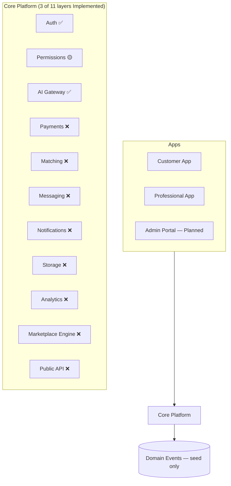
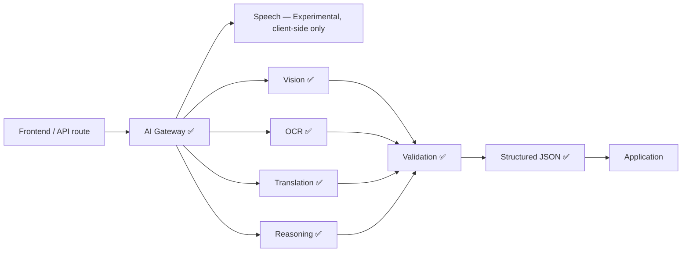

# MASTER_CONTEXT.md

> Single Source of Truth for the Klussie Platform — an executive overview.
> Detailed specs belong in the linked documents below, not in this file.
> Every AI assistant reads [`AI_CONTEXT.md`](./AI_CONTEXT.md) first, then
> this document, in every session, before anything else.

**This document owns:** the current state of the project — status,
priorities, risks, debt, decisions. It does not own product philosophy
(`PRODUCT_CONSTITUTION.md`) or code-level rules (`ENGINEERING_STANDARDS.md`).

### 30-second briefing (for AI sessions)

- **What Klussie is:** AI-powered marketplace connecting customers with
  trusted service professionals — not a handyman app, a multi-vertical
  "operating system for trusted services." (§5)
- **What to build next:** [`IMPLEMENTATION_ROADMAP.md`](./IMPLEMENTATION_ROADMAP.md)
  is the only source of truth. How to build it:
  [`../ENGINEERING.md`](../ENGINEERING.md).
- **Current milestone:** Epic 07 — Asset Engine, **in progress**
  (5/8 packages) — deliberately incomplete: WP 07.06–07.08 (dual-write,
  reconciliation, the read switch) touch live client code and real user
  data for the first time in this sequence, and are decomposed but not
  built without a database connection to verify against. Epics 03, 05
  and 06 complete. None of Epics 03/05/06/07 verified against a live
  database (gate 10 open on all — see §12). (§2)
- **The architecture is frozen.** `PLATFORM_DOMAIN_MODEL`,
  `DATABASE_ARCHITECTURE`, `SYSTEM_ARCHITECTURE` and
  `SUPABASE_ARCHITECTURE` change only by ADR. Klussie is a **Property
  Intelligence Platform**; the marketplace is one module inside it.
- **Biggest technical debt:** no payment system; 31 user-facing
  components without render tests; TypeScript adopted but not at scale.
  ~~No CI~~ closed in Epic 00. Full list: (§12)
- **Biggest project risks:** no revenue path; **no restore drill has ever
  been performed** (ADR-0017); single-maintainer project. Full list:
  (§13)
- **Protected architecture:** never bypass the AI Gateway, never expose AI
  keys client-side, never put business logic in UI, **never branch on
  workspace type**. Full list: (§17)
- **Before touching production data:** take a backup —
  [`operations/DISASTER_RECOVERY.md`](./operations/DISASTER_RECOVERY.md) §5.
  Klussie is on the Free plan and has no automatic backups.

### Document map

| Document | Purpose | Status |
|---|---|---|
| `AI_CONTEXT.md` | Fast-onboarding briefing every AI session reads first | Implemented |
| `MASTER_CONTEXT.md` | This file — executive overview | Implemented |
| `READING_GUIDES.md` | Role-based reading order (CEO/Product/Design/Frontend/Backend/AI/DevOps/QA) | Implemented |
| `IMPLEMENTATION_READINESS_REVIEW.md` | Point-in-time audit of doc-set integrity before Phase 9's execution roadmap | Implemented |
| `IMPLEMENTATION_ROADMAP.md` | **The master engineering plan — the only source of truth for what to build next.** 27 epics, work-package standard, completion gates, migration pattern. Supersedes the two rows below for execution purposes | Implemented |
| `../ENGINEERING.md` | **The engineering operating manual** — workflow, branch/commit conventions, verification gates, deviation procedure. First thing an engineer reads before touching code | Implemented |
| `../implementation/` | Engineering workspace — templates (work package, Definition of Done, review, rollback, ADR workflow, epic completion) and per-epic trackers | Implemented |
| `EXECUTION_ROADMAP.md` | 10-epic execution sequence bridging documentation to implementation | **Superseded** by `IMPLEMENTATION_ROADMAP.md`; retained as history |
| `architecture/EPIC_03_CONVERSATION_EXPERIENCE_PLAN.md` | Epic 03's 12 work packages — scope, dependencies, files, acceptance, complexity, risks | Implemented |
| `product/PRODUCT_CONSTITUTION.md` | Permanent product philosophy | Implemented |
| `engineering/ENGINEERING_STANDARDS.md` | Enforceable code rules + scorecard | Implemented |
| `engineering/TESTING.md` | **The regression baseline** — what counts as a behavioural regression, all 59 user-facing flows, the coverage map, and the known defects preserved deliberately | Implemented |
| `operations/ENVIRONMENTS.md` · `DISASTER_RECOVERY.md` · `POSTGRES_TOOLS_WINDOWS.md` | Staging/production runbooks, the free-tier backup strategy, and client-tool setup | Implemented |
| `design/DESIGN_SYSTEM.md` | Visual and interaction design direction (constitution tier — see `design/README.md` for the full companion-doc set) | Implemented |
| `operations/AUTH_PROVIDER_SETUP.md` | External OAuth provider registration steps (Authentication UX Redesign, Phase 2) | Implemented |
| `architecture/ROADMAP.md` | Full phase-by-phase implementation roadmap (13 phases) | **Superseded** by `IMPLEMENTATION_ROADMAP.md`; retained as history |
| `product/HOMEPAGE_CONCEPTS.md` | Three original conversational-homepage concepts (A/B/C) | Implemented |
| `product/HOMEPAGE_DIRECTION.md` | The chosen homepage direction — C's foundation, B's restraint | Implemented |
| `product/EXPERIENCE_VISION.md` | 10-part experience spec for the conversational homepage | Implemented |
| `product/HOME_OPERATING_SYSTEM.md` | Long-term vision for "My Home" / post-booking relationship | Implemented |
| `product/PROPERTY_MEMORY.md` | Underlying philosophy of Digital Property Memory | Implemented |
| `adr/README.md` | Architecture Decision Records — index of all ADRs | Implemented |
| `features/README.md` | Feature-brief process, template, and index | Implemented |
| `architecture/PLATFORM_DOMAIN_MODEL.md` | **The platform's permanent domain model — highest-level architectural document, FROZEN at Version 1.0 (ADR-0015).** Owns what the platform *is*: 14 Platform Principles, the Capability Engine (§6), identity/workspace/capability, property–location–asset and the Digital Twin, Service Records, Workflows, the Execution Model, Property Memory, Workspace Knowledge, the Knowledge Graph and Provider Intelligence. Every other architectural document is subordinate to it; changes require an ADR | Implemented |
| `architecture/DATABASE_ARCHITECTURE.md` | **The data architecture implementing the domain model.** Owns aggregates vs projections, storage classes, tenancy and the crossing registry, the event backbone, and what every future migration must satisfy. No SQL — the physical schema is the next milestone | Implemented |
| `architecture/SYSTEM_ARCHITECTURE.md` | **The logical software architecture.** Owns the 24 platform engines, their ownership boundaries and contracts, engine communication, the event flow, and the AI/workflow/search/analytics/integration runtimes. No code, no APIs, no infrastructure | Implemented |
| `architecture/SUPABASE_ARCHITECTURE.md` | **The persistence blueprint.** Owns schema organisation, aggregate placement, UUID/mutability strategy, RLS philosophy, event partitioning, projection mechanics, and which Supabase service does what. No DDL — migrations are the next milestone | Implemented |
| `architecture/ARCHITECTURE.md` | Detailed system architecture — owns what is *currently built*, which will differ from `PLATFORM_DOMAIN_MODEL.md` for years by design | Implemented |
| `architecture/AI_ARCHITECTURE.md` | AI Gateway internals, prompt/eval framework | Implemented |
| `architecture/API_SPEC.md` | API contracts (internal + future public API) | Implemented |
| `engineering/SECURITY.md` | Threat model, security posture | Implemented |
| `product/MONETIZATION.md` | Revenue model, commission structure | Implemented |
| `design/` companion set | Tokens, components, layout, responsive, UX patterns, animation, accessibility, copy, iconography, illustration, governance, white-label — see `design/README.md` | Implemented |

Don't link to a `Planned` row as if it exists. When a section below needs
detail that belongs in one of them, treat it as a reason to write that
document next, not a reason to inline the detail here.

**Folder structure (Foundation Freeze, Phases 2, 4 & 5):** `docs/` is
organized by category — `design/`, `product/`, `architecture/`,
`engineering/`, `operations/`, `adr/`, and `features/` are active today.
`company/` is reserved for a later Foundation Freeze phase and doesn't
exist yet — don't create it speculatively.

**Known gap:** the original product manifesto (pasted early in this
project, before the current session's context window) is not recoverable
verbatim from any tool available to this AI session — it predates this
conversation and no artifact or file copy of it exists. If it needs to be
archived in the repository, it must be re-supplied by the founder rather
than reconstructed from memory or paraphrase.

---

## Table of contents

1. [Executive Summary](#1-executive-summary)
2. [Current Milestone](#2-current-milestone)
3. [Current State](#3-current-state)
4. [Repository Health](#4-repository-health)
5. [Product Vision](#5-product-vision)
6. [Architecture Overview](#6-architecture-overview)
7. [Core Systems](#7-core-systems)
8. [Current Priorities](#8-current-priorities)
9. [Current Blockers](#9-current-blockers)
10. [Engineering Rules](#10-engineering-rules)
11. [Product Rules](#11-product-rules)
12. [Technical Debt](#12-technical-debt)
13. [Risks](#13-risks)
14. [KPIs](#14-kpis)
15. [Decision Log](#15-decision-log)
16. [Open Decisions](#16-open-decisions)
17. [Protected Decisions](#17-protected-decisions)
18. [AI Session Instructions](#18-ai-session-instructions)
19. [North Star](#19-north-star)

---

## 1. Executive Summary

Klussie is an AI-powered operating system for trusted professional
services — not a handyman app. A customer describes a problem by text,
speech, or photo; AI understands it, builds a structured work order,
matches a professional, and manages the job through completion and
payment. No category picker, no jargon, no manually comparing providers.

**Mission:** remove every barrier between a customer with a problem and the
professional who can solve it. Full vision: §5.

---

## 2. Current Milestone

```
Current Milestone     IMPLEMENTATION_ROADMAP.md Epic 07 — Asset Engine
Status                IN PROGRESS — 5 of 8 work packages (07.01–07.05).
                       Deliberately incomplete — see Current Objective and
                       the progress record: implementation/epic-07/COMPLETION.md
Current Objective     Done: property.assets and .asset_placements exist —
                       placement repeats ADR-0028's mutable-pointer-plus-
                       closed-log shape by citation, no new ADR needed. The
                       facet system (property.facet_types, .asset_facets)
                       validates declared attribute keys by trigger, no
                       facet type seeded. Isolation inherits the property's
                       stewardship at every depth, no asset-specific
                       resolver. The asset engine contract (my_assets,
                       resolve_asset) has real api delegates, unlike Epic
                       06's engine-only containment functions — WP 07.08 is
                       a genuine near-term caller. household_items (real,
                       live, existing production data) is backfilled into
                       property.assets, idempotently, via a bookkeeping-only
                       household_items_id column — the first backfill in
                       this roadmap moving real existing data rather than
                       deriving from a table the same epic just created.
                       STOPPED HERE, DELIBERATELY: WP 07.06 (dual-write),
                       07.07 (reconcile) and 07.08 (the read switch) are
                       decomposed but not built. They touch
                       src/lib/householdItems.js — live client code, real
                       users — and the reconciliation gate (roadmap §3)
                       needs real data to mean anything, which this session
                       cannot reach.
Previous Milestone    Epic 06 — Location Engine (2026-08-17, complete, 5/5
                       packages) — the roadmap's own highest correctness-risk
                       item in the physical tier. Record:
                       implementation/epic-06/COMPLETION.md
Current Branch        main (Epic 03 WP01–WP08 merged via PR #1 and #2); Epic
                       03 WP09–WP12 on branch/PR #3; Epic 05 on branch/PR #4
                       (stacked on #3); Epic 06 on branch/PR #5 (stacked on
                       #4); Epic 07 not yet committed to a branch
Next Deliverable      Finish Epic 07: WP 07.06 (dual-write), 07.07
                       (reconcile — the hard gate), 07.08 (the read switch).
                       **Needs a direct Postgres connection before any of
                       the three should be attempted** — this is the first
                       epic where that gap blocks real client-code work,
                       not just SQL verification.
Open from Epic 07     The epic is not closed — WP 07.06–07.08 remain,
                       deliberately deferred (see Current Objective). Nothing
                       in WP 07.01–07.05 run against any database — five new
                       diagnostics written, none run. household_items_id
                       (bookkeeping only) should retire alongside
                       household_items itself, whenever that happens.
Open from Epic 06     No structural guard stops a direct UPDATE bypassing
                       reparent_location() and leaving descendant paths
                       stale — a stated convention, not enforced. The same
                       gap now also exists for property.assets.location_id
                       (Epic 07's own carry-forward note).
Open from Epic 05     Nothing in this epic has been run against any database —
                       migrations 0039–0042, four SQL diagnostics, all
                       written, none run, same connection gap as Epic 03.
Open from Epic 03     Nothing from WP 03.09 onward has been seen exercised
                       against a live database: no working credentials for
                       either known test account (no new account created to
                       work around that), and no direct Postgres connection
                       (pooler host + password, or a linked Supabase CLI
                       project) — so VERIFY_WORKSPACE_ISOLATION_POLICIES.sql
                       (WP 03.10) and VERIFY_LIST_MY_WORKSPACES.sql (WP 03.12)
                       are both written but unrun. RoleSelectionScreen still
                       asks the classification question §27/Principle 3
                       forbid — a pre-existing, tracked,
                       deliberately-not-fixed-here gap (§12).
                       docs/architecture/ARCHITECTURE.md was not updated in
                       Epic 03 — closed in Epic 05. Production has none of
                       Epics 01–05 — see
                       operations/PRODUCTION_MIGRATION_0018_0029.md, written
                       for 0018–0029 only and not yet extended through 0042.
Open from Epic 02     The read switch has never been seen rendering (.env.local
                       does not point at a project this session can sign into);
                       ADR-0020/0021/0022 still Proposed; pro_profiles is not
                       redacted by erasure, a legal question; auth.users
                       deletion cascades into nine tables, violating §5 and
                       §11.4; step 6 is unreachable, so profiles and
                       profile_contacts both survive
Open from Epic 01     The audit write path was unallocated — partially closed by
                       WP 02.07, which wrote the first audit row; no
                       application-code path into the platform schema exists,
                       deliberately; partition ranges run to end-2027 and are
                       created by hand
Open from Epic 00     Branch protection not enabled on main (CI reports failure
                       without blocking merge); no restore drill performed
                       (ADR-0017, Free plan constraint); 31 user-facing
                       components still have no render test; no CI run has ever
                       been observed from this machine
Last Updated          2026-08-16
```

Implemented in Phase 1 so far: authenticated + rate-limited AI Gateway
(`reason()`/`translate()`), least-privilege server auth, domain-event seed
(`emit_domain_event`), audit log, feature-flags table, prompt library
(`/ai/*/prompt.md`), a 14-component Design System with real usages,
`PRODUCT_CONSTITUTION.md`, and `ENGINEERING_STANDARDS.md`.

---

## 3. Current State

Ground truth, as of this writing. Where any other section or document
disagrees with this table, this table wins.

| Area | Reality |
|---|---|
| Frontend | Vite + React 19, plain JS/JSX (TypeScript: Planned, Phase 2), hand-written CSS via custom properties (no Tailwind, no Framer Motion) |
| Backend | Vercel Node serverless functions (`api/*.js`) — not Supabase Edge Functions. Supabase used for Postgres, Auth, Storage, Realtime only |
| AI | `@anthropic-ai/sdk` routed through the AI Gateway (`api/_lib/aiGateway.js`). Speech is client-side Web Speech API — Experimental, not yet routed through the Gateway |
| Payments | Planned. Commission is a display-only constant on a demo invoice; no integration implemented |
| Auth | Implemented — Supabase Auth, email/password. Every AI endpoint requires a session and is rate-limited |
| Repository structure | See [`README.md`](../README.md#repository-structure) for the canonical layout — not duplicated here. Current layout does **not** match the target described in §6 |
| Platform schema | In Progress — Epic 01 created the ten engine-tier schemas, twelve roles, `platform.events`, `platform.audit_records`, `platform.emit_event()` and consumer cursor/quarantine storage. Still unused except by erasure, which wrote the first audit row (Epic 02 WP07). Applied to staging only — production is untouched |
| Identity | In Progress — Epic 02. `identity.identities` holds the person reference and personal attributes, backfilled from every profile and dual-written on signup **inside the auth transaction** (a trigger, not the client). Profile display now reads from it through two resolvers; erasure redacts across all three tables and deletes nothing. `public.profiles` and `public.profile_contacts` both remain, written and authoritative for application state and bilateral contact visibility — step 6 is unreachable ([ADR-0023](adr/0023-identity-display-resolution-versus-row-visibility.md)). Staging only |
| Testing | In Progress — Vitest + React Testing Library, **841 tests across 72 files**, plus a regression baseline (`engineering/TESTING.md`) and SQL diagnostics — through Epic 03 WP08 run against staging; WP 03.09 onward, and all of Epics 05–07 (partial), written but unrun (no DB connection this session, `MASTER_CONTEXT.md` §2). CI gates lint/type-check/test/build, and — for the first time — **actually observed passing** on Epic 03's PR #3. 31 user-facing components still have no render test. Previously: 561 tests across 42 files. No E2E |
| Property Memory | In Progress — My Home V1 is derived entirely from existing rows (jobs, professionals, reviews, AI analyses, photos) via `src/lib/homeTimeline.js`, no new schema. My Items V1 is real storage (`household_items`, migration 0016) with manual entry and photos, and carries `source`/`ai_suggestion` so photo recognition can later propose values the owner confirms. Rooms, installations, documents and maintenance schedules remain Planned — no schema (ADR-0008) |
| Localization | Implemented — 10 locales (`nl`, `fr`, `de`, `en`, `es`, `ar`, `fa`, `tr`, `ru`, `zh`), two right-to-left. UI copy lives in three tables under `src/lib`; catalog names live in the database. Parity across all three tables is derived from `LANGS` and enforced by `homeStrings.test.js` |
| Core Platform | 3 of 11 layers Implemented (Auth, AI Gateway) or In Progress (Permissions). 8 layers Planned: Payments, Matching, Messaging, Notifications, Storage, Analytics, Marketplace Engine, API |

---

## 4. Repository Health

> Most rows below are status labels, not measured percentages — there's no
> instrumentation yet (§7, Analytics Engine is Planned). Where a number is a
> verified fact (e.g. test coverage) it's shown as one; nothing here is
> invented for the sake of looking precise. "Owner" is unassigned throughout
> — this is currently a single-maintainer project with no team structure.

| Area | Current | Target | Trend | Owner |
|---|---|---|---|---|
| Architecture | In Progress — 3/11 Core Platform layers implemented; the platform schema foundation and event backbone exist (Epic 01) and the Identity engine is real and read from (Epic 02) | All 11 layers implemented, nothing bypasses Core Platform | Improving | Unassigned |
| Documentation | Implemented — 23 of 23 Document Map rows implemented, integrity-audited (`IMPLEMENTATION_READINESS_REVIEW.md`); Foundation Freeze complete (9 of 9 phases) | Keep current as reality changes going forward; next structural addition is `company/`, whenever a real need for it exists | New baseline | Unassigned |
| Security | In Progress — auth, RLS, rate limiting, least-privilege implemented; `engineering/SECURITY.md` documents the full threat model and known gaps | Pen-tested | New baseline | Unassigned |
| Performance | Planned — not yet profiled | Defined once profiling implemented | New baseline | Unassigned |
| Accessibility | In Progress — `design/ACCESSIBILITY.md` audit done; Epic 03 added a global focus ring, a real focus trap + focus restoration on `Modal`, live regions, ARIA tablist semantics, and 44px touch targets on new surfaces. Older screens not re-audited | Constitution Rule 6 formally verified | Improving | Unassigned |
| Testing | In Progress — **841 tests, 72 files**; all `src/lib` business logic, the homepage, both Property Memory surfaces, and Epics 01–07's schema/emission/consumer/workspace/property/location/asset layers covered. SQL diagnostics verify the database posture against staging through Epic 03 WP08; WP 03.09 onward, and all of Epics 05–07 (partial), unrun (no DB connection this session). Every gate in Epics 01-07 was proven able to fail before being trusted — a discipline that found real defects in Epic 02, a near-miss in Epic 03 (WP 03.11's public-profile reads), and a real `search_path`/extension-schema bug in Epic 06 (found by reasoning, not by running anything — see `implementation/epic-06/COMPLETION.md` §5). The feature components extracted from `App.jsx` (customer/pro/auth/profile) still have no render tests — their *rules* are tested, their markup is mostly not (WorkspaceSwitcher is the one exception, Epic 03) | Defined in Phase 2 | Improving | Unassigned |
| Design System | In Progress — 21 components implemented (Epic 03 added TrustStrip, UnfoldPanel/UnfoldItem, VoiceCapture, PhotoCapture, TextComposer, RecentWorkStrip, SegmentedTabs/TabPanel); most of `App.jsx` still unmigrated | Full adoption, dark mode, white-label tokens | Improving | Unassigned |
| AI | In Progress — AI Gateway, intake, translation implemented | Full capability routing + eval automation | New baseline | Unassigned |
| Marketplace Engine | In Progress — SQL-function matching implemented, no ranking/geo | Real Marketplace Engine implemented | New baseline | Unassigned |
| Payment Engine | Planned — no integration implemented | Stripe Connect implemented | New baseline | Unassigned |
| Developer Experience | In Progress — `App.jsx` down to 19 lines; the app is now organised by feature (`src/shell`, `src/auth`, `src/profile`, `src/customer`, `src/pro`, `src/messaging`, `src/requests`, `src/ui`, `src/home`) with every rule in `src/lib`. No component exceeds 300 lines. No types yet | Modular, typed, tested | Improving | Unassigned |
| Deployment | Implemented — Vercel pipeline plus a CI gate on lint, type-check, test and build (Epic 00). Branch protection not yet enabled | Merge blocked on CI | New baseline | Unassigned |
| Infrastructure | Planned — no queue, no cache, single region | Defined once scale requires it (§16) | New baseline | Unassigned |

---

## 5. Product Vision

Klussie should become the global operating system for trusted professional
services — not just home repairs. The same marketplace engine should
eventually power:

Home Services · Cleaning · Security · Transport · Property Management ·
Healthcare · Pet Care · Business Services · Enterprise Facility Management

**Core philosophy:** AI first · trust first · accessibility first ·
configuration over hardcoding · backend before frontend · scalability
before complexity · documentation is part of the product.

**Design direction:** locked, 2026-08-05 — see
[`design/DESIGN_SYSTEM.md`](./design/DESIGN_SYSTEM.md) for the full brief (brand
personality, color/typography/motion rules, component litmus test). Short
version: evolve the existing warm identity (forest/sage/amber, Fraunces
display type, generous whitespace), reduce heavy borders and paper effects,
increase breathing room and subtle motion. Never move toward a colder
SaaS-dashboard register — that direction was considered and explicitly
rejected (ADR-006).

The **Product Principles** that justify *why* any of this gets built —
Trust, Simplicity, Conversion, Retention, Scalability, Marketplace
Liquidity — are permanent and owned by `PRODUCT_CONSTITUTION.md`. How
progress against them is measured is §14, KPIs, which is this document's
job because it evolves.

---

## 6. Architecture Overview

> 🎯 **Target architecture — not yet built.** See §3 for what exists today.
>
> ⚠️ **Superseded as a description of the platform.** Since ADR-0013 and
> ADR-0014, what the platform *is* is owned by
> [`architecture/PLATFORM_DOMAIN_MODEL.md`](./architecture/PLATFORM_DOMAIN_MODEL.md).
> The eleven-layer list below mixes domain concerns (Payments, Matching),
> infrastructure adapters (Storage, Notifications) and delivery mechanisms
> (API), and contains no properties, assets, workspaces or capabilities —
> it is a useful *implementation checklist* and is retained as one. It is
> no longer a model of the architecture. Where the two disagree, the
> domain model wins.



Nothing bypasses Core Platform once a layer exists for that concern (§17).
✅ = Implemented, 🟡 = In Progress, ❌ = Planned.



No frontend component or endpoint talks to an AI provider directly — every
call routes through the AI Gateway (`api/_lib/aiGateway.js`), so a provider
swap for one capability never touches another. Deeper detail:
[`architecture/AI_ARCHITECTURE.md`](./architecture/AI_ARCHITECTURE.md).

---

## 7. Core Systems

Core Systems are user-facing capability groupings, built from the Core
Platform layers in §6. The two taxonomies don't map one-to-one yet —
tracked as an open decision (§16).

| System | Status |
|---|---|
| AI Understanding Engine | In Progress — text/voice/photo intake and translation implemented; video and live-camera analysis Planned |
| Trust Engine | In Progress — reviews and reputation score implemented; identity/insurance/background verification Planned |
| Marketplace Engine | In Progress — SQL-function matching implemented; ranking/availability/geo Planned |
| Payment Engine | Planned |
| Communication Engine | In Progress — chat and live translation implemented; push/email/SMS Planned |
| Analytics Engine | Planned |

Full specs: [`architecture/ARCHITECTURE.md`](./architecture/ARCHITECTURE.md) /
[`architecture/AI_ARCHITECTURE.md`](./architecture/AI_ARCHITECTURE.md).

---

## 8. Current Priorities

1. Finish Phase 1: event-bus wiring into existing flows, real Permissions
   layer.
2. Migrate remaining inline UI onto the Design System — now scoped per
   feature folder rather than "somewhere in `App.jsx`".
3. ~~Move commission math and trust-score computation out of `App.jsx`~~ —
   done in the Engineering Health sprint (`src/lib/billing.js`,
   `src/lib/pros.js`). Promoting them from `src/lib` to a Core Platform
   module is still open, and only matters once the server needs the same
   math.
4. Begin Phase 2: testing framework, incremental TypeScript, release
   strategy.

New product features are secondary to the above.

---

## 9. Current Blockers

What's actually stopping Phase 2 from starting, not just "not done yet":

- **No test suite implemented** — Phase 2 can't be verified as done
  without one, and there's no harness to build tests against incrementally.
- **No TypeScript convention decided** — incremental migration needs a
  starting order first (§16, Open Decisions).
- **No CI pipeline implemented** — nothing currently gates a merge or
  deploy automatically; adding tests without CI to run them is only half
  the fix.
- **Event bus is only 2/9 wired** — Release Strategy and Disaster Recovery
  (later phases) assume domain events are reliably emitted; today most
  aren't.

---

## 10. Engineering Rules

Enforceable version + live scorecard: [`ENGINEERING_STANDARDS.md`](./engineering/ENGINEERING_STANDARDS.md).

Summary: no component over 300 lines · no function over 40 lines ·
everything typed (Planned, starts Phase 2) · everything documented ·
everything reusable · no duplicated code · no inline SQL · no inline
prompts · no magic numbers. (Business logic in UI is a Protected Decision,
§17, not repeated here.)

---

## 11. Product Rules

Enforceable version: [`PRODUCT_CONSTITUTION.md`](./product/PRODUCT_CONSTITUTION.md),
which owns two complementary things:

- **Product Principles** — the permanent *why* behind every decision
  (Trust, Simplicity, Conversion, Retention, Scalability, Marketplace
  Liquidity).
- **Rules** — the enforceable law built on those principles, including
  Rule 10: every feature must serve a Principle **and** be expected to
  move a Product KPI (§14 — the evolving *how it's measured* layer this
  document owns).

Principles and KPIs are not alternatives. A feature needs a reason
(Principle) and a measurable target (KPI) before it ships — see §14.

---

## 12. Technical Debt

| Severity | Item | Impact | Recommended Fix | Phase | Priority |
|---|---|---|---|---|---|
| ✅ Closed | ~~No CI pipeline~~ — delivered in Epic 00 WP01/WP05 | Tests exist (404) but nothing runs them on a merge or deploy, so a regression still reaches production unnoticed | Add a CI gate on lint + test + build | Phase 2 | P0 |
| 🟡 Medium | No TypeScript **at scale** — toolchain landed in Epic 00 WP03/WP04 with one module converted; the rest is still JavaScript | Type errors reach production undetected | Incremental adoption, smallest/most-depended-on files first | Phase 2 | P1 |
| 🟠 High | **The Epic 02 read switch has never been seen rendering** | WP 02.06 moved every profile read onto the identity engine. It is verified value-by-value against staging and by 19 client assertions, but no profile, quote-card or onboarding surface was opened in a browser: `.env.local` points at production and staging's anon key was unavailable to that session | Point `.env.local` at staging and walk the `engineering/TESTING.md` §5 profile flows | Epic 02 | P1 |
| 🟠 High | **`public.pro_profiles` is not redacted by erasure** | For a `flexi` sole trader — most of this marketplace — `business_name` is frequently the person's own name, and a VAT number identifies an individual. Erasure leaves both. Redacting would erase a business's public record | A legal decision, not an implementation one. Needed before erasure is offered to anyone | Epic 02 | P1 |
| 🟠 High | **Deleting an `auth.users` row cascades into nine tables** | `public.profiles` is the parent of nine `on delete cascade` foreign keys and cascades from `auth.users` itself, so deleting one account destroys that person's requests, reviews and conversations — **and both sides of every message, including the other party's**. Violates `SUPABASE_ARCHITECTURE.md` §5 ("no cascading deletes anywhere") and §11.4. Predates Epic 02; erasure routes around it by never deleting | Drop the cascades when the epic that retires `profiles` runs | Legacy | P1 |
| 🟠 High | **Three ADRs are `Proposed`, not accepted** — [0020](adr/0020-events-partitioning-parameters.md), [0021](adr/0021-one-audit-table-with-nullable-workspace.md) and [0022](adr/0022-backfilled-identifiers-are-uuidv7-minted-in-sql.md) | All three were forced by questions the frozen documents left open, and all three are implemented. While `platform.events` and `platform.audit_records` are empty, changing either costs a `drop table` and a re-run; after the first written row it costs rewriting every partition of a table designed never to be rewritten | Accept, revise, or supersede — the decision is cheap now and expensive later. **The window closes when something starts writing rows**, which is not yet scheduled | Epic 01 | P1 |
| 🟡 Medium | **The audit write path is unallocated** | Epic 01's definition lists it under Backend alongside the emission helper and consumer scaffolding, and no work package built it. `SUPABASE_ARCHITECTURE.md` §8 correctly makes `platform.audit_records` writable by no application role, so as things stand nothing can write an audit record at all. Nothing needs to yet | A `SECURITY DEFINER` function owned by a role that can write, callable by engines that cannot — the same shape as `platform.emit_event()`. A WP 01.08, or folded into the epic that first needs it | Epic 01 | P2 |
| 🟠 High | **`RoleSelectionScreen` asks the exact question `PLATFORM_DOMAIN_MODEL.md` §27 forbids** | Principle 3 / §27: "The platform never asks a person to classify themselves... It is the wrong question because it is a question about *context*, asked as though it were a question about *identity*." `src/auth/RoleSelectionScreen.jsx` shows every new signup a one-time "how will you use klussie" choice (customer vs. professional) before anything else. Predates the Platform Domain Model freeze (ADR-0013); not introduced or worsened by Epic 03, and Epic 03's WP 03.12 (the workspace switcher) deliberately left it alone rather than redesigning onboarding in a work package scoped to add a switcher — see `IMPLEMENTATION_ROADMAP.md` §14 | A product decision, not an implementation one: replace the forced choice with "create an account, get a Personal Workspace, become a pro later when there's something real to put in it" (§27's own framing) — likely the same session that relocates the "Become a pro" entry point out of the topbar's `role` toggle for single-workspace users, which Epic 03 also left alone | Legacy, found during Epic 03 | P1 |
| 🔴 Critical | **Epics 03, 05, 06 and 07 — nothing from WP 03.09 onward has been exercised against a live database, and it now blocks live client-code work, not just SQL** | Same class of gap as the Epic 02 row above, now **five epics deep** and upgraded from High to Critical: Epic 07's remaining work (dual-write, reconciliation, the read switch in `src/lib/householdItems.js`) cannot responsibly proceed without it — the reconciliation gate (roadmap §3) needs real data, and this is the first epic where the risk is live, running client code rather than additive SQL. No working credentials for either known test account, and no direct Postgres connection (pooler host/password, no linked Supabase CLI project) to run any of the ~20 `VERIFY_*.sql` diagnostics written since | Get a working `.env.local` (pointed at staging, with valid seeded-account credentials) and a direct Postgres connection to whichever session finishes Epic 07 — required, not merely helpful, before WP 07.06 begins | Epic 03, 05, 06, 07 | **P0** |
| 🟠 High | No payment system | No real revenue path | Stripe Connect integration | Phase 4 | P1 |
| 🟡 Medium | No render tests on the extracted feature components | The Engineering Health sprint moved ~2,150 lines of JSX into `src/customer`, `src/pro`, `src/auth`, `src/profile` and `src/messaging` with their rules unit-tested but their markup unverified by any test. The move was checked by line-level diff, build, lint and manual smoke — not by assertions that survive the next change | Add render tests per feature folder, starting with the surfaces that spend money: `RequestDetailSheet`, `InvoiceSheet`, `ProProfile` | Phase 2 | P2 |
| 🟡 Medium | Literal `\uXXXX` escape text rendered in 12 places | JSX text content doesn't interpret backslash escapes, so customers see `€` where a euro sign belongs — in the invoice totals, the budget fields, the flexi tracker and the boost price. Preserved verbatim through the Engineering Health sprint because fixing it changes what a customer reads, which that sprint promised not to do | Replace each with the real character. Sites are commented in `ServiceSheet.jsx`, `QuoteFormSheet.jsx`, `AiIntakeSheet.jsx`, `InvoiceSheet.jsx`, `SendQuoteSheet.jsx`, `ProProfile.jsx`, `AppShell.jsx` | Phase 1 | P2 |
| 🟡 Medium | Design System migration incomplete | Visual inconsistency, duplicated markup | Migrate remaining screens opportunistically | Phase 1 | P2 |
| 🟡 Medium | `pro_matches_request()` is a bare SQL function | No ranking/availability/geo, limits match quality | Build the real Marketplace Engine | Phase 5 | P2 |
| 🟡 Medium | `awaiting_pro` status leaks to the UI untranslated | The status table in `src/lib/requestStatus.js` has no case for the status a directed request sits in (ADR-0012), so its fallback renders the raw enum value — a customer who used one-tap booking sees `awaiting_pro` in `RequestsList` and `RequestDetailSheet` in all 8 locales, and gets no timeline on the detail sheet at all | Add a `statusAwaitingPro` key across all 8 locales and a `PRESENTATION` entry for it; wording must not imply the job is booked, since ADR-0012 commits the customer, not the professional. Decide where it sits in `REQUEST_STATUS_ORDER` — the timeline gap is the same bug. Both fallbacks are now pinned by `requestStatus.test.js`, so the fix has one place to land | Phase 1 | P2 |
| 🟢 Low | Browser Web Speech API for voice intake | Inconsistent quality across browsers/mobile | Evaluate Whisper or similar | Phase 9 | P3 |
| 🟢 Low | Categories/services hardcoded seed data | Adding a service needs a deploy, not a config change | Marketplace Engine configurable taxonomy | Phase 5 | P3 |

---

## 13. Risks

Project/business risk — not a restatement of §12; see there for engineering
detail.

**High**
- No revenue path yet — payments are entirely Planned, not implemented.
- No CI — tests exist but nothing gates a merge or deploy on them.
- Single-maintainer project — no redundancy on any system.

**Medium**
- No professional verification behind `is_certified` — trust/liability
  exposure if an unverified pro causes harm.
- No notifications outside an open tab — drop-off risk between AI intake
  and a pro's response.
- Hardcoded categories slow expansion into new verticals/countries.

**Low**
- Design-language direction undecided (§16) — cosmetic, not blocking.

---

## 14. KPIs

How progress against the Product Principles (`PRODUCT_CONSTITUTION.md`,
§11) is measured. Unlike Principles, KPIs are expected to evolve. None of
these are instrumented in production yet — the Analytics Engine (§7) is
Planned. "Current" is honestly "not yet measured," not a placeholder for an
invented number.

| KPI | Target | Current |
|---|---|---|
| Time to first booking | < 60 seconds | Not yet instrumented |
| AI understanding accuracy | > 95% | Not yet instrumented (spot-checked during dev only) |
| First-time fix rate | > 90% | Not yet instrumented |
| Professional response time | < 5 minutes | Not yet instrumented |
| Average booking completion | > 85% | Not yet instrumented |
| NPS | > 70 | Not yet instrumented |
| Customer retention | > 60% | Not yet instrumented |
| Professional retention | > 80% | Not yet instrumented |

---

## 15. Decision Log

Full ADR bodies (Context/Decision/Consequences) now live in
[`adr/`](./adr/README.md) — extracted there in Foundation Freeze Phase 4
so this section doesn't duplicate a source of truth (Constitution Rule
8). This is the index; `adr/README.md` is the canonical one.

| ADR | Title | Status |
|---|---|---|
| [0001](./adr/0001-capability-based-ai-gateway.md) | Adopt a capability-based AI Gateway | Implemented |
| [0002](./adr/0002-warm-paper-ticket-design-language.md) | Keep the warm "paper ticket" design language for now | Superseded by 0006 |
| [0003](./adr/0003-postgres-backed-rate-limiting.md) | Postgres-backed rate limiting instead of Redis | Implemented |
| [0004](./adr/0004-domain-events-via-security-definer-rpc.md) | Route domain events through `emit_domain_event()` RPC | Implemented |
| [0005](./adr/0005-testing-ci-disaster-recovery-before-payments.md) | Move Testing/CI/Disaster Recovery ahead of Payments in the roadmap | Implemented |
| [0006](./adr/0006-design-direction-lock.md) | Design Direction Lock: evolve the warm identity, reject the cooler SaaS-dashboard register | Implemented |
| [0007](./adr/0007-conversational-homepage-ia.md) | Conversational-first homepage over marketplace/category-grid IA | Implemented (built, Epic 03) |
| [0008](./adr/0008-my-home-replaces-discover-tab.md) | "My Home" replaces the Discover tab, not a new tab | Implemented (built as homepage sections, not a nav destination — Epic 03) |
| [0009](./adr/0009-docs-folder-reorganization.md) | Reorganize `docs/` into category subfolders | Implemented |
| [0010](./adr/0010-defer-permissions-layer-formalization.md) | Defer formalizing the Permissions layer | Implemented |
| [0011](./adr/0011-trust-strip-shows-only-verified-signals.md) | The trust strip shows only signals backed by real data | Implemented (built, Epic 03 WP7) |
| [0012](./adr/0012-one-tap-booking-commits-the-customer-not-the-professional.md) | One-tap booking commits the customer, not the professional | Implemented (built, Epic 03 WP9) |
| [0013](./adr/0013-workspace-centred-platform-domain-model.md) | Adopt a workspace-centred platform domain model | Implemented (domain model; no application code yet) |
| [0014](./adr/0014-capability-model-as-the-platform-organising-concept.md) | The Capability Model is the platform's organising concept | Implemented (domain model; no application code yet) |
| [0015](./adr/0015-service-records-digital-twin-workflows-and-execution-strategies.md) | Service Records, Digital Twin, Knowledge Graph, Workflows, Execution Strategies — **platform architecture frozen at Version 1.0** | Implemented (domain model; no application code yet) |
| [0016](./adr/0016-operate-production-on-free-plan-without-automatic-backups.md) | Operate production on the Free plan, without automatic backups | Superseded by 0017 |
| [0017](./adr/0017-free-tier-disaster-recovery-strategy.md) | A self-managed disaster recovery strategy on the Free plan — native `pg_dump`, no Docker, no plan upgrade | Accepted |
| [0018](./adr/0018-restore-mode-suspend-triggers-during-logical-restore.md) | Restore Mode — suspend platform triggers during logical restores | **Proposed** — recorded, not implemented; revisit after the first drill |
| [0019](./adr/0019-canonical-platform-event-envelope.md) | The canonical platform Event Envelope — 13 fields, immutable, carried by every domain event | Accepted — **completes Platform Architecture v1.0**; resolves the sole P0 from the pre-Epic-01 red team review |

---

## 16. Open Decisions

- Core Systems (§7) vs. Core Platform layers (§6): formalize a 1:1 mapping,
  or define Core Systems as explicit compositions of multiple layers?
- Stripe Connect: Standard, Express, or Custom?
- TypeScript migration order: file-by-file or domain-by-domain?
- Search provider for the Marketplace Engine: Postgres full-text vs.
  Algolia/Meilisearch?
- Push notification provider: web push, FCM, or OneSignal?
- Image/video CDN: stay on Supabase Storage, or move to
  Cloudinary/Cloudflare Images?
- Queue provider for async jobs — is one needed yet, or does everything
  stay synchronous?
- Cache layer — is Redis/Upstash needed, or does that wait for real scale
  pressure?

Resolve here before implementing — don't relitigate in every session.

---

## 17. Protected Decisions

Never violate these without an explicit, documented decision overriding
them (add an ADR to §15 if one ever does):

- Never remove or bypass the AI Gateway.
- Never expose AI provider keys client-side.
- Never bypass Core Platform once a concern has a Core Platform module for
  it.
- Never move business logic into UI components.
- Never hardcode categories or services once the Marketplace Engine's
  configurable taxonomy exists — today's hardcoded seed data is a tracked
  exception, not a precedent.
- Never call payment, matching, or messaging providers directly from
  components.
- Never write to `audit_log` or `domain_events` directly — only through
  `emit_domain_event()` or an equivalent security-definer function.
- Never use the Supabase service-role key in a user-facing request path.
- Every capability-gated feature ships behind a Feature Flag.
- Every new UI element uses the Design System.
- Never redesign the product simply because something looks more modern —
  see `design/DESIGN_SYSTEM.md`'s Final Rule (ADR-006).
- Never give AI a visual theme (no purple, neon, glowing borders, robot
  aesthetics, sci-fi language) — AI stays invisible in the UI.
- Never mix icon families — Lucide only.

---

## 18. AI Session Instructions

Enforceable version — the actual checklist every session follows — now
lives in [`AI_CONTEXT.md`](./AI_CONTEXT.md), the first document any AI
session reads (Foundation Freeze Phase 6). Not duplicated here per
Constitution Rule 8, one source of truth.

Short version: read `AI_CONTEXT.md`, then this document, then
`product/PRODUCT_CONSTITUTION.md` and `engineering/ENGINEERING_STANDARDS.md`;
review existing code before proposing changes; explain before
implementing; implement only the approved scope; update docs if reality
changed; stop.

---

## 19. North Star

Success: a customer opens Klussie, describes a problem, books a trusted
professional, pays securely, and leaves satisfied — within one minute,
without choosing a category, without technical jargon, without wondering
if they picked the right professional.

When someone needs professional help anywhere in the world, their first
instinct should be: **"I'll open Klussie."**

---

*Version 2.1 — 2026-08-17 (Epic 07 Asset Engine, in progress, 5/8 packages: milestone, test count (841/72), the first backfill moving real existing data, debt row extended to five epics and raised to P0 — WP 07.06–08 need database access before they can be built)*

*Version 2.0 — 2026-08-17 (Epic 06 Location Engine complete, 5/5 packages: milestone, test count (792/67), a real ltree/search_path bug found and fixed, debt row extended to four epics)*

*Version 1.9 — 2026-08-16 (Epic 05 Property Engine complete, 6/6 packages: milestone, test count (742/62), ARCHITECTURE.md's Known Gaps updated for both Epic 03 and Epic 05)*

*Version 1.8 — 2026-08-16 (Epic 03 Workspace Engine complete, 12/12 packages: milestone, test count (696/57), and two new technical-debt rows — the RoleSelectionScreen/§27 conflict and the unverified read-switch/RLS work)*

*Version 1.7 — 2026-08-16 (Epic 03 Workspace Engine in progress: milestone updated through WP 03.09, test count refreshed to 643/51)*

*Version 1.6 — 2026-08-11 (Epic 03 implemented: milestone, testing/accessibility/design-system status, ADR index 0010–0012, technical debt refreshed against the real codebase)*
