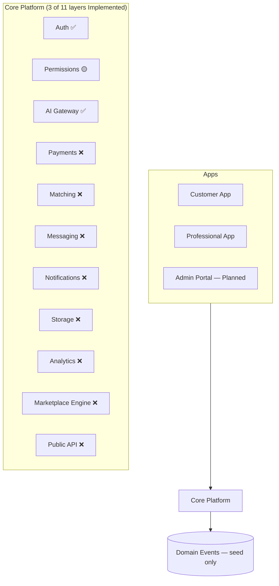
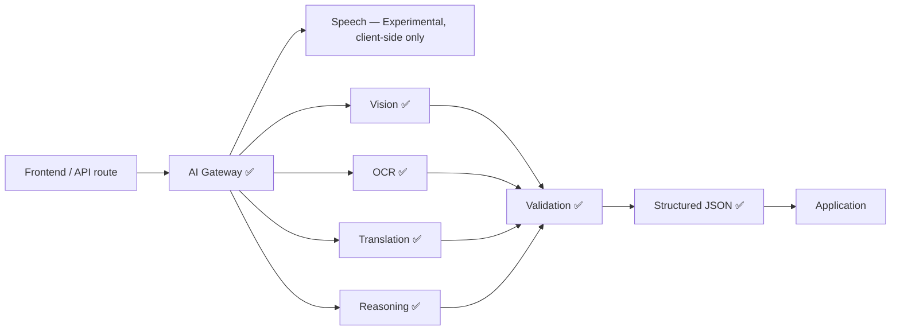

# MASTER_CONTEXT.md

> Single Source of Truth for the Klussie Platform — an executive overview.
> Detailed specs belong in the linked documents below, not in this file.
> Every AI assistant reads [`AI_CONTEXT.md`](./AI_CONTEXT.md) first, then
> this document, in every session, before anything else.

**This document owns:** the current state of the project — status,
priorities, risks, debt, decisions. It does not own product philosophy
(`PRODUCT_CONSTITUTION.md`) or code-level rules (`ENGINEERING_STANDARDS.md`).

### 30-second briefing (for AI sessions)

- **What Klussie is:** AI-powered marketplace connecting customers with
  trusted service professionals — not a handyman app, a multi-vertical
  "operating system for trusted services." (§5)
- **Current milestone:** Phase 1 — Foundation, In Progress. (§2)
- **Current priorities:** Core Platform extraction, Design System
  migration, event-bus wiring. Full list: (§8)
- **Biggest technical debt:** no TypeScript, no CI. `App.jsx` is no longer
  on this list — the Engineering Health sprint reduced it to 19 lines by
  splitting it into feature modules. Full list: (§12)
- **Biggest project risks:** no payment system, no CI gate,
  single-maintainer project. Full list: (§13)
- **Protected architecture:** never bypass the AI Gateway, never expose AI
  keys client-side, never put business logic in UI. Full list: (§17)
- **Next implementation task:** event-bus wiring into existing
  request/quote/message flows, then Phase 2. (§9)

### Document map

| Document | Purpose | Status |
|---|---|---|
| `AI_CONTEXT.md` | Fast-onboarding briefing every AI session reads first | Implemented |
| `MASTER_CONTEXT.md` | This file — executive overview | Implemented |
| `READING_GUIDES.md` | Role-based reading order (CEO/Product/Design/Frontend/Backend/AI/DevOps/QA) | Implemented |
| `IMPLEMENTATION_READINESS_REVIEW.md` | Point-in-time audit of doc-set integrity before Phase 9's execution roadmap | Implemented |
| `EXECUTION_ROADMAP.md` | 10-epic execution sequence bridging documentation to implementation | Implemented |
| `architecture/EPIC_03_CONVERSATION_EXPERIENCE_PLAN.md` | Epic 03's 12 work packages — scope, dependencies, files, acceptance, complexity, risks | Implemented |
| `product/PRODUCT_CONSTITUTION.md` | Permanent product philosophy | Implemented |
| `engineering/ENGINEERING_STANDARDS.md` | Enforceable code rules + scorecard | Implemented |
| `design/DESIGN_SYSTEM.md` | Visual and interaction design direction (constitution tier — see `design/README.md` for the full companion-doc set) | Implemented |
| `operations/AUTH_PROVIDER_SETUP.md` | External OAuth provider registration steps (Authentication UX Redesign, Phase 2) | Implemented |
| `architecture/ROADMAP.md` | Full phase-by-phase implementation roadmap (13 phases) | Implemented |
| `product/HOMEPAGE_CONCEPTS.md` | Three original conversational-homepage concepts (A/B/C) | Implemented |
| `product/HOMEPAGE_DIRECTION.md` | The chosen homepage direction — C's foundation, B's restraint | Implemented |
| `product/EXPERIENCE_VISION.md` | 10-part experience spec for the conversational homepage | Implemented |
| `product/HOME_OPERATING_SYSTEM.md` | Long-term vision for "My Home" / post-booking relationship | Implemented |
| `product/PROPERTY_MEMORY.md` | Underlying philosophy of Digital Property Memory | Implemented |
| `adr/README.md` | Architecture Decision Records — index of all ADRs | Implemented |
| `features/README.md` | Feature-brief process, template, and index | Implemented |
| `architecture/ARCHITECTURE.md` | Detailed system architecture | Implemented |
| `architecture/AI_ARCHITECTURE.md` | AI Gateway internals, prompt/eval framework | Implemented |
| `architecture/API_SPEC.md` | API contracts (internal + future public API) | Implemented |
| `engineering/SECURITY.md` | Threat model, security posture | Implemented |
| `product/MONETIZATION.md` | Revenue model, commission structure | Implemented |
| `design/` companion set | Tokens, components, layout, responsive, UX patterns, animation, accessibility, copy, iconography, illustration, governance, white-label — see `design/README.md` | Implemented |

Don't link to a `Planned` row as if it exists. When a section below needs
detail that belongs in one of them, treat it as a reason to write that
document next, not a reason to inline the detail here.

**Folder structure (Foundation Freeze, Phases 2, 4 & 5):** `docs/` is
organized by category — `design/`, `product/`, `architecture/`,
`engineering/`, `operations/`, `adr/`, and `features/` are active today.
`company/` is reserved for a later Foundation Freeze phase and doesn't
exist yet — don't create it speculatively.

**Known gap:** the original product manifesto (pasted early in this
project, before the current session's context window) is not recoverable
verbatim from any tool available to this AI session — it predates this
conversation and no artifact or file copy of it exists. If it needs to be
archived in the repository, it must be re-supplied by the founder rather
than reconstructed from memory or paraphrase.

---

## Table of contents

1. [Executive Summary](#1-executive-summary)
2. [Current Milestone](#2-current-milestone)
3. [Current State](#3-current-state)
4. [Repository Health](#4-repository-health)
5. [Product Vision](#5-product-vision)
6. [Architecture Overview](#6-architecture-overview)
7. [Core Systems](#7-core-systems)
8. [Current Priorities](#8-current-priorities)
9. [Current Blockers](#9-current-blockers)
10. [Engineering Rules](#10-engineering-rules)
11. [Product Rules](#11-product-rules)
12. [Technical Debt](#12-technical-debt)
13. [Risks](#13-risks)
14. [KPIs](#14-kpis)
15. [Decision Log](#15-decision-log)
16. [Open Decisions](#16-open-decisions)
17. [Protected Decisions](#17-protected-decisions)
18. [AI Session Instructions](#18-ai-session-instructions)
19. [North Star](#19-north-star)

---

## 1. Executive Summary

Klussie is an AI-powered operating system for trusted professional
services — not a handyman app. A customer describes a problem by text,
speech, or photo; AI understands it, builds a structured work order,
matches a professional, and manages the job through completion and
payment. No category picker, no jargon, no manually comparing providers.

**Mission:** remove every barrier between a customer with a problem and the
professional who can solve it. Full vision: §5.

---

## 2. Current Milestone

```
Current Milestone     Execution Roadmap Epic 03 — Conversation Experience
Status                Implemented (2026-08-11)
Current Objective     Done: all 12 work packages of
                       architecture/EPIC_03_CONVERSATION_EXPERIENCE_PLAN.md, plus
                       the intent-first homepage evolution on top of WP1's Rest
                       state (hero, section tabs, intent-before-input-method,
                       "today for your home", My Home / My Items, first-login
                       tour). All 3 originally-blocking open questions resolved
                       (ADR-0011, ADR-0012, and Discover retained-not-deleted).
                       Next objective is Phase 2 (Testing/CI/TypeScript)
Previous Milestone    Epic 01 — Foundation Completion: FROZEN 2026-08-06 at
                       commit 91a2ee4. Domain event bus (5 of 9 events) live
                       in production; Permissions layer deferred (ADR-0010);
                       Vitest harness real and passing. TypeScript, CI,
                       staging project, Playwright, and the release pipeline
                       remain undone — frozen, not finished
Current Branch        phase-1-ui-redesign (ahead of main; Epic 03 commit local, not pushed)
Next Deliverable      Event-bus wiring into existing request/quote/message
                       flows, then Phase 2 (Testing, CI, TypeScript, Release
                       Strategy) — application work, separate from the
                       Foundation Freeze documentation initiative, which is
                       now at Phase 8 of 9 (see docs/architecture/ROADMAP.md
                       vs. this repo's own Foundation Freeze phases — two
                       different phase-numbering sequences, don't conflate)
Last Updated          2026-08-06
```

Implemented in Phase 1 so far: authenticated + rate-limited AI Gateway
(`reason()`/`translate()`), least-privilege server auth, domain-event seed
(`emit_domain_event`), audit log, feature-flags table, prompt library
(`/ai/*/prompt.md`), a 14-component Design System with real usages,
`PRODUCT_CONSTITUTION.md`, and `ENGINEERING_STANDARDS.md`.

---

## 3. Current State

Ground truth, as of this writing. Where any other section or document
disagrees with this table, this table wins.

| Area | Reality |
|---|---|
| Frontend | Vite + React 19, plain JS/JSX (TypeScript: Planned, Phase 2), hand-written CSS via custom properties (no Tailwind, no Framer Motion) |
| Backend | Vercel Node serverless functions (`api/*.js`) — not Supabase Edge Functions. Supabase used for Postgres, Auth, Storage, Realtime only |
| AI | `@anthropic-ai/sdk` routed through the AI Gateway (`api/_lib/aiGateway.js`). Speech is client-side Web Speech API — Experimental, not yet routed through the Gateway |
| Payments | Planned. Commission is a display-only constant on a demo invoice; no integration implemented |
| Auth | Implemented — Supabase Auth, email/password. Every AI endpoint requires a session and is rate-limited |
| Repository structure | See [`README.md`](../README.md#repository-structure) for the canonical layout — not duplicated here. Current layout does **not** match the target described in §6 |
| Testing | In Progress — Vitest + React Testing Library, 231 tests across 10 files covering `src/lib` helpers and the customer homepage. No E2E, no CI runner |
| Core Platform | 3 of 11 layers Implemented (Auth, AI Gateway) or In Progress (Permissions). 8 layers Planned: Payments, Matching, Messaging, Notifications, Storage, Analytics, Marketplace Engine, API |

---

## 4. Repository Health

> Most rows below are status labels, not measured percentages — there's no
> instrumentation yet (§7, Analytics Engine is Planned). Where a number is a
> verified fact (e.g. test coverage) it's shown as one; nothing here is
> invented for the sake of looking precise. "Owner" is unassigned throughout
> — this is currently a single-maintainer project with no team structure.

| Area | Current | Target | Trend | Owner |
|---|---|---|---|---|
| Architecture | In Progress — 3/11 Core Platform layers implemented | All 11 layers implemented, nothing bypasses Core Platform | New baseline | Unassigned |
| Documentation | Implemented — 23 of 23 Document Map rows implemented, integrity-audited (`IMPLEMENTATION_READINESS_REVIEW.md`); Foundation Freeze complete (9 of 9 phases) | Keep current as reality changes going forward; next structural addition is `company/`, whenever a real need for it exists | New baseline | Unassigned |
| Security | In Progress — auth, RLS, rate limiting, least-privilege implemented; `engineering/SECURITY.md` documents the full threat model and known gaps | Pen-tested | New baseline | Unassigned |
| Performance | Planned — not yet profiled | Defined once profiling implemented | New baseline | Unassigned |
| Accessibility | In Progress — `design/ACCESSIBILITY.md` audit done; Epic 03 added a global focus ring, a real focus trap + focus restoration on `Modal`, live regions, ARIA tablist semantics, and 44px touch targets on new surfaces. Older screens not re-audited | Constitution Rule 6 formally verified | Improving | Unassigned |
| Testing | In Progress — 345 tests, 20 files; all `src/lib` business logic and the homepage covered. The feature components extracted from `App.jsx` have no render tests yet — their *rules* are tested, their markup is not | Defined in Phase 2 | Improving | Unassigned |
| Design System | In Progress — 21 components implemented (Epic 03 added TrustStrip, UnfoldPanel/UnfoldItem, VoiceCapture, PhotoCapture, TextComposer, RecentWorkStrip, SegmentedTabs/TabPanel); most of `App.jsx` still unmigrated | Full adoption, dark mode, white-label tokens | Improving | Unassigned |
| AI | In Progress — AI Gateway, intake, translation implemented | Full capability routing + eval automation | New baseline | Unassigned |
| Marketplace Engine | In Progress — SQL-function matching implemented, no ranking/geo | Real Marketplace Engine implemented | New baseline | Unassigned |
| Payment Engine | Planned — no integration implemented | Stripe Connect implemented | New baseline | Unassigned |
| Developer Experience | In Progress — `App.jsx` down to 19 lines; the app is now organised by feature (`src/shell`, `src/auth`, `src/profile`, `src/customer`, `src/pro`, `src/messaging`, `src/requests`, `src/ui`, `src/home`) with every rule in `src/lib`. No component exceeds 300 lines. No types yet | Modular, typed, tested | Improving | Unassigned |
| Deployment | Implemented — working Vercel pipeline, both apps | CI gate before deploy implemented | New baseline | Unassigned |
| Infrastructure | Planned — no queue, no cache, single region | Defined once scale requires it (§16) | New baseline | Unassigned |

---

## 5. Product Vision

Klussie should become the global operating system for trusted professional
services — not just home repairs. The same marketplace engine should
eventually power:

Home Services · Cleaning · Security · Transport · Property Management ·
Healthcare · Pet Care · Business Services · Enterprise Facility Management

**Core philosophy:** AI first · trust first · accessibility first ·
configuration over hardcoding · backend before frontend · scalability
before complexity · documentation is part of the product.

**Design direction:** locked, 2026-08-05 — see
[`design/DESIGN_SYSTEM.md`](./design/DESIGN_SYSTEM.md) for the full brief (brand
personality, color/typography/motion rules, component litmus test). Short
version: evolve the existing warm identity (forest/sage/amber, Fraunces
display type, generous whitespace), reduce heavy borders and paper effects,
increase breathing room and subtle motion. Never move toward a colder
SaaS-dashboard register — that direction was considered and explicitly
rejected (ADR-006).

The **Product Principles** that justify *why* any of this gets built —
Trust, Simplicity, Conversion, Retention, Scalability, Marketplace
Liquidity — are permanent and owned by `PRODUCT_CONSTITUTION.md`. How
progress against them is measured is §14, KPIs, which is this document's
job because it evolves.

---

## 6. Architecture Overview

> 🎯 **Target architecture — not yet built.** See §3 for what exists today.



Nothing bypasses Core Platform once a layer exists for that concern (§17).
✅ = Implemented, 🟡 = In Progress, ❌ = Planned.



No frontend component or endpoint talks to an AI provider directly — every
call routes through the AI Gateway (`api/_lib/aiGateway.js`), so a provider
swap for one capability never touches another. Deeper detail:
[`architecture/AI_ARCHITECTURE.md`](./architecture/AI_ARCHITECTURE.md).

---

## 7. Core Systems

Core Systems are user-facing capability groupings, built from the Core
Platform layers in §6. The two taxonomies don't map one-to-one yet —
tracked as an open decision (§16).

| System | Status |
|---|---|
| AI Understanding Engine | In Progress — text/voice/photo intake and translation implemented; video and live-camera analysis Planned |
| Trust Engine | In Progress — reviews and reputation score implemented; identity/insurance/background verification Planned |
| Marketplace Engine | In Progress — SQL-function matching implemented; ranking/availability/geo Planned |
| Payment Engine | Planned |
| Communication Engine | In Progress — chat and live translation implemented; push/email/SMS Planned |
| Analytics Engine | Planned |

Full specs: [`architecture/ARCHITECTURE.md`](./architecture/ARCHITECTURE.md) /
[`architecture/AI_ARCHITECTURE.md`](./architecture/AI_ARCHITECTURE.md).

---

## 8. Current Priorities

1. Finish Phase 1: event-bus wiring into existing flows, real Permissions
   layer.
2. Migrate remaining inline UI onto the Design System — now scoped per
   feature folder rather than "somewhere in `App.jsx`".
3. ~~Move commission math and trust-score computation out of `App.jsx`~~ —
   done in the Engineering Health sprint (`src/lib/billing.js`,
   `src/lib/pros.js`). Promoting them from `src/lib` to a Core Platform
   module is still open, and only matters once the server needs the same
   math.
4. Begin Phase 2: testing framework, incremental TypeScript, release
   strategy.

New product features are secondary to the above.

---

## 9. Current Blockers

What's actually stopping Phase 2 from starting, not just "not done yet":

- **No test suite implemented** — Phase 2 can't be verified as done
  without one, and there's no harness to build tests against incrementally.
- **No TypeScript convention decided** — incremental migration needs a
  starting order first (§16, Open Decisions).
- **No CI pipeline implemented** — nothing currently gates a merge or
  deploy automatically; adding tests without CI to run them is only half
  the fix.
- **Event bus is only 2/9 wired** — Release Strategy and Disaster Recovery
  (later phases) assume domain events are reliably emitted; today most
  aren't.

---

## 10. Engineering Rules

Enforceable version + live scorecard: [`ENGINEERING_STANDARDS.md`](./engineering/ENGINEERING_STANDARDS.md).

Summary: no component over 300 lines · no function over 40 lines ·
everything typed (Planned, starts Phase 2) · everything documented ·
everything reusable · no duplicated code · no inline SQL · no inline
prompts · no magic numbers. (Business logic in UI is a Protected Decision,
§17, not repeated here.)

---

## 11. Product Rules

Enforceable version: [`PRODUCT_CONSTITUTION.md`](./product/PRODUCT_CONSTITUTION.md),
which owns two complementary things:

- **Product Principles** — the permanent *why* behind every decision
  (Trust, Simplicity, Conversion, Retention, Scalability, Marketplace
  Liquidity).
- **Rules** — the enforceable law built on those principles, including
  Rule 10: every feature must serve a Principle **and** be expected to
  move a Product KPI (§14 — the evolving *how it's measured* layer this
  document owns).

Principles and KPIs are not alternatives. A feature needs a reason
(Principle) and a measurable target (KPI) before it ships — see §14.

---

## 12. Technical Debt

| Severity | Item | Impact | Recommended Fix | Phase | Priority |
|---|---|---|---|---|---|
| 🟠 High | No CI pipeline | Tests exist (345) but nothing runs them on a merge or deploy, so a regression still reaches production unnoticed | Add a CI gate on lint + test + build | Phase 2 | P0 |
| 🟠 High | No TypeScript | Type errors reach production undetected | Incremental adoption, smallest/most-depended-on files first | Phase 2 | P1 |
| 🟠 High | No payment system | No real revenue path | Stripe Connect integration | Phase 4 | P1 |
| 🟡 Medium | No render tests on the extracted feature components | The Engineering Health sprint moved ~2,150 lines of JSX into `src/customer`, `src/pro`, `src/auth`, `src/profile` and `src/messaging` with their rules unit-tested but their markup unverified by any test. The move was checked by line-level diff, build, lint and manual smoke — not by assertions that survive the next change | Add render tests per feature folder, starting with the surfaces that spend money: `RequestDetailSheet`, `InvoiceSheet`, `ProProfile` | Phase 2 | P2 |
| 🟡 Medium | Literal `\uXXXX` escape text rendered in 12 places | JSX text content doesn't interpret backslash escapes, so customers see `€` where a euro sign belongs — in the invoice totals, the budget fields, the flexi tracker and the boost price. Preserved verbatim through the Engineering Health sprint because fixing it changes what a customer reads, which that sprint promised not to do | Replace each with the real character. Sites are commented in `ServiceSheet.jsx`, `QuoteFormSheet.jsx`, `AiIntakeSheet.jsx`, `InvoiceSheet.jsx`, `SendQuoteSheet.jsx`, `ProProfile.jsx`, `AppShell.jsx` | Phase 1 | P2 |
| 🟡 Medium | Design System migration incomplete | Visual inconsistency, duplicated markup | Migrate remaining screens opportunistically | Phase 1 | P2 |
| 🟡 Medium | `pro_matches_request()` is a bare SQL function | No ranking/availability/geo, limits match quality | Build the real Marketplace Engine | Phase 5 | P2 |
| 🟡 Medium | `awaiting_pro` status leaks to the UI untranslated | The status table in `src/lib/requestStatus.js` has no case for the status a directed request sits in (ADR-0012), so its fallback renders the raw enum value — a customer who used one-tap booking sees `awaiting_pro` in `RequestsList` and `RequestDetailSheet` in all 8 locales, and gets no timeline on the detail sheet at all | Add a `statusAwaitingPro` key across all 8 locales and a `PRESENTATION` entry for it; wording must not imply the job is booked, since ADR-0012 commits the customer, not the professional. Decide where it sits in `REQUEST_STATUS_ORDER` — the timeline gap is the same bug. Both fallbacks are now pinned by `requestStatus.test.js`, so the fix has one place to land | Phase 1 | P2 |
| 🟢 Low | Browser Web Speech API for voice intake | Inconsistent quality across browsers/mobile | Evaluate Whisper or similar | Phase 9 | P3 |
| 🟢 Low | Categories/services hardcoded seed data | Adding a service needs a deploy, not a config change | Marketplace Engine configurable taxonomy | Phase 5 | P3 |

---

## 13. Risks

Project/business risk — not a restatement of §12; see there for engineering
detail.

**High**
- No revenue path yet — payments are entirely Planned, not implemented.
- No CI — tests exist but nothing gates a merge or deploy on them.
- Single-maintainer project — no redundancy on any system.

**Medium**
- No professional verification behind `is_certified` — trust/liability
  exposure if an unverified pro causes harm.
- No notifications outside an open tab — drop-off risk between AI intake
  and a pro's response.
- Hardcoded categories slow expansion into new verticals/countries.

**Low**
- Design-language direction undecided (§16) — cosmetic, not blocking.

---

## 14. KPIs

How progress against the Product Principles (`PRODUCT_CONSTITUTION.md`,
§11) is measured. Unlike Principles, KPIs are expected to evolve. None of
these are instrumented in production yet — the Analytics Engine (§7) is
Planned. "Current" is honestly "not yet measured," not a placeholder for an
invented number.

| KPI | Target | Current |
|---|---|---|
| Time to first booking | < 60 seconds | Not yet instrumented |
| AI understanding accuracy | > 95% | Not yet instrumented (spot-checked during dev only) |
| First-time fix rate | > 90% | Not yet instrumented |
| Professional response time | < 5 minutes | Not yet instrumented |
| Average booking completion | > 85% | Not yet instrumented |
| NPS | > 70 | Not yet instrumented |
| Customer retention | > 60% | Not yet instrumented |
| Professional retention | > 80% | Not yet instrumented |

---

## 15. Decision Log

Full ADR bodies (Context/Decision/Consequences) now live in
[`adr/`](./adr/README.md) — extracted there in Foundation Freeze Phase 4
so this section doesn't duplicate a source of truth (Constitution Rule
8). This is the index; `adr/README.md` is the canonical one.

| ADR | Title | Status |
|---|---|---|
| [0001](./adr/0001-capability-based-ai-gateway.md) | Adopt a capability-based AI Gateway | Implemented |
| [0002](./adr/0002-warm-paper-ticket-design-language.md) | Keep the warm "paper ticket" design language for now | Superseded by 0006 |
| [0003](./adr/0003-postgres-backed-rate-limiting.md) | Postgres-backed rate limiting instead of Redis | Implemented |
| [0004](./adr/0004-domain-events-via-security-definer-rpc.md) | Route domain events through `emit_domain_event()` RPC | Implemented |
| [0005](./adr/0005-testing-ci-disaster-recovery-before-payments.md) | Move Testing/CI/Disaster Recovery ahead of Payments in the roadmap | Implemented |
| [0006](./adr/0006-design-direction-lock.md) | Design Direction Lock: evolve the warm identity, reject the cooler SaaS-dashboard register | Implemented |
| [0007](./adr/0007-conversational-homepage-ia.md) | Conversational-first homepage over marketplace/category-grid IA | Implemented (built, Epic 03) |
| [0008](./adr/0008-my-home-replaces-discover-tab.md) | "My Home" replaces the Discover tab, not a new tab | Implemented (built as homepage sections, not a nav destination — Epic 03) |
| [0009](./adr/0009-docs-folder-reorganization.md) | Reorganize `docs/` into category subfolders | Implemented |
| [0010](./adr/0010-defer-permissions-layer-formalization.md) | Defer formalizing the Permissions layer | Implemented |
| [0011](./adr/0011-trust-strip-shows-only-verified-signals.md) | The trust strip shows only signals backed by real data | Implemented (built, Epic 03 WP7) |
| [0012](./adr/0012-one-tap-booking-commits-the-customer-not-the-professional.md) | One-tap booking commits the customer, not the professional | Implemented (built, Epic 03 WP9) |

---

## 16. Open Decisions

- Core Systems (§7) vs. Core Platform layers (§6): formalize a 1:1 mapping,
  or define Core Systems as explicit compositions of multiple layers?
- Stripe Connect: Standard, Express, or Custom?
- TypeScript migration order: file-by-file or domain-by-domain?
- Search provider for the Marketplace Engine: Postgres full-text vs.
  Algolia/Meilisearch?
- Push notification provider: web push, FCM, or OneSignal?
- Image/video CDN: stay on Supabase Storage, or move to
  Cloudinary/Cloudflare Images?
- Queue provider for async jobs — is one needed yet, or does everything
  stay synchronous?
- Cache layer — is Redis/Upstash needed, or does that wait for real scale
  pressure?

Resolve here before implementing — don't relitigate in every session.

---

## 17. Protected Decisions

Never violate these without an explicit, documented decision overriding
them (add an ADR to §15 if one ever does):

- Never remove or bypass the AI Gateway.
- Never expose AI provider keys client-side.
- Never bypass Core Platform once a concern has a Core Platform module for
  it.
- Never move business logic into UI components.
- Never hardcode categories or services once the Marketplace Engine's
  configurable taxonomy exists — today's hardcoded seed data is a tracked
  exception, not a precedent.
- Never call payment, matching, or messaging providers directly from
  components.
- Never write to `audit_log` or `domain_events` directly — only through
  `emit_domain_event()` or an equivalent security-definer function.
- Never use the Supabase service-role key in a user-facing request path.
- Every capability-gated feature ships behind a Feature Flag.
- Every new UI element uses the Design System.
- Never redesign the product simply because something looks more modern —
  see `design/DESIGN_SYSTEM.md`'s Final Rule (ADR-006).
- Never give AI a visual theme (no purple, neon, glowing borders, robot
  aesthetics, sci-fi language) — AI stays invisible in the UI.
- Never mix icon families — Lucide only.

---

## 18. AI Session Instructions

Enforceable version — the actual checklist every session follows — now
lives in [`AI_CONTEXT.md`](./AI_CONTEXT.md), the first document any AI
session reads (Foundation Freeze Phase 6). Not duplicated here per
Constitution Rule 8, one source of truth.

Short version: read `AI_CONTEXT.md`, then this document, then
`product/PRODUCT_CONSTITUTION.md` and `engineering/ENGINEERING_STANDARDS.md`;
review existing code before proposing changes; explain before
implementing; implement only the approved scope; update docs if reality
changed; stop.

---

## 19. North Star

Success: a customer opens Klussie, describes a problem, books a trusted
professional, pays securely, and leaves satisfied — within one minute,
without choosing a category, without technical jargon, without wondering
if they picked the right professional.

When someone needs professional help anywhere in the world, their first
instinct should be: **"I'll open Klussie."**

---

*Version 1.6 — 2026-08-11 (Epic 03 implemented: milestone, testing/accessibility/design-system status, ADR index 0010–0012, technical debt refreshed against the real codebase)*
