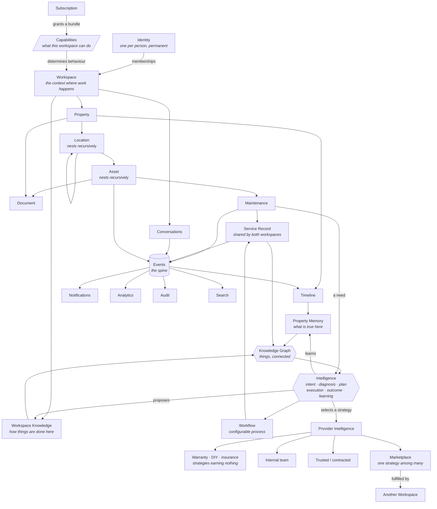
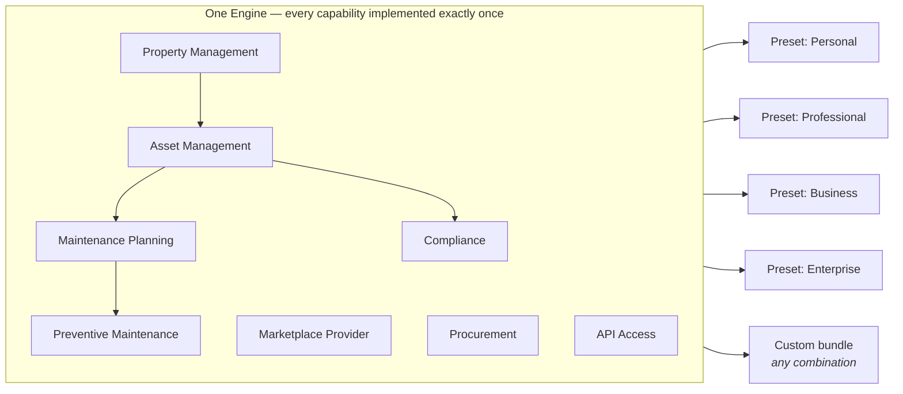
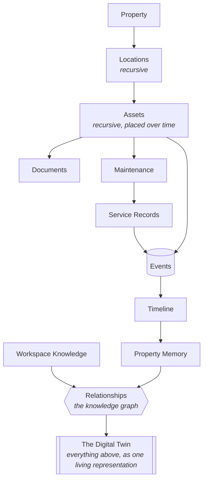
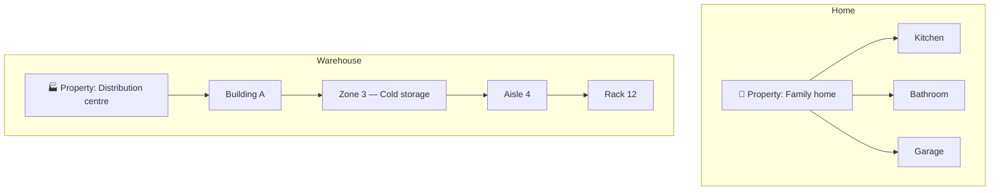
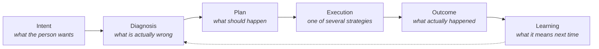
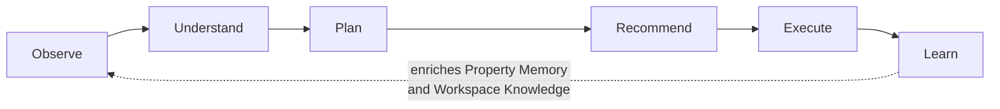

# Klussie — Platform Domain Model

**This document owns:** the permanent domain model of the Klussie
platform — what exists in the world Klussie models, what each concept
means, how the concepts relate, and which boundaries are load-bearing.
It is the highest-level architectural document in this repository and
every other architectural document is subordinate to it.

It does **not** own: storage design (`DATABASE_ARCHITECTURE.md`, to be
written against this model), current system state
(`ARCHITECTURE.md`), project status (`../MASTER_CONTEXT.md`), product
philosophy (`../product/PRODUCT_CONSTITUTION.md`,
`../product/PROPERTY_MEMORY.md`), or anything about implementation.

> **No implementation appears here by design.** No schema, no tables, no
> endpoints, no components, no framework choices. A domain model that
> mentions its storage has already stopped being a domain model. If a
> statement in this document can only be true of one particular
> technology, it is in the wrong document.

**Reading order.** This document assumes
`../product/PROPERTY_MEMORY.md` (the philosophy underneath property
understanding) and is assumed by `DATABASE_ARCHITECTURE.md` (the
storage design that must satisfy it). Where this document and any
existing architectural document disagree about *what the platform is*,
this document wins. Where they disagree about *what is currently built*,
`ARCHITECTURE.md` wins — that distinction is deliberate and is explained
in §29.

---

## Table of contents

**Part I — Foundations**
1. [The Reframe](#1--the-reframe)
2. [The Founding Constraint](#2--the-founding-constraint)
3. [The Concept Map](#3--the-concept-map)

**Part II — Identity and Access**
4. [Identity](#4--identity)
5. [Workspace](#5--workspace)
6. [The Capability Engine](#6--the-capability-engine) — *core chapter*
7. [Membership, Roles and Permissions](#7--membership-roles-and-permissions)
8. [Invitations and External Access](#8--invitations-and-external-access)

**Part III — The Physical World**
9. [Property and the Digital Twin](#9--property-and-the-digital-twin)
10. [Location](#10--location)
11. [Asset](#11--asset)
12. [Document](#12--document)
13. [Maintenance and Service Records](#13--maintenance-and-service-records)

**Part IV — Work and Exchange**
14. [Execution: Intent, Workflow and the Marketplace](#14--execution-intent-workflow-and-the-marketplace)
15. [Conversation](#15--conversation)

**Part V — Memory and Intelligence**
16. [Event](#16--event)
17. [Timeline](#17--timeline)
18. [Property Memory and Workspace Knowledge](#18--property-memory-and-workspace-knowledge)
19. [Intelligence](#19--intelligence)

**Part VI — Platform Services**
20. [Notification](#20--notification)
21. [Search](#21--search)
22. [Analytics](#22--analytics)
23. [Audit](#23--audit)
24. [Subscription and Billing](#24--subscription-and-billing)

**Part VII — Global and Enterprise**
25. [Jurisdiction](#25--jurisdiction)
26. [Consumer and Enterprise Are the Same Platform](#26--consumer-and-enterprise-are-the-same-platform)
27. [Workspace Switching](#27--workspace-switching)

**Part VIII — Closing**
28. [Derived Engineering Rules](#28--derived-engineering-rules)
29. [Trade-offs Accepted](#29--trade-offs-accepted)
30. [Deliberately Not Answered](#30--deliberately-not-answered)
31. [Relationship to Existing Documents](#31--relationship-to-existing-documents)
32. [Architectural Verification](#32--architectural-verification)

---

# The Platform Principles

These fourteen principles are **constraints, not conclusions**. They were
set deliberately at platform-foundation time and they supersede any
earlier assumption they conflict with. Everything in the numbered
sections that follow is an elaboration of them, never an amendment to
them.

A principle is changed only by an ADR that explicitly supersedes it.

| # | Principle | In short |
|---|---|---|
| 1 | **Capability** | A workspace is not defined by its type. A workspace is defined by the capabilities enabled for it. Personal, Professional and Business are merely default capability presets. The platform has one engine; capabilities determine behaviour. |
| 2 | **One Engine** | Every capability is implemented once and shared by every workspace that holds it. Never create parallel implementations. |
| 3 | **One Identity** | A person has exactly one identity and may belong to unlimited workspaces. Identity and membership are separate concepts. Never duplicate identities. |
| 4 | **Context over Roles** | Users never switch roles; they switch active workspace context. Permissions derive from membership. The interface never asks a person to declare themselves "home" or "enterprise." |
| 5 | **Workspace** | Every activity happens inside a workspace. Capabilities differ between workspaces. Architecture does not. |
| 6 | **Property** | Properties belong to workspaces. A workspace may hold many. Never assume one property per person. |
| 7 | **Location** | Every property contains locations. Residential and commercial spaces are the same concept. |
| 8 | **Asset** | Everything maintainable is an Asset. Different metadata, shared engine. |
| 9 | **Marketplace** | Marketplace interactions occur between workspaces, never between people. |
| 10 | **Intelligence Before Marketplace** | Users describe outcomes; the intelligence determines execution. Marketplace selection is one execution strategy among several, never the starting point. |
| 11 | **Outcome Over Activity** | The platform always optimises for the best outcome for the workspace, never for marketplace volume. Where those diverge, the workspace wins — including when the best outcome earns the platform nothing. |
| 12 | **AI** | One AI engine, reasoning over an interconnected knowledge graph of the workspace, its properties, locations, assets, service records, documents, providers and policies. It observes, understands, plans, recommends, executes and learns, continuously enriching Property Memory and Workspace Knowledge. Never a separate consumer and enterprise AI. |
| 13 | **Subscription** | Subscriptions belong to workspaces, not to people. A subscription is a commercial wrapper around a capability bundle. |
| 14 | **Mirror Test** | Every feature must work naturally for homeowners, professionals, businesses, hotels, warehouses, schools and hospitals. If it does not, the abstraction is probably wrong. |

**Principle 1 is the load-bearing one.** Every other principle is either a
consequence of it or a constraint on how it is applied. If the Capability
Principle holds, the platform stays one engine no matter how many markets,
verticals, customer sizes or products it eventually serves. If it is
violated even once — a single behaviour that branches on workspace type —
the platform has begun to fragment, and every subsequent feature pays for
it.

**Where each principle is realised in this document:**

| Principle | Sections |
|---|---|
| 1 · Capability | §6 (the Capability Engine — catalogue, presets, evolution), §24 (subscriptions grant bundles), §28 rules 1–5 |
| 2 · One Engine | §6, §26 (the demonstration), §28 rule 6 |
| 3 · One Identity | §2 (the founding constraint), §4, §8 (invitations never fork an identity) |
| 4 · Context over Roles | §7 (permissions on membership), §27 (switching), §28 rule 13 |
| 5 · Workspace | §5, §6 |
| 6 · Property | §9 (stewardship, portfolios, shared ownership) |
| 7 · Location | §10 (recursive, one concept for all space) |
| 8 · Asset | §11 (nesting, placement over time, taxonomies as configuration) |
| 9 · Marketplace | §14.3 (the five patterns, one mechanism) |
| 10 · Intelligence Before Marketplace | §14.1 (intent and execution strategies), §14.4 (Provider Intelligence), §19.3 (the lifecycle) |
| 11 · Outcome Over Activity | §14.1 (strategies that earn nothing), §29 (the trade-off named) |
| 12 · AI | §19 (one engine, knowledge graph, lifecycle), §18 (memory and knowledge) |
| 13 · Subscription | §24 |
| 14 · Mirror Test | §26 (applied), §28 rule 22 |

---

# Part I — Foundations

## 1 · The Reframe

Klussie began as a marketplace: a customer has a problem, a professional
solves it, the platform takes a cut of the introduction. That model has
a structural ceiling, and it is worth naming precisely, because every
decision in this document is downstream of it.

**A marketplace forgets.** Its unit of value is the transaction. When
the transaction completes, the relationship resets. The second booking
is no cheaper to produce than the first, the platform knows nothing on
the second visit that it did not know on the first, and the only
defensible position is supply density — which is bought, continuously,
and never owned. Marketplaces compete on liquidity forever because they
have nothing else to compete on.

**Klussie is a Property Intelligence Platform.** Its unit of value is
the *property* and the accumulated understanding of it. The marketplace
is one module inside that platform — the module that handles the moment
when understanding needs to become work performed by someone else.

The distinction is not marketing. It changes what the system is
obligated to model:

| | Marketplace | Property Intelligence Platform |
|---|---|---|
| Core noun | Transaction | Property |
| Value over time | Flat — every session starts cold | Compounding — every job deepens understanding |
| Retention driver | Supply density | Accumulated memory the customer would lose by leaving |
| Natural buyer | Consumers seeking a one-off | Anyone responsible for physical things over time |
| Enterprise fit | Poor — enterprises don't want a lead-gen tool | Natural — enterprises already run this model manually |
| AI's role | Better matching | Understanding a specific property |

The last two rows are the strategic argument. A marketplace has no
honest path into enterprise, because an enterprise does not want a
better way to find a plumber — it already has a procurement process.
What an enterprise wants is exactly what a homeowner wants, at a
different scale: to know what it owns, what condition those things are
in, what is about to fail, what was done last time and by whom, and what
that costs over the life of the thing. That is one product, not two.

**The consequence for this model:** the platform must model physical
things and their history as first-class citizens, and must model
"getting someone to come and fix it" as one behaviour among several,
rather than as the point of the entire system.

## 2 · The Founding Constraint

Everything in this document follows from one rule:

> **A person has exactly one identity. A person may act within many
> workspaces. Users never switch identities; they switch workspace
> context.**

This single constraint resolves a family of problems that would
otherwise each need their own mechanism.

**It resolves the dual-account problem.** A plumber is also a person who
lives in a house. In a marketplace built around "customer accounts" and
"provider accounts," that plumber needs two logins, two profiles, two
reputations, two notification streams, and no way to see them together.
Every marketplace that starts with a role on the account eventually
fights this, and the fight is expensive because the role is baked into
the identity. Here, the plumber has one identity, one Personal
Workspace for their home, and one Professional Workspace for their
business.

**It resolves the enterprise-employee problem.** A facilities manager at
a hotel group is also a private individual with a flat and a landlord.
Their employer must be able to grant, scope, and revoke their access to
the hotel's workspaces without touching anything about them as a person,
and without their private property history being visible to their
employer — ever, under any administrative role.

**It resolves the tenancy problem before it exists.** The workspace is
the tenancy boundary. Because it is introduced at the very beginning,
before there is meaningful data, the platform never has to perform the
retrofit that ends most consumer products' enterprise ambitions: adding
an organisation dimension underneath millions of rows that assumed a
single user owned everything.

**It resolves the identity-versus-legal-entity problem.** Contracts,
invoices, tax registration, insurance, and payouts belong to legal
entities, not to human beings. A workspace can represent a legal entity;
an identity cannot, because one person may be a director of several
companies and an employee of another.

### The boundary is the architecture

The workspace is not merely a grouping. It is deliberately the *same*
boundary for six independent concerns, and this coincidence is the
central load-bearing idea of the platform:

| Concern | Boundary |
|---|---|
| Data isolation — what you can see | Workspace |
| Permission evaluation — what you can do | Workspace membership |
| Commercial relationship — who pays, for what plan | Workspace |
| AI context — what the assistant knows about right now | Workspace |
| Marketplace participation — who is transacting with whom | Workspace |
| Jurisdiction — which country's rules apply | Workspace (see §25) |

When one boundary serves every concern, there is one thing to get right,
one thing to test, and one thing to explain. When these are six different
boundaries — as they are in most platforms that grew into enterprise —
every feature must reason about all six, and the combinations are where
security failures live.

**Trade-off, stated plainly.** This constraint imposes a concept on the
99% case that does not need it. A person with one home has one workspace
and will never think about workspaces at all — but every part of the
system still carries the workspace dimension. That cost is accepted, and
§27 and §29 describe how it is kept invisible in the product and what it
costs in engineering.

## 3 · The Concept Map

The whole model in one view. Read it as "what contains what" and "what
refers to what," not as storage.



Five things to notice, because they are the shape of the whole system:

1. **Capabilities sit between the subscription and everything the
   workspace does.** They are the only thing that varies behaviour. There
   is no second mechanism, and in particular there is no workspace type
   in this diagram — because type is a preset name, not a structural
   concept (§6).
2. **Identity connects to everything only through Workspace.** There is
   no path from a person to a property that does not pass through a
   membership. This is what makes permission evaluation tractable.
3. **Events are the spine.** Timeline, Notifications, Analytics, Audit,
   Search and — through Timeline — Property Memory are all *derived*
   from the same event stream rather than being separately maintained.
   §16 explains why this is a genuine commitment and not a diagram
   convenience.
4. **Intelligence sits between the need and the marketplace, and the
   marketplace is one strategy of several.** A need reaches the
   intelligence, which diagnoses, plans, recommends, and — once a human
   agrees — selects how it gets done. Several available strategies earn
   the platform nothing, which is deliberate (§14.1). The platform is
   whole without the marketplace; the marketplace is not whole without
   the platform.
5. **Service Records close the circle.** However work gets executed —
   internal team, trusted provider, marketplace, warranty — it produces
   the same record, which returns to the property's history and into the
   knowledge graph. This is the mechanism by which the platform compounds
   rather than resetting after each transaction, and it is why everything
   above is one system rather than a marketplace with a database attached.

---

# Part II — Identity and Access

## 4 · Identity

**What it is.** The permanent representation of a single human being.
It answers exactly one question: *who is this person?* It carries
authentication factors, the person's name and preferred language, their
communication channels, and their platform-wide preferences. It carries
nothing about what they do, own, or are permitted to do.

**Why it exists separately from everything else.** Because roles are
temporary and identities are not. A person may be a customer this year, a
professional next year, an employee of three companies over a decade, and
a homeowner throughout. If the platform encodes any of that in the
identity, then every change of circumstance becomes a data migration for
that person, and the platform can never truthfully answer "is this the
same person?" across contexts — which is the question that reputation,
fraud prevention, and account recovery all depend on.

**What Identity deliberately does not carry.**

- No role. "Customer" and "professional" are not properties of a person.
- No reputation. Reputation is earned by a *workspace* through work
  performed under it — see §14. A person's rating as a plumber says
  nothing about them as a homeowner, and conflating the two is both
  inaccurate and a privacy leak.
- No property, no asset, no document. All of these belong to workspaces.
- No subscription. Plans belong to workspaces (§24).

**How it scales.** Identity is the smallest and least-changing concept in
the platform, which is what allows it to be the one thing consulted on
every single request. It is also the natural boundary for the platform's
strongest privacy guarantee: *an identity's presence in one workspace is
never discoverable from another workspace.*

**How it evolves.** The realistic extensions are all about assurance,
not about structure: additional authentication factors, verified
attributes attached to the person (government ID, professional
certification, background check) held once and *presented* to workspaces
rather than duplicated into them, and federated identity (§8) where the
person authenticates through an employer's provider while remaining the
same platform identity.

**Trade-off.** One identity per person is an assertion the platform can
never fully enforce — nothing prevents someone from creating two. The
model accepts this. The guarantee being made is not "no person has two
identities"; it is "the platform never *requires* a person to have two,"
which is the property that actually matters for user experience and for
the integrity of verified attributes.

## 5 · Workspace

**What it is.** A workspace is a bounded context in which work happens.
It is the answer to *on whose behalf, and within whose world, is this
action taking place?*

Every meaningful object in the platform belongs to exactly one
workspace. Every action is performed by an identity acting *within* a
workspace. There is no such thing as an action taken by a person alone,
and no such thing as data that floats outside a workspace.

**Why it exists.** Because "on whose behalf" is a question that consumer
software usually answers implicitly — the answer is always "the person
logged in" — and that implicit answer is precisely what cannot be
extended to organisations, families, or professional practices. Making
the answer explicit from the beginning is what allows one engine to serve
a homeowner and a hospital.

**What a workspace has, regardless of type.**

- A name and a visual identity, chosen by its members, because people
  navigate between workspaces by recognition (§27).
- A type, and — more importantly — a capability set (§6).
- Members, each with a role (§7).
- A jurisdiction (§25).
- A subscription (§24).
- Its own data: properties, assets, documents, conversations, timeline,
  memory.
- Its own AI context (§19).

**How it scales.** The workspace is the natural unit of partition. It is
the value that appears in every access decision, every query, every
cache key, every AI context assembly, and every audit record. A platform
where the isolation boundary and the partition boundary are the same
thing can grow by adding partitions, and can, if it ever needs to, place
different partitions in different regions without changing the model —
which is what makes §25 possible rather than aspirational.

**How it evolves.**

- **Workspace groups.** A hotel chain with eleven properties will
  eventually want them as eleven workspaces (so that a site manager in
  Antwerp cannot see Brussels) under one commercial and administrative
  umbrella. That umbrella — consolidated billing, group-level
  administrators, cross-workspace reporting — is a genuine future
  extension. It is deliberately *not* in the initial model, because a
  group is only meaningful once multi-workspace enterprises exist, and
  introducing it early would put a second, mostly-empty boundary into
  every access decision.
- **Workspace templates.** A new franchise location, a new rental unit,
  a new construction project — all benefit from being created
  pre-populated. This is configuration, not new structure.
- **Archival rather than deletion.** A workspace that ends — a business
  that closes, a property portfolio that is sold — must become
  inaccessible without destroying the history that other workspaces
  legitimately reference (a completed job, a review, an invoice). See
  §30 for what remains unresolved here.

**Trade-off.** The workspace boundary is strong, and strong boundaries
make legitimate crossings expensive. Every genuinely cross-workspace
feature — the marketplace itself, a shared property between a landlord
and a tenant, group reporting — needs an explicit, designed mechanism
rather than a query. This is the correct trade (implicit crossings are
how data leaks), but it is a real and recurring cost.

## 6 · The Capability Engine

This is the chapter that determines whether the platform survives its own
growth. Everything else in this document describes *what the platform
models*. This describes *what makes it one platform* instead of several
wearing the same name.

### 6.1 · The rule

> **A workspace is not defined by its type. A workspace is defined by the
> capabilities enabled for it.**
>
> No behaviour anywhere in the platform may branch on workspace type.
> Behaviour branches on capabilities. Type is a preset name and a label
> for humans — nothing more.

Personal, Professional and Business are not three products, three
architectures, or three code paths. They are three **named bundles of
capabilities**, and a workspace's bundle can be changed, extended,
customised or ignored entirely without the platform noticing anything
unusual has happened.

### 6.2 · What a capability is

A capability is a **named, coarse-grained unit of product behaviour that
a workspace either holds or does not hold.**

Three properties define it:

- **It is describable to a customer.** "This workspace can plan
  preventive maintenance." If a capability cannot be explained to the
  person paying for it, it is too fine-grained — it is a feature, not a
  capability.
- **It is durable.** Capabilities are part of the platform's permanent
  vocabulary. They are not rollout switches and they do not get deleted
  after a launch.
- **It is orthogonal to who is using it.** A capability says what the
  *workspace* can do. It says nothing about what any particular member
  may do.

That last point is the one most often collapsed, and collapsing it
produces security bugs, so it is stated as a separate rule:

> **Capability and permission are two independent gates, and both must
> pass.** The capability answers *"is this behaviour available in this
> workspace at all?"* The permission (§7) answers *"may this member, in
> this workspace, with this role and scope, do it?"*

A workspace without the Procurement capability has no approval workflow
for anyone, including its owner. A workspace with it still refuses a
member who lacks the permission. Neither gate substitutes for the other,
and no feature may check only one.

**Capabilities are not feature flags.** They are frequently confused
because both are switches. The difference is ownership and lifespan: a
feature flag is an *engineering* mechanism for rolling out or rolling back
a change, is temporary, and should be deleted once a change is fully
live. A capability is a *product and commercial* surface, is permanent,
and is granted per workspace. They should be built on shared machinery
and must never be conflated in meaning — a capability that disappears
after launch was a flag, and a flag that customers can buy was a
capability all along.

**Capabilities declare dependencies.** Preventive Maintenance is
meaningless without Asset Management, which is meaningless without
Property Management. Compliance depends on Document Intelligence to be
worth anything. The engine resolves these: granting a capability grants
what it requires, and a capability cannot be withdrawn while something
that depends on it is still held. This keeps bundles honest — a preset
cannot accidentally promise something it has not enabled the foundations
for.



The arrows into the presets are *selections*, not implementations. There
is exactly one Property Management capability, and a household and a
hospital run the same one.

### 6.3 · Why capabilities are superior to workspace branching

The alternative — asking *"is this a business workspace?"* wherever
behaviour differs — fails in five distinct ways. They are worth
enumerating, because each one is a real cost that arrives later and is
paid forever.

**1. Type branching multiplies with every new type.** The model names
three types today and anticipates Enterprise and White Label. Reality
will add landlords, property managers, housing associations, franchises,
insurers and municipalities. With type branching, each addition is a
sweep through every conditional in the codebase, and every sweep is an
opportunity to miss one. With capabilities, each addition is a new
preset — a data change with no code in it.

**2. Type branching cannot express the customer who does not fit.** A
large household that wants compliance tracking for a listed building. A
professional who manages properties as well as servicing them. A small
business that needs one enterprise integration and nothing else. Under
type branching each is a special case, and special cases are where
platforms go to die. Under capabilities each is a grant.

**3. Type branching couples product decisions to deployment.** Changing
what a Business workspace includes means changing and shipping code.
Changing a capability preset is configuration — it can be piloted with
one customer, varied by jurisdiction (§25), sold as an add-on, or
reverted, at any time, by someone who is not an engineer.

**4. Type branching hides the real question.** `if (type === 'business')`
does not say *why*. Six months later nobody knows whether that branch was
about compliance, about team size, about billing, or about an assumption
that has since become false. `if (workspace.can(Compliance))` states its
own reason. The code becomes the documentation of who gets what.

**5. Type branching is how fragmentation begins.** This is the serious
one, and §6.6 treats it on its own.

### 6.4 · How capabilities simplify engineering

**One implementation, always.** A feature is built once, declares the
capability it belongs to, and is available to every workspace holding
that capability. There is no consumer version and no enterprise version
of anything. Asset recognition built for a dishwasher works on a forklift
because there is only one asset engine, and it was never told what kind
of customer it was serving.

**Features become declarative.** A feature declares what it requires
rather than testing who is asking. This inverts the dependency: the
feature no longer needs to know the taxonomy of customers, which means
the taxonomy can change without touching the feature.

**Testing collapses from combinations to units.** Under type branching, a
feature must be tested against every type, and a new type re-opens every
test. Under capabilities, a feature is tested with its capability present
and absent. Two states, regardless of how many presets, tiers, verticals
or countries exist now or later.

**Deletion becomes possible.** Type-branched code accumulates because
nobody can prove which branches are still reachable. A capability's call
sites are enumerable by construction, which means a capability can be
genuinely retired rather than left in place forever out of caution.

**The commercial model and the technical model stay the same object.** A
plan grants a bundle (§24). There is no translation layer between what
was sold and what the software does, and therefore no drift between them.

### 6.5 · How capabilities reduce duplicate code

The duplication that capabilities prevent is rarely deliberate. It
happens in a specific and predictable way, and naming the sequence is the
best defence against it:

1. An enterprise customer needs work orders with approval steps.
2. The existing maintenance flow does not have approvals, and adding them
   is judged risky for the consumer experience.
3. An "enterprise work order" flow is built alongside the existing one.
4. Both now need scheduling. Scheduling is written twice, or written once
   and bent to serve two shapes.
5. Six months later a fix lands in one and not the other, and no
   individual decision along the way was unreasonable.

The capability model breaks the sequence at step 3, because there is
nowhere to put a second flow. Approvals are a capability that the
existing maintenance flow honours when present and ignores when absent.
The consumer experience is protected by the *absence of a capability*
rather than by the *presence of a second implementation* — and that is
the entire trick.

The general form:

> **When two customers need different behaviour, the answer is one
> implementation with a capability, never two implementations with a
> type check.**

### 6.6 · How capabilities prevent platform fragmentation

Fragmentation is not a single event. It is the accumulated result of many
locally sensible decisions, and it is effectively irreversible once the
duplicated paths have their own customers.

A fragmented platform has these symptoms, in roughly this order: a
feature that exists for one customer segment and not another with no
stated reason; two names for the same concept; a bug fixed in one place
and not the other; a customer who cannot be served because they need
pieces of two segments; an engineer who must know which segment a request
came from before they can begin; and finally, a decision to split the
codebase formally, because it has already split informally.

The Capability Principle is the structural defence, and it works because
it removes the *option*. There is no "enterprise codebase" to put
something in. A capability either exists for everyone who holds it or it
does not exist.

**The check to run, repeatedly:** ask of any proposed work, *would this
be implemented differently for a household than for a hospital?* If the
answer is yes, either a capability is missing, or the abstraction is
wrong (§26, the Mirror Test). It is never a reason to write it twice.

### 6.7 · The capability catalogue

Capabilities are grouped below by what they are *for*, because that is how
presets are assembled and how customers understand them.

**This is a catalogue, not a schema, and explicitly not a fixed list.**
It is expected to grow continuously and for the growth to be unremarkable
— §6.9 is the argument that adding to it is the platform's normal mode of
expansion rather than an architectural event.

**Demand and supply**

| Capability | What it enables |
|---|---|
| **Marketplace Consumer** | Requesting work from other workspaces; receiving and accepting quotes. |
| **Marketplace Provider** | Being discoverable as supply; receiving requests, quoting, performing work, being reviewed. |
| **Portfolio & Reputation** | A public profile, published work, testimonials and the reputation that attaches to a providing workspace (§14). |
| **Procurement** | Structured buying: approval chains, budget thresholds, purchase orders, preferred-supplier lists. |
| **CRM** | Managing relationships with customers over time — history, notes, follow-up, repeat-business tracking. |

**The physical world**

| Capability | What it enables |
|---|---|
| **Property Management** | Holding properties and their location hierarchies (§9, §10). The foundation nearly everything else depends on. |
| **Asset Management** | Registering assets, their placement over time, condition and lifecycle (§11). |
| **Inventory** | Consumables and stock — quantities that deplete, rather than assets that age. |
| **Fleet Management** | Vehicles and mobile plant: assets whose defining attribute is that they move, with usage-based rather than time-based service intervals. |

**Care over time**

| Capability | What it enables |
|---|---|
| **Maintenance Planning** | Recording maintenance, scheduling it, and tracking what is due (§13). |
| **Preventive Maintenance** | Interval- and condition-driven schedules generated rather than manually entered. |
| **Compliance** | Obligations with legal force: statutory inspections, certifications, expiry tracking, evidence. |
| **Advanced Compliance** | Regulated-industry depth — audit-ready evidence chains, retention regimes, tamper-evident records, regulator-facing reporting. Split from Compliance because most customers need the first and very few need the second; that split is the ordinary way a capability tiers. |
| **Scheduling** | Time, availability, appointments, dispatch and calendars. |

**Knowledge and intelligence**

| Capability | What it enables |
|---|---|
| **Property Memory** | Accumulated understanding of a specific property (§18). |
| **Document Intelligence** | Reading documents to propose structured facts — invoices, manuals, certificates (§12). |
| **AI Premium** | Deeper reasoning, proactive behaviour, longer horizons, population-scale analysis within a workspace (§19). |
| **Analytics** | Aggregated reporting within a workspace (§22). |

**Working together**

| Capability | What it enables |
|---|---|
| **Team Collaboration** | Multiple members, assignment of work, internal discussion, scoped roles at depth (§7). |
| **Workflow Automation** | Rules that act on events: when this happens, do that, notify them, require approval from her. |
| **Notifications** | Reaching people across channels, with escalation and rotas at higher volumes (§20). |

**Commercial**

| Capability | What it enables |
|---|---|
| **Billing** | Issuing invoices, terms, accounts, tax handling appropriate to the jurisdiction (§25). |
| **Payments** | Moving money — collection, payout, settlement between workspaces (§14). |

**Extension**

| Capability | What it enables |
|---|---|
| **API Access** | Programmatic access to the workspace's own data and behaviour. |
| **Enterprise Integrations** | Connections to a customer's existing systems, and outbound event subscription (§16). |
| **Federated Identity** | Single sign-on and directory-driven membership (§8). |
| **White Label** | The platform presented under another organisation's brand, taxonomy and terminology (§24). |

### 6.8 · Workspace presets

A preset is a **named default bundle**. It is a starting point and a
convenience, never a constraint — a workspace may hold any combination of
capabilities, and presets exist so that the overwhelming majority never
have to think about that.

| | Personal | Professional | Business | Enterprise |
|---|:---:|:---:|:---:|:---:|
| Property Management | ● | ● | ● | ● |
| Asset Management | ● | ● | ● | ● |
| Property Memory | ● | ● | ● | ● |
| Marketplace Consumer | ● | ● | ● | ● |
| Maintenance Planning | | ● | ● | ● |
| Notifications | ● | ● | ● | ● |
| Marketplace Provider | | ● | | |
| Portfolio & Reputation | | ● | | |
| Scheduling | | ● | ● | ● |
| Billing | | ● | ● | ● |
| Payments | | ● | ● | ● |
| Fleet Management | | ● | ● | ● |
| CRM | | ● | | ● |
| Team Collaboration | | ● | ● | ● |
| Preventive Maintenance | | | ● | ● |
| Compliance | | | ● | ● |
| Procurement | | | ● | ● |
| Analytics | | | ● | ● |
| Inventory | | | ● | ● |
| Document Intelligence | | | ● | ● |
| Workflow Automation | | | | ● |
| Advanced Compliance | | | | ● |
| API Access | | | | ● |
| Enterprise Integrations | | | | ● |
| Federated Identity | | | | ● |
| White Label | | | | ○ |

● granted by default · ○ available, negotiated

**What this table is not.** It is not a product specification and it is
not binding. It is an illustration of how presets compose, and the
individual assignments are expected to move as the product learns what
customers actually need. Nothing in the architecture changes when a dot
moves.

**Three things the table is meant to show:**

1. **Enterprise is not a different product.** It is the Business preset
   plus five capabilities. Every one of those five is available to any
   workspace that has a reason for it.
2. **Presets overlap heavily.** The physical model and Property Memory
   are in every preset, because they are the platform. A homeowner and a
   hospital differ in what they add, never in what they stand on.
3. **The Professional preset is not a directory listing.** A professional
   workspace holds Property Management and Asset Management like everyone
   else, because a plumbing firm has premises, vans and tools —
   and is therefore a customer of the platform even when it receives no
   marketplace work at all.

**On the Business workspace generally.** Hotels, factories, warehouses,
schools, hospitals, restaurants, retail, office buildings and
municipalities differ enormously in operations and not at all in domain
model. Each has properties, locations, assets, documents, people who
maintain things, and external providers. What differs is which
capabilities they hold and how their taxonomies are configured. §26
makes this argument in full.

### 6.9 · Capability evolution — how the platform grows

**New products are new capabilities.** This is the claim the Capability
Principle is ultimately for, and it should be tested against genuinely
distant examples rather than comfortable ones:

| Future product | New concepts needed? | What it actually is |
|---|---|---|
| **Energy Monitoring** | None | Assets that produce readings over time; a capability that interprets them and feeds Property Memory. |
| **IoT Sensors** | None | A source of observations attached to assets and locations, entering the platform as events (§16). |
| **Building Automation** | None | Assets that can be acted upon as well as observed; actions are events under a member's authority (§19). |
| **Smart Home** | None | Building Automation with a consumer preset and consumer language. |
| **Insurance** | None | Documents with validity, assets with values, history as evidence; a capability that packages them. |
| **ERP Integration** | None | Enterprise Integrations applied to a specific system family. |
| **Accounting Integration** | None | Billing and Payments exposed through Enterprise Integrations. |
| **Facility Management** | None | Property Management, Maintenance Planning, Team Collaboration, Compliance and Procurement — a preset, not a product. |
| **Municipality Management** | None | Facility Management at civic scale, with jurisdiction-specific taxonomies and reporting (§25). |

**Not one of these requires a new platform architecture.** Each is a
capability — occasionally a preset composed of existing capabilities, and
often nothing more than a named bundle with its own marketing. The
platform experiences a new vertical as configuration.

**The test to apply when something new is proposed:**

> Can this be expressed as a capability over the existing model — identity,
> workspace, property, location, asset, document, event, knowledge,
> marketplace, intelligence? If yes, build it as a capability. If no, the
> model needs a deliberate extension recorded as an ADR. It is never a
> reason to build a second platform.

**How capabilities themselves evolve.** They split (Compliance into
Compliance and Advanced Compliance, as customers separate into those who
need evidence and those who need audit-grade evidence); they merge, when
two turn out to always travel together; they deprecate, when the product
moves on; and they are versioned, so that a capability's meaning can
change for new grants without silently changing for existing ones.

### 6.10 · What happens when a capability is withdrawn

A real question, because plans get downgraded, trials end, and customers
leave. The rule:

> **Withdrawing a capability removes behaviour. It never destroys the
> data that behaviour produced.**

A workspace that loses Compliance stops generating obligations and
schedules; its certificates and history remain, visible and exportable.
A workspace that loses Team Collaboration stops accepting new members;
existing history keeps its authorship. Restoring the capability restores
the behaviour over the intact record.

This is a domain rule rather than an implementation preference, and it
matters commercially as well as ethically: a customer who cannot safely
try a capability will not try it, and a customer who fears losing their
history on downgrade will not upgrade in the first place.

### 6.11 · Trade-offs

**Indirection costs local readability.** You cannot tell from a feature's
code alone which workspaces receive it. Mitigated by keeping capabilities
coarse and few, and by the rule in §6.2 that a capability must be
describable to a customer.

**Granularity has no correct answer.** Too coarse and customers pay for
things they do not want; too fine and the catalogue becomes an
unmanageable matrix that nobody can reason about or sell. The bias is
deliberately toward coarse, and splitting later (§6.9) is the intended
correction path.

**Dependency graphs can tangle.** As the catalogue grows, dependencies
between capabilities can become a graph nobody fully holds in their head.
The mitigation is to keep dependencies shallow and directional — the
physical model at the bottom, extension capabilities at the top — and to
treat a cycle as a modelling error rather than something to resolve.

**Presets can drift from reality.** A preset that no longer matches what
customers of that type actually need produces friction on every sale.
This is a product-maintenance obligation, and it is a far cheaper one
than the code-sweep that type branching would require instead.

## 7 · Membership, Roles and Permissions

**Membership** is the link between an identity and a workspace. It is
where every access question is answered. A person with no membership in a
workspace does not merely lack permission — the workspace does not exist
from their perspective, and its non-existence must be indistinguishable
from a workspace that was never created.

A membership carries: the identity, the workspace, a role, an optional
scope (below), a state (invited, active, suspended, ended), and its
validity period.

**Why permissions live on the membership.** Because the same person must
be able to be an owner in one workspace and a read-only guest in
another, simultaneously, with no possibility of the two being confused. A
permission attached to an identity would be global and therefore wrong. A
permission attached to a workspace would be uniform across members and
therefore useless.

**Roles** are named bundles of permissions, defined per workspace type as
sensible defaults. The role names differ by context because the humans
using them differ — a household does not want to be told it has
"administrators" — but the underlying permission grammar is identical.

| Personal | Professional | Business | Permission shape |
|---|---|---|---|
| Owner | Owner | Administrator | Everything, including ending the workspace |
| Household member | Manager | Manager | Everything operational; no commercial or membership control |
| — | Employee | Team member | Perform and record work; cannot alter commercial settings |
| Guest | — | Auditor / Viewer | Read only, often scoped |
| — | Contractor | External provider | Time-boxed, scope-limited (§8) |

**Scoped roles.** A permission grant may be narrowed to part of a
workspace — typically a subtree of locations or a set of properties. A
site manager for two of a chain's eleven hotels is an administrator
*within those two properties only*.

This is included in the founding model rather than deferred, for one
reason: scoping is nearly free to design in and extremely expensive to
retrofit, because retrofitting it means revisiting every access decision
ever written under the assumption that membership implies whole-workspace
access. Consumer workspaces will never use it. Enterprise workspaces
cannot function without it.

**How permission evaluation must behave.** Three properties, stated as
behaviour rather than mechanism:

1. **Deny by default.** Absence of a grant is denial, never an error to
   be interpreted.
2. **Single evaluation point.** Every access decision answers the same
   question — *does this identity, in this workspace, with this role and
   scope, hold this permission over this object?* There is no second,
   parallel way to gain access.
3. **Explainable.** For any decision, the platform must be able to say
   *why* — which membership, which role, which grant. Enterprises will
   ask; auditors will require it; and an authorisation system that cannot
   explain itself cannot be trusted to be correct.

**How it evolves.** Custom roles for enterprises (composing permissions
rather than picking a preset), approval workflows as a permission concept
(the right to *request* an action distinct from the right to *perform*
it, which is how procurement actually works), and delegation with an
expiry (cover during leave).

**Trade-off.** Scoped roles make permission evaluation hierarchical
rather than flat, which is genuinely harder — it depends on the location
tree in §10, and a scope must be re-evaluated when that tree changes.
The alternative, whole-workspace-or-nothing access, is simpler and
closes the enterprise market permanently.

## 8 · Invitations and External Access

Every way a person gains access to a workspace is one mechanism —
membership — created through one of several routes. The routes differ in
who initiates and who approves; what they produce is identical, which is
what keeps access review comprehensible.

**Direct invitation.** A member with membership-management permission
invites a person by a communication channel. If that channel already
belongs to an identity, the invitation appears to that person in their
existing account, and accepting it adds a workspace — it never creates a
second identity. If it does not, the person creates an identity and the
invitation resolves into a membership. This is the mechanism by which
the "one identity" rule survives contact with real-world invitations,
and it must never be compromised for onboarding convenience.

**Request to join.** A person asks to join a workspace they can
identify. An administrator approves or declines. This inverts the
initiative and matters for large organisations, where a new employee
knows their employer's workspace exists but no administrator knows the
employee has arrived.

**Approval modes.** A workspace configures how membership is granted:
open (any invitee joins immediately), approval-required (an administrator
confirms every join), or domain-verified (people authenticating with a
verified organisational email domain join automatically at a default
role). Consumer workspaces will use the first; enterprises require the
second or third.

**Temporary contractor access.** An external professional needs to see
part of a workspace — the machine hall, the plant room, the affected
apartment — for a bounded period, and must lose that access
automatically. This is not a special mechanism: it is a membership with a
scope (§7) and an expiry. Expiry is a property of every membership, and
is simply unset for permanent ones.

Designing this as ordinary membership rather than a parallel
"external access" concept is deliberate. A separate mechanism would mean
two systems that grant access, two places to audit, and two chances to
get revocation wrong.

**Marketplace-derived access.** When a workspace engages a professional
workspace through the marketplace (§14), the engagement itself creates a
narrowly scoped, time-boxed grant: the professional can see the location
and assets relevant to the work, the conversation, and nothing else. It
ends when the work does.

This is the same mechanism again, and it is the point at which the
marketplace stops being a directory and becomes part of the platform: a
booking is not an introduction, it is a temporary, revocable, audited
extension of a workspace's boundary.

**Federated identity and directory integration** (future). Enterprises
above a certain size will not accept per-person credentials in a
third-party system. The realistic sequence is: single sign-on so that
authentication happens at the employer's provider while the platform
identity remains the same identity; then directory synchronisation, so
that joining, moving between sites, and leaving the organisation
propagate into memberships automatically; then group-to-role mapping, so
that the employer's existing organisational structure drives scoped
roles without manual administration.

Nothing about this is speculative structurally — it is the same
membership, created and ended by an external authority instead of by a
human administrator. The model is ready for it; the integration work is
significant and belongs to whichever phase first has an enterprise
customer that requires it.

**Trade-off.** Directory-driven membership means an external system can
grant access to workspace data. That is exactly what the customer is
asking for, and it moves part of the platform's security posture to the
customer's identity provider. This is standard, expected, and must be
explicit in the security model rather than discovered later.

---

# Part III — The Physical World

This part is the heart of the platform. It is also where the consumer
and enterprise arguments are won or lost, because a physical model that
is too shallow for a factory or too heavy for a flat forces the
duplicate architecture that §28 forbids.

## 9 · Property and the Digital Twin

### 9.1 · Property

**What it is.** A property is a place in the world that someone is
responsible for. A house, an apartment, a holiday home, a workshop, a
hotel, a warehouse, a school campus, a municipal depot.

**Why it exists as its own concept.** Because it is the thing that
accumulates value in this platform. Memory attaches to a property, not to
a person and not to a workspace. This distinction is what allows a
property's understanding to outlive the arrangement that currently
manages it.

**Stewardship, not ownership.** A workspace *stewards* a property — it
is currently responsible for it. Stewardship is a relationship with a
beginning and possibly an end, not an inherent attribute of the property.

This is a deliberate and consequential choice. It follows directly from
the two clocks in `../product/PROPERTY_MEMORY.md` §5: the ownership
lifecycle is bounded and personal, the property lifecycle is continuous
and physical. A model in which a property is an inseparable child of a
workspace makes the property lifecycle inexpressible — the roof's
replacement schedule would be destroyed by a house sale, and a landlord
could not hand a unit's maintenance history to a managing agent without
copying it.

Modelling stewardship as a relationship means the platform *can* express
transfer, portfolio movement between managing agents, and shared
responsibility. Whether it *should* transfer memory on a sale is a real
question with a privacy dimension, and `PROPERTY_MEMORY.md` §5
deliberately leaves it open. This document does not resolve it either
(§30) — it only ensures the model does not foreclose the answer.

**Shared and overlapping stewardship** (future extension). A rented flat
is stewarded by a landlord and inhabited by a tenant, and both have
legitimate, different, partially-overlapping interests in its assets and
history. A managed building has an owner, a managing agent, and
residents. This is genuinely multi-workspace and genuinely hard; the
model permits it by making stewardship a relationship rather than a
containment, and defers the design.

**How it scales.** Properties are numerous but small and slow-changing.
A consumer stewards one to three; a large enterprise may steward
thousands. Nothing about the concept behaves differently at either end.

### 9.2 · The Digital Twin

**What it is.** The platform's continuously evolving digital
representation of a real property — everything it knows about that
building, accumulated over the building's life.

**What it is not.** It is not a 3D model, a floor plan, or a rendering.
Those are *inputs* the twin can eventually absorb, not what it is. The
twin is the complete, structured, living answer to *"what is this
property, what is in it, what has happened to it, and what does that
mean?"*

**The twin is not a new structure.** This is the point of naming it. The
Digital Twin is the *composition* of concepts this document already
defines, and giving the composition a name is worth doing because it is
what future technologies attach to:



Each layer adds a different kind of truth: **Locations** give it space,
**Assets** give it contents, **Documents** give it evidence,
**Maintenance and Service Records** give it a history of care, **Events**
give it a chronology, **Memory** gives it interpretation, **Knowledge**
gives it policy, and **Relationships** (§19.2) give it the connections
that make any of it reasoning material rather than a filing cabinet.

**Why this abstraction earns its place.** Because it is the answer to a
question that would otherwise force architectural change repeatedly:
*where does the next generation of building technology plug in?*

| Future technology | What it actually is, to the twin | New architecture needed |
|---|---|---|
| **IoT sensors** | A source of observations attached to an asset or location, arriving as events | None |
| **Energy monitoring** | Sensor observations aggregated at property and location level, interpreted by memory | None |
| **Floor plans** | A spatial attribute of locations — the twin gains coordinates it did not have | None |
| **BIM models** | A rich import that populates locations and assets at depth, with relationships already expressed | None |
| **Building automation** | Assets that can be *acted upon* as well as observed; actions are events under a member's authority (§19) | None |
| **Smart home** | Building automation with a Personal preset and consumer language | None |
| **Enterprise facilities** | The same twin at greater depth, volume and regulatory obligation | None |

**Not one of these requires a structural change**, because each is either
a new source of observations, a new attribute on an existing concept, or
a new capability (§6.9). That is the test the Digital Twin abstraction
exists to pass, and it is the reason to name it now rather than after the
first sensor integration has bent the model around itself.

**The twin grows for the life of the building, not the life of the
account.** This is where §9.1's stewardship model pays off. A twin
started by one owner and continued by the next is one continuous
representation of one continuous building — which is the difference
between a property that has a history and an account that has a log.

**How it evolves.** Spatial resolution (coordinates, plans, models);
real-time state alongside recorded history; simulation, where the twin is
used to ask *what if* rather than only *what happened*; and eventually
twins of things other than buildings — a fleet, an estate, a campus —
since nothing in the composition is specific to a structure with walls.

**Trade-offs.** A twin is only as good as what has been recorded, and it
starts nearly empty; the product must be useful before the twin is rich,
or the twin never becomes rich. And the richer it becomes, the more
valuable it is to the customer *and* the harder the platform is to leave
— which obliges the platform to keep it exportable in a genuinely usable
form (§18.2 makes the same commitment about knowledge).

## 10 · Location

**What it is.** A place *within* a property. A kitchen. A bathroom. A
garage. A machine hall. Aisle 4. Rack 12. The plant room. Floor 3. Room
314.

**Locations nest, recursively and without a fixed depth.** This is the
most important structural decision in Part III.

A home is a shallow tree: property → rooms. A hotel is deeper: property
→ building → floor → room. A warehouse is deeper still: site → building
→ zone → aisle → rack → shelf. A hospital may be deeper again. Any model
with a fixed number of levels either cannot express a warehouse or
burdens a homeowner with levels that mean nothing to them.



Both are the same structure. The home simply stops after one level.
**Depth is a property of the customer's world, not of the software.**

**Why this is worth the cost.** Recursive structures are harder to query
and index than fixed hierarchies — this is a genuine and well-understood
engineering cost, and it lands in `DATABASE_ARCHITECTURE.md`. It is
accepted because the alternative is two physical models, and two physical
models means two of everything downstream: two maintenance systems, two
search behaviours, two AI contexts, two permission scoping rules. The
recursion is paid for once, in one place.

**Locations carry meaning, not just position.** A location has a type
(kitchen, plant room, cold storage) drawn from a configurable taxonomy,
and that type is what allows the platform to reason without being told:
a cold storage zone has temperature obligations, a plant room contains
the systems that fail expensively, a kitchen is where a particular family
of appliances lives. Taxonomies are configuration and vary by
jurisdiction and industry — never hardcoded (§28).

**How it evolves.** Spatial attributes (floor area, volume, coordinates)
for planning and for on-site navigation; occupancy and use-period
tracking, which is what turns a hotel room or a rented unit into a
schedulable thing; and eventually plan or model references, so a location
can be pointed at on a drawing.

**Trade-off.** Free-depth trees permit nonsense — a user can build
fifteen meaningless levels. The mitigation is product guidance and
templates, not structural restriction. Restricting depth to prevent
misuse would reintroduce exactly the limit that makes enterprise
impossible.

## 11 · Asset

**What it is.** A physical thing that has a lifecycle, needs care, and
whose history is worth remembering. A dishwasher. A boiler. A roof. A
forklift. An HVAC unit. A production line. A van. A fire door.

**Why it exists.** Because the asset — not the job and not the room — is
the true anchor of maintenance history and prediction. "This boiler has
been serviced three times in two years" is a statement about an asset. It
is the sentence that makes `PROPERTY_MEMORY.md`'s rungs two through four
reachable at all; without a stable asset identity, there is only a list
of jobs that happened in a building.

**An asset's relationship to a location is an assignment over time, not
an identity.** This matters more than it first appears.

A forklift moves between zones, and between sites. A tenant's washing
machine moves out with the tenant. A dehumidifier is wherever it is
needed this week. If an asset simply *is* in a location, then moving it
either destroys its history or forces a duplicate. Modelling placement as
a time-bounded assignment means an asset keeps one continuous identity
and history across every move — and it means the platform can answer
"what was in this room last winter?", which is an ordinary question in
insurance, compliance and incident investigation.

**Assets nest.** A production line contains machines; a machine contains
a motor; a building's HVAC system contains air handling units. The same
argument as §10: a homeowner never uses it, an industrial customer cannot
function without it, and it is one structure rather than two.

**What an asset carries.** Identity and type (from a configurable
taxonomy), make/model/serial where known, acquisition and installation
dates, expected service life, warranty terms, current placement, current
condition, its documents (§12), and its maintenance history (§13).

**How assets come into existence** — and this is a product-defining
point. The consumer will not fill in an inventory form. Assets must be
able to arrive through:

- **Recognition** — a photo, understood, proposing an asset the owner
  confirms.
- **Inference from work** — a completed boiler repair implies a boiler,
  and the platform should propose it rather than requiring the
  homeowner to have registered it first.
- **Bulk provision** — an existing register, imported. Used at scale, but
  not reserved for any segment: a household moving in with an inventory
  uses the same route.
- **Manual entry** — always available, never the primary path for
  consumers.

The requirement that every asset record its origin, and that
machine-proposed values remain distinguishable from human-confirmed ones
until confirmed, is a domain requirement rather than an implementation
detail: the platform's trustworthiness depends on never presenting a
guess as a fact.

**How it evolves.** Sensor and telemetry association, which turns
predicted maintenance into observed condition; component-level tracking
for industrial customers; cost-of-ownership accumulation across an
asset's whole life; and disposal and replacement chains, so a replaced
boiler's history informs its successor rather than vanishing.

**Trade-off.** Asset granularity is a judgement with no correct answer.
Is a kitchen one asset or eleven? A finer model is more useful and more
burdensome. The model permits both and the *product* must choose defaults
per context — with the consumer default being coarse and growing finer
only as understanding accumulates.

## 12 · Document

**What it is.** Any file that carries meaning about something else — an
invoice, a warranty, a manual, an inspection certificate, a photo of a
leak, a floor plan, an insurance policy, a compliance report.

**Why it exists as a first-class concept rather than an attachment.**
Because documents outlive the thing they were attached to and are needed
from more than one direction. A warranty belongs to an asset, is
evidenced by an invoice, was produced by a job, and matters to a claim
three years later. Modelling documents as attachments to a single parent
forces duplication and guarantees that the copy found is the wrong one.

A document therefore attaches to any number of subjects — a property, a
location, an asset, a maintenance record, a marketplace engagement, or
the workspace itself.

**Documents have meaning, not just content.** A document has a type, a
validity period where relevant, and an issuer. This is what allows
behaviour that is otherwise impossible: an insurance certificate that
expires in thirty days is actionable; a PDF is not. For professional and
business workspaces this is not a convenience — expiring certifications,
inspection intervals and permit renewals are the substance of compliance.

**How it scales.** Documents are the platform's largest data by volume
and the least frequently accessed. Their metadata is small, queried
constantly, and belongs with the rest of the model; their content is
large, queried rarely, and belongs wherever large content belongs. That
separation is an implementation matter, but the *model* must not conflate
a document with its bytes.

**How it evolves.** Extraction — reading a document to propose structured
facts (an invoice implying a job, a serial number, a warranty period);
versioning, since certificates are reissued; retention and deletion
policy, which is a jurisdictional obligation (§25) rather than a
preference; and signature or verification for documents that must be
proved authentic.

## 13 · Maintenance and Service Records

### 13.1 · Maintenance

**What it is.** The care of an asset over time: what has been done, what
is due, what is overdue, what is predicted.

**Why it is a concept and not just a list of past jobs.** Because
maintenance is fundamentally forward-looking, and the platform's value is
concentrated in the forward direction. Three kinds:

- **Reactive** — something broke. The marketplace's traditional
  territory.
- **Planned** — a schedule says it is due. Where the platform saves the
  customer money by preventing the reactive case.
- **Predicted** — accumulated understanding says it is *becoming* due.
  Where the platform is doing something no directory can (see
  `PROPERTY_MEMORY.md` §2, rung four).

**The critical decoupling: maintenance is not the marketplace.** A
maintenance need may be resolved by an internal team, by a contracted
provider, by the marketplace, by the workspace's own members, or by a
decision to defer. The marketplace is one of several fulfilment routes.

This decoupling is what makes the Business workspace coherent — a hotel's
engineering team performs most maintenance internally and buys the rest —
and it is what stops the platform from degrading back into a booking
funnel with a database attached. It also means the platform remains
useful, and retains its data, for customers who never transact.

**How it scales.** A home has tens of maintenance records; a factory
generates thousands per year. The concept is identical; what differs is
whether the workspace needs work-order routing, assignment and approval —
capabilities (§6), not structure.

**How it evolves.** Condition-based triggering from telemetry;
compliance-driven schedules where the interval is a legal obligation
rather than a recommendation; cost forecasting across an asset
population; and warranty-aware routing (an in-warranty failure should not
be dispatched to a paid provider — the platform knowing this is a
concrete, checkable instance of the value proposition).

### 13.2 · Service Record

**What it is.** The permanent record of a specific piece of work
performed — what was wrong, what was done, by whom, with what, at what
cost, and what should happen next.

**It is one object, shared by two workspaces.** This is the decision that
matters, and it is worth stating before anything else:

> A Service Record is **not** a customer's record of a job plus a
> professional's record of the same job. It is **one record**, written
> once, read by both workspaces from their own perspective, and belonging
> permanently to both the property's history and the performing
> workspace's operational history.

**Why one object rather than two.** The two-record design is the obvious
one and it fails in five specific ways:

1. **They diverge.** Two records of the same event drift the moment
   either is amended, and there is then no answer to which is true.
2. **Disputes become unresolvable.** "You said you replaced the valve" is
   a question about a fact. If each party holds their own version of the
   fact, the platform cannot help — and adjudicating work disputes is
   precisely what a trusted platform is for.
3. **The property's history becomes hearsay.** A customer-side record is
   a summary of what someone was told. The valuable record is what the
   person holding the tools actually wrote down.
4. **The professional's expertise is thrown away.** Diagnosis, part
   numbers, measurements and technician notes are the highest-value
   content in the entire platform for Property Memory — and in a
   two-record design they stay on the professional's side and never
   inform the property.
5. **Everything downstream is built twice.** Warranty tracking,
   compliance evidence, cost history and provider intelligence would each
   need to choose a source, or reconcile two.

**Two perspectives on one record.** Both workspaces see the same
underlying work; what differs is which questions it answers for them.

| | The property's workspace sees | The performing workspace sees |
|---|---|---|
| **Frames it as** | A chapter in this building's history | A job delivered by this business |
| **Asks** | What is wrong with my boiler, and is it getting worse? | How long did this take, and was it profitable? |
| **Aggregates by** | Asset, location, property, over years | Technician, period, service type, customer |
| **Feeds** | Timeline, Property Memory, Digital Twin, warranty claims, compliance evidence, resale disclosure | Operational analytics, quoting accuracy, technician performance, parts usage, reputation |
| **Retains it** | For the life of the property, across changes of steward | For the life of the business, as its delivery record |

The same record. One asks *what does this tell me about my building?*; the
other asks *what does this tell me about my business?*

**Perspective is not the same as visibility.** Shared does not mean
everything is visible to everyone, and the model must be explicit or it
will be got wrong:

- **Shared and visible to both** — diagnosis, work performed, dates,
  technicians present, labour and travel time, materials and quantities,
  part numbers, manufacturer information, measurements, before/after
  photos and video, documents, warranties arising, customer approval, the
  agreed price, future recommendations, and the AI summary.
- **Private to the performing workspace** — internal cost, margin, the
  supplier actually used and what they charged, internal scheduling
  notes, and any technician commentary marked internal. A business's cost
  base is its own information.
- **Private to the property's workspace** — its own annotations, internal
  approvals, budget context, and the record's place in its own planning.

The rule that governs the split: **facts about the work are shared;
commercial and internal context is not.** A part number is a fact about
the building. The margin on that part is a fact about the business.

**Authorship and permanence.** The performing workspace authors the
record of what was done — they were there. The property's workspace
authors its approval and its own annotations. Neither may rewrite the
other's contribution, and neither may silently alter a completed record:
corrections are **amendments with their own authorship and time**, never
overwrites. A service history that can be quietly edited is worthless as
evidence, and evidence is exactly what it will be asked to be — in a
warranty claim, an insurance claim, a compliance audit, a dispute, or a
sale.

**What it can contain.** Grouped by what each group is *for*:

| Group | Contents | Primarily serves |
|---|---|---|
| **The problem** | Diagnosis, symptoms, cause where determined, measurements taken | Property Memory, failure-pattern recognition |
| **The work** | What was performed, technicians present, labour breakdown, travel time, time on site | Both perspectives equally |
| **The parts** | Materials used, quantities, part numbers, manufacturer information, supplier information | Warranty, repeat-repair detection, parts genealogy |
| **The evidence** | Before/after photos, video, documents, certificates issued | Disputes, compliance, insurance, resale |
| **The commercial** | Quotation, invoice, agreed price, customer approval | Billing, cost history, budget tracking |
| **The aftermath** | Warranties arising, technician notes, future recommendations, AI summary | Preventive maintenance, next-visit planning |

**Every one of those is optional.** A household's tap washer produces a
service record with four fields; a hospital's annual boiler inspection
produces one with two hundred and a statutory certificate. Same concept,
same engine — the Mirror Test (§26) applied to the record itself.

**Where Service Records sit in the model.** They are the join between
Part III and Part IV — the artifact where work performed by *someone
else* becomes history belonging to *this building*:

- A **marketplace engagement** (§14.3) produces a Service Record on
  completion. This is the moment a transaction becomes memory, and it is
  why the marketplace is part of the platform rather than bolted to it.
- **Internal work** produces exactly the same object. A hotel's own
  engineer and a contracted firm leave the same kind of trace, which is
  what makes internal and external work comparable at all.
- They are the richest input to **Property Memory** (§18.1) — the
  substance behind `../product/PROPERTY_MEMORY.md`'s move from data to
  understanding.
- They are the evidence base for **Provider Intelligence** (§14.4). "This
  provider has worked on this asset class thirty times with two
  callbacks" is a statement assembled from service records.
- They carry **warranty** into existence, which is what makes
  warranty-aware routing checkable rather than aspirational.

**How it scales.** A household accumulates a handful a year; a facilities
operation generates thousands a month. The concept is identical at both
ends. What differs is capability — bulk entry, technician mobile capture,
approval routing — never structure.

**How it evolves.** Structured measurements that become trendable rather
than textual; verified completion, where a sensor or a photograph
corroborates the record; parts genealogy, tracing a component from
supplier through installation to failure; and cross-property failure
patterns feeding the shared learning loop under §18.1's aggregation rule.

**Trade-offs.** A rich record is a burden on the person holding the
tools, and a professional who finds it tedious will produce thin records
— which starves everything downstream. The mitigation is progressive
detail: capture almost nothing by default, let intelligence propose
structure from a photo and a sentence (§19), and reserve mandatory fields
for what compliance genuinely requires. **The platform's value depends on
records being written, which means the cost of writing them is an
architectural concern, not a UI detail.**

And the shared-object decision has a real cost: two workspaces with
legitimate, differing interests in one record means every visibility rule
must be deliberate, and a mistake exposes a business's cost base to its
customer or a household's private notes to a contractor. That cost is
accepted because the alternative — two records that disagree — is worse
in a way that cannot be repaired later.

---

# Part IV — Work and Exchange

## 14 · Execution: Intent, Workflow and the Marketplace

### 14.1 · The Execution Model

Principle 10 reframes what the marketplace is for, and it must be stated
before the mechanics, because it changes what the mechanics are in service
of:

> **Users describe outcomes. The intelligence determines execution.
> Marketplace selection is one execution strategy, never the starting
> point.**

A person does not want to browse plumbers. They want the leak to stop. A
facilities manager does not want a supplier list. They want the line
running before the morning shift. In a marketplace product these are the
same thing, because selecting a provider is the only mechanism available.
In this platform they are not.

**The six stages of execution.** Every need, from a dripping tap to a
plant shutdown, passes through the same sequence:



| Stage | The question it answers | Owned by |
|---|---|---|
| **Intent** | What does this person want to be true? | The person — stated in their own words |
| **Diagnosis** | What is actually wrong, and how certain are we? | The intelligence, over the Digital Twin (§9.2) |
| **Plan** | What should happen, when, within which constraints? | The intelligence, bounded by Workspace Knowledge (§18.2) |
| **Execution** | How does it get done — by which strategy? | The person decides; the platform proposes and then carries out |
| **Outcome** | What actually happened, recorded permanently? | A Service Record (§13.2) |
| **Learning** | What does this change about the property and the policy? | The intelligence, into Memory and Knowledge |

This is the same loop as §19.3's intelligence lifecycle, seen from the
request's side rather than the platform's. Intent and Diagnosis are what
Observe and Understand look like when a person initiates; Outcome is what
Execute produces. **There is one loop, not two** — stated explicitly
because two near-identical lifecycles in one architecture is exactly the
kind of duplication this document exists to prevent.

**Execution strategies.** The Execution stage is where the platform's
character is decided, because the honest answer is frequently not a
marketplace booking at all:

| Strategy | When it is right | What the platform earns |
|---|---|---|
| **Warranty** | The asset is in warranty and the fault is covered | Nothing |
| **DIY guidance** | The fix is safe, simple, and the person is willing | Nothing |
| **Watch and wait** | A known pattern that resolves itself, or is not yet urgent | Nothing |
| **Insurance** | The event is a claim, not a repair | Nothing directly |
| **Manufacturer** | Specialist equipment, authorised service required | Little or nothing |
| **Internal team** | The workspace employs people who do this | Nothing directly |
| **Trusted provider** | A provider this workspace already uses and rates | Possibly nothing |
| **Contracted provider** | A framework agreement already covers it | Contract-dependent |
| **Procurement** | A part is needed, not a person | Varies |
| **Marketplace** | No existing relationship covers the need | Commission |
| **Automation** *(future)* | A connected asset can be corrected remotely | Varies |

**Look at the right-hand column.** Most rows earn the platform nothing.
That is not an oversight — it is Principle 11 made concrete:

> **Outcome Over Activity.** The platform always optimises for the best
> outcome for the workspace, never for marketplace volume. Where those
> diverge, the workspace wins — including when the best outcome earns the
> platform nothing.

**Why this is architectural rather than an ethical flourish.** A platform
structurally incapable of saying "this is under warranty, you need nobody"
will not be asked next time, and a platform that is asked *first*, every
time, is worth incomparably more than one that captures a larger share of
a smaller number of requests. Being trusted is the business model;
routing everything to the marketplace is how that trust is spent.
`../product/PROPERTY_MEMORY.md` §7 already commits the platform to the
customer's side when incentives diverge — this is that commitment
expressed as a mechanism rather than a value.

It also has a structural consequence that must not be lost: **the
platform must record the outcomes it earns nothing from.** A warranty
claim, a DIY fix and a "wait and see" all produce Service Records and all
enrich the twin. A platform that only remembers what it was paid for has
a hole in its memory exactly where the cheapest, most trust-building
advice lives.

**Why this ordering is architectural rather than a product preference.**
A platform whose entry point is provider selection can only ever produce
provider selection, and will optimise everything toward it — which is the
marketplace ceiling §1 exists to escape. A platform whose entry point is
the outcome can route to the cheapest correct answer for the customer,
including the answers that generate no commission at all. Being willing
to conclude "you do not need anyone, this is under warranty" is precisely
what makes the platform trustworthy enough to be asked next time, and
`../product/PROPERTY_MEMORY.md` §7 already commits the platform to the
homeowner's side when incentives diverge.

**What this means for the marketplace module.** It remains essential — it
is how supply is discovered, engaged, paid and reviewed, and for a new
customer with no history it is the only route available. It is simply no
longer the front door. Everything below describes a mechanism the
intelligence *invokes*, not a place users start.

### 14.2 · The Workflow Engine

**What it is.** The platform's representation of *how a process
proceeds* — its stages, who must act at each, what evidence is required,
what approvals gate it, and what happens when it stalls.

**The rule:**

> **Every process is a workflow definition held as configuration. No
> process is hardcoded.**

**Workflow and Execution Strategy are orthogonal, and confusing them is
the likely error.** A strategy answers *who does the work*. A workflow
answers *how the process runs*. The same warranty-claim workflow governs
the process whether the manufacturer's own engineer or an authorised
third party performs the work; the same trusted-provider strategy can run
under an emergency workflow or a routine one.

**Processes the platform must express — as definitions, not code:**

| Workflow | Distinctive shape |
|---|---|
| **Residential repair** | Short, few stages, no approvals, high tolerance for informality |
| **Commercial maintenance** | Scheduled, assigned, evidence expected, reported |
| **Warranty claim** | Eligibility check, manufacturer involvement, evidence-heavy, outcome may be rejection |
| **Insurance claim** | Documentation-first, assessor stage, settlement rather than completion |
| **Inspection** | No fault to fix; produces a certificate and possibly findings that spawn other workflows |
| **Preventive maintenance** | Generated rather than requested, recurring, tolerant of rescheduling |
| **Emergency response** | Compressed, escalating, approvals deferred or bypassed under stated rules |
| **Enterprise approval** | Sequential or parallel authorisation, thresholds, delegation, audit at each step |

Under hardcoded logic these are eight implementations that overlap
heavily and drift apart. As definitions they are eight configurations of
one engine.

**What a workflow definition carries.** Stages and the permitted
transitions between them; who may perform each transition, expressed as
permissions (§7) rather than named people; what must be present before a
transition is allowed — an approval, a photo, a measurement, a signed
document; time expectations and what happens when they lapse; which
notifications fire (§20); and which events are emitted (§16).

**How this stays compatible with the One Engine Principle.** Four ways,
and each matters:

1. **There is exactly one workflow engine.** Definitions vary; the thing
   that runs them does not. A residential repair and a hospital's
   statutory inspection are executed by the same machinery.
2. **Definitions are data.** A new process is authored, not deployed.
   This is the same argument as §6 and §25 — configuration over
   branching — applied to process.
3. **Capability gates availability, not implementation.** A workspace
   without Procurement does not see approval workflows. The engine is
   unchanged; the catalogue available to that workspace is smaller.
4. **Jurisdiction and vertical are configuration.** A Belgian statutory
   inspection and a Dutch one are two definitions, not two code paths
   (§25). Launching a country adds definitions.

**Every transition is an event.** This is what keeps workflows inside the
model rather than beside it: a workflow's progress is visible in the
timeline, auditable (§23), and available to the intelligence, without the
workflow engine needing its own parallel history. It also means a
workflow can be *observed* by the intelligence — a stage that repeatedly
stalls is a fact the platform can notice and raise.

**Definitions are versioned, and in-flight work keeps its version.** A
workflow changed today must not retroactively alter a claim that started
last month — the process a piece of work was governed by is part of the
record of that work, and for compliance workflows it is part of the
evidence. This is a domain requirement, not an implementation nicety.

**This is where the business rules live.** Stated plainly because it is
the question `DATABASE_ARCHITECTURE.md` will have to answer: the platform
has a state machine, and it belongs in **versioned workflow definitions
interpreted by one engine**, not distributed across application code and
not embedded in storage-layer triggers. Rules expressed as data can be
varied by jurisdiction, gated by capability, versioned per instance,
inspected by the intelligence, and tested — and rules embedded in a
particular storage technology can do none of those things.

**How it scales.** A household's repair runs a three-stage definition it
never sees. A hospital group runs dozens of definitions across thousands
of concurrent instances. Same engine, same concept.

**How it evolves.** Customer-authored workflows, which is a genuine
enterprise requirement and the natural extension of Workflow Automation
(§6.7); conditional branching driven by Workspace Knowledge; workflows
spanning workspaces, where a claim involves customer, provider, insurer
and manufacturer; and intelligence-proposed workflow improvements drawn
from where instances actually stall.

**Trade-offs.** Configurable process is more powerful and less
predictable than fixed code: a badly authored definition can deadlock,
and a customer who can author workflows can author bad ones. Mitigations
are validation of definitions before activation, and keeping the default
catalogue small and well-made. There is also a real debuggability cost —
"why is this stuck?" is harder to answer about an interpreted definition
than about a fixed sequence, which makes the transition history in §16
load-bearing rather than optional.

### 14.3 · The marketplace mechanism

**What it is.** The module through which one workspace obtains work from
another.

**The reframe that makes it fit.** In a marketplace product, the
transaction is between a *customer* and a *provider* — two different
kinds of account. Here, **every marketplace interaction is between two
workspaces.** A request originates in a workspace; it is fulfilled by
another workspace.

This one change makes every commercial pattern fall out of the same
mechanism:

| Pattern | Requesting workspace | Fulfilling workspace |
|---|---|---|
| Homeowner books a plumber | Personal | Professional |
| Hotel books an HVAC contractor | Business | Professional |
| Plumbing firm subcontracts overflow | Professional | Professional |
| Property manager arranges work for a client site | Business | Professional |
| A firm hires another firm's specialist team | Professional | Professional |

No new architecture appears in any row. Business-to-business,
business-to-consumer and professional-to-professional are the same
transaction seen from different chairs. A marketplace built around
customer and provider account types can express only the second row and
must build the others as separate products.

**What flows through the marketplace.** A request (what is needed,
where, when, with what context); matching (which fulfilling workspaces
are suitable and available); quotes; engagement (the commitment, and the
scoped access grant it produces per §8); performance; completion;
payment; and review.

**Requests carry context, and that is the platform's structural
advantage.** A marketplace request is a description. A platform request
can carry the asset, its make and model, its age, its service history,
the documents, the location, and the property's accumulated
understanding. A professional receiving the second kind can quote
accurately, arrive with the right part, and finish in one visit. This is
not a better listing — it is a categorically different exchange, and it is
only possible because Part III exists.

**Reputation belongs to the fulfilling workspace, not to an identity.**
An individual tradesperson's reputation follows their professional
workspace. This is correct rather than convenient: work is performed
under a commercial entity that carries the insurance and the liability,
and an employee's departure should not strip the firm of its record, nor
should the firm's record follow an employee who leaves.

The consequence — that a sole trader who restructures their business
starts a new reputation — is real, and portability of *verified
individual* credentials (as opposed to workspace reputation) is the
mitigation, via the verified attributes described in §4.

**Payments settle between workspaces.** The paying party is a workspace
and the receiving party is a workspace. This matters for the same reason
as reputation: invoices, tax and payouts are facts about legal entities.
It also means enterprise payment patterns — purchase orders, invoicing on
account, payment terms, consolidated monthly settlement — are variations
on the same relationship rather than a separate billing product.

**How it evolves.** Framework agreements and preferred-supplier lists
(an enterprise pre-approving a set of professional workspaces, which is
how organisations actually buy); tendering for larger works; recurring
service contracts, which are the natural monetisation of planned
maintenance; and marketplaces of things other than labour — parts,
inspections, insurance — which the model already permits because nothing
in it assumes the thing being obtained is human labour.

**Trade-off.** Workspace-to-workspace transacting adds a step for the
simplest case: a person booking a plumber must implicitly be acting
within their Personal Workspace. The product must make this invisible
(§27). The model does not permit removing it, because removing it is
precisely what makes the other four rows of the table above impossible.

### 14.4 · Provider Intelligence

**What it is.** The platform concept that answers *"who should do this
work?"* — as a reasoned selection over every available source of supply,
not as a search over a directory.

**The reframe: the marketplace is one provider source among many.**

| Source | What it is | Typically strongest for |
|---|---|---|
| **Internal team** | The workspace's own members with Team Collaboration | Businesses with maintenance staff |
| **Contracted providers** | Standing agreements, framework contracts, preferred-supplier lists | Enterprise, where procurement has already chosen |
| **Trusted providers** | Workspaces this one has used before and would use again | Any workspace with history — the most valuable source |
| **Manufacturer networks** | Warranty-authorised and brand-certified providers | In-warranty assets, specialist equipment |
| **Marketplace supply** | Providing workspaces discoverable on the platform | New customers, new areas, unmet demand |
| **External directories** *(future)* | Supply the platform does not itself host | Thin markets, specialist trades, new countries |

A marketplace product has one row of this table and therefore treats
provider selection as a search problem. Provider Intelligence treats it
as a *judgement* problem across all six, and the first three usually
produce a better answer than the fifth.

**What the selection considers.** Drawn from the workspace, the property,
the asset and the platform — which is only possible because Parts III and
V exist:

- **Relationship** — providers this workspace has used, and how those
  jobs went. History outranks ratings, because it is specific.
- **Workspace Knowledge** (§18) — declared preferences, preferred
  suppliers and brands, approval rules, budget thresholds, permitted
  working hours, site safety procedures.
- **Fit for the work** — the capabilities and trades the provider
  actually offers, and their evidenced competence with this asset type.
- **Certification and partnership** — brand certifications, manufacturer
  authorisation, warranty-approved status. Dispatching a paid provider to
  an in-warranty failure is a concrete, checkable failure of the platform.
- **Compliance and risk** — insurance in force, licences valid for the
  jurisdiction (§25), certifications unexpired. Held as documents with
  validity (§12), which is what makes this checkable rather than claimed.
- **Practicalities** — availability against the needed window, distance
  and travel, and language shared with the people on site.
- **Reputation** — ratings and reviews, which matter most precisely when
  the stronger signals above are absent.
- **The customer's own instructions** — which override everything. An
  explicit "not them again," or "always use this firm," is a decision,
  not a signal to be weighed.

**Why this belongs in the domain model.** Because it determines what the
rest of the model must record. Provider Intelligence is only possible if
insurance is a document with an expiry rather than a checkbox, if past
work is attached to an asset rather than to a job list, if preferences are
a first-class part of the workspace rather than free text, and if
certifications are verifiable. Those are all modelling decisions, and they
are made in Parts III and V specifically so that this section can exist.

**Provider Intelligence recommends; it does not commit.** Selection is
surfaced with its reasoning, and the customer decides — the same rule as
§19 and `../product/PROPERTY_MEMORY.md` §7. For workspaces that want
automation, auto-dispatch within stated bounds is a Workflow Automation
capability the customer explicitly enables, never a default.

**It must be able to explain itself.** For any recommendation the
platform must be able to say why — this provider, this history, this
certification, this availability. A customer overriding the
recommendation is useful information, and an unexplainable recommendation
is one nobody will trust twice.

**The tension worth naming honestly.** Provider Intelligence optimises
for the individual customer's best outcome, and the individual customer's
best outcome is usually a provider they already trust. Left alone, this
starves new supply: a new provider with no history is never selected, so
never gains history. That is a direct conflict with marketplace liquidity,
which `../product/PRODUCT_CONSTITUTION.md` names as a product principle.

The conflict is real and is not resolved by this document. What the model
does commit to is that it must be resolvable *deliberately* — the
platform must be able to introduce new supply on purpose, with the reason
visible, rather than having the outcome fall out of a scoring function
nobody chose. Whoever designs the selection owns this decision explicitly.

**How it evolves.** Predictive dispatch, where a predicted need is matched
to a provider before a failure occurs; capacity-aware selection across a
provider population; multi-provider work requiring coordination; and
external directory federation, which is how the platform enters a country
before it has built supply there.

## 15 · Conversation

**What it is.** A thread of communication between people, bound to a
context.

**Why it is not just messaging.** A conversation in this platform always
has a subject — a marketplace engagement, an asset, a maintenance record,
a property, or the workspace itself. This is what makes a conversation
part of the record rather than a side channel. A decision reached in
conversation ("we'll replace rather than repair") is part of the
property's history, and a platform whose messages float free of the
things they are about has thrown that away.

**Conversations may span workspaces.** A marketplace conversation has
participants from two workspaces, and is the ordinary case rather than
the exception. It is also the clearest example of why cross-workspace
crossings must be explicit (§5): the participants see the conversation
and precisely the context that was granted with it, not each other's
workspaces.

**Language is a first-class property, not a feature.** In the platform's
markets a customer and a professional routinely do not share a language.
Conversation must therefore treat the message's original language and
each participant's reading language as distinct, and preserve the
original permanently — the original is the record; a translation is a
rendering of it. Getting this the wrong way round loses evidence.

**How it evolves.** Additional channels reaching the same thread, so
that a person replying by email or messaging app does not create a
parallel history; structured moments inside a conversation (a quote, a
schedule change, an approval) that are both readable and machine-usable;
and participation by the platform's own assistant as an explicit,
labelled participant rather than an invisible hand (§19).

---

# Part V — Memory and Intelligence

## 16 · Event

**What it is.** A durable, factual statement that something happened, at
a time, in a workspace, caused by an identity or by the system.

**Why events are the spine.** Six different platform services need to
know what happened: the timeline, notifications, analytics, audit,
search, and — through the timeline — memory. There are two possible
designs. Either each service is updated by every feature that does
anything, or every feature emits one fact and the services derive
themselves from it.

The first design is what most systems do accidentally. It means every new
feature must remember to update six things, the six drift apart, and the
drift is discovered when a customer notices their timeline disagrees with
their invoice.

The second is a genuine commitment, and it needs stating as one:

> **Every meaningful change in the platform emits an event, and the
> derived services are built only from events. A service that is
> maintained by direct writes as well as by events is not a derived
> service and will diverge.**

**What makes an event trustworthy.** It is a statement of fact in the
past tense; it is immutable once emitted; it carries its workspace, its
actor, its subject and its time; it is emitted as part of the change it
describes, so that a change without an event is impossible; and it means
the same thing forever, because consumers of an old event cannot be
asked to reinterpret it.

Those four properties are the semantic minimum. The canonical **Event
Envelope** — the complete set of fields every event carries, identical
across every engine — is specified in `DATABASE_ARCHITECTURE.md` §23 and
decided by [ADR-0019](../adr/0019-canonical-platform-event-envelope.md).

**Events are not a message bus.** This document specifies the *semantic*
role of events — that facts are recorded once and consumed many times. It
does not specify delivery, ordering or subscription, which are
implementation concerns and belong downstream.

**How it evolves.** External subscription, so that an enterprise customer
can receive its own workspace's events in its own systems — which is a
significant enterprise requirement and comes almost free once events are
genuinely the spine; and event-sourced reconstruction, where a derived
service can be rebuilt from history rather than repaired, which is what
makes changing a derived view safe.

**Trade-off, stated honestly.** Event schemas are a public contract, and
contracts are hard to change. An event emitted today may be read by a
memory model in five years. This forces a discipline — model the *fact*,
not the current feature's convenience — that is real work and is the
price of everything else in Part V.

## 17 · Timeline

**What it is.** The chronological record of everything that has happened
to a property, a location, or an asset — derived from events, never
maintained separately.

**Why it exists.** Because a property's history is the platform's
compounding asset and the customer's reason not to leave. A homeowner who
can see ten years of their house's life will not export it into a
competitor's empty database.

**Timeline is fact, not interpretation.** This boundary against §18 is
deliberate and load-bearing. The timeline says a boiler was serviced on
14 March for €120. It does not say that this is more often than typical.
The first is a fact that will still be true in a decade; the second is an
interpretation that may be revised as the model improves or as more is
known. Keeping them separate means understanding can improve without
rewriting history — and means the platform can always show its work by
pointing from an interpretation back to the facts underneath it.

In `PROPERTY_MEMORY.md`'s four rungs, **Timeline is rung one. Memory is
rungs two through four.**

**Timeline follows the property, not the workspace.** It attaches to the
thing that persists. This is what §9's stewardship model exists to make
possible.

**How it evolves.** Multiple resolutions of the same history (an asset's
own timeline, a location's, a property's whole life); annotation, where a
human adds context a machine could not infer; and provenance, so that
every entry can be traced to the event that produced it.

## 18 · Property Memory and Workspace Knowledge

The platform accumulates two different kinds of understanding, and they
belong to two different things. Conflating them is the most likely
modelling error in this whole part of the document, so the distinction is
drawn before either is defined:

| | **Property Memory** | **Workspace Knowledge** |
|---|---|---|
| Belongs to | The property (§9) | The workspace (§5) |
| Answers | *What is true about this building?* | *How does this organisation want things done?* |
| Source | Derived from events and timeline — **learned** | Mostly declared by people, some inferred and confirmed — **stated** |
| Example | "This boiler is serviced more often than typical for its age" | "Never dispatch outside 08:00–17:00 without approval" |
| Survives | A change of steward, in principle (§9, §30) | The workspace, and applies across all its properties |
| Authority | Interpretation — always revisable | Instruction — binding until changed |

The difference that matters most is the last row. Property Memory is the
platform's *opinion*, and may be wrong. Workspace Knowledge is the
customer's *policy*, and the platform does not get to disagree with it.
A system that treats a stated budget threshold as a signal to be weighed
against other signals has misunderstood what it was told.

**The intelligence combines both** (§19). A boiler needs attention:
Property Memory says this one degrades faster than typical and the last
two repairs were the same fault; Workspace Knowledge says this
organisation prefers replacement over a third repair, has a €5,000
threshold requiring approval, uses this brand, and does not permit work
during teaching hours. Neither alone produces a good answer. Together
they produce the answer a long-serving facilities manager would have
given.

### 18.1 · Property Memory

**What it is.** The platform's *understanding* of a specific property —
its patterns, its tendencies, its likely near future. Its philosophy is
owned by `../product/PROPERTY_MEMORY.md` and is not restated here; this
section places it in the domain model.

**Where it sits.** Memory is derived from the timeline, which is derived
from events. It is revisable, versioned, and always traceable back to the
facts that produced it. It is never the system of record for anything.

**What distinguishes it from analytics.** Analytics answers questions
about populations: how many boilers fail in their eighth year. Memory
answers questions about *this* property: this boiler, in this house, with
this water hardness, serviced by this professional, is behaving like
this. The two use related techniques and serve entirely different
purposes, and conflating them produces a system that knows a great deal
about homes in general and nothing about yours.

**The two loops** (from `PROPERTY_MEMORY.md` §6) sit in tension with the
workspace boundary, and this document must be honest about it. The
private loop is straightforward: a property's memory belongs to the
workspace stewarding it. The shared loop — patterns learned across many
properties, making a first-ever booking smarter — necessarily crosses the
boundary that §5 makes the strongest guarantee in the platform.

The constraint is therefore stated as a rule rather than an intention:

> Cross-property learning may only consume aggregates. No individual
> property's specifics may ever be inferable from what another property's
> experience produces. If a pattern cannot be expressed without reference
> to a particular property, it does not leave that property.

`PROPERTY_MEMORY.md` §6 calls this constraint load-bearing for whether
the platform is trustworthy at all. This document agrees and makes it
architectural rather than aspirational: the shared loop is not a
privileged path through the workspace boundary, it is a separate
population-level model that never receives individual records.

**Memory applies to every workspace type.** A factory's understanding of
its production line is the same concept as a household's understanding of
its boiler — longer-lived, more valuable, and bought with the same
mechanism. This is a substantial part of why one platform can serve both.

**Trade-off.** Memory is probabilistic and will sometimes be wrong.
`PROPERTY_MEMORY.md` §7 already forbids the platform from acting on it
unilaterally; the modelling consequence is that memory must always be
presented as interpretation, with its supporting facts reachable, and
must never be silently promoted into the timeline.

### 18.2 · Workspace Knowledge

**What it is.** How a workspace wants things done. The standing
preferences, policies, constraints and rules that should shape every
decision made within it, without anyone having to restate them.

**Why it exists as a first-class concept.** Because without it, the
platform's intelligence is condemned to be permanently new. It can know
everything about a building and still recommend a supplier the customer
sacked last year, a repair that exceeds an approval threshold, or a
visit during exam week. Property Memory answers *what is true*;
Workspace Knowledge answers *what is acceptable here* — and the second is
what separates a system that is impressive from one that is actually
usable by an organisation.

It is also what makes Provider Intelligence (§14.4) possible. Nearly
every signal that selection weighs above ratings — preferred suppliers,
brand requirements, working hours, approval rules — is Workspace
Knowledge.

**What it holds.** Representative rather than exhaustive:

| Category | Examples |
|---|---|
| **Provider preferences** | Trusted providers; providers never to use again; contracted suppliers; who to call first for which trade |
| **Brand and material preferences** | Preferred manufacturers; approved parts; standardisation requirements |
| **Maintenance policy** | Repair-versus-replace thresholds; service intervals stricter than the manufacturer's; what must never be deferred |
| **Financial rules** | Budget thresholds; spend limits by role or site; what requires a quote; what requires competitive quotes |
| **Approval rules** | Who signs off what, above which value, for which category |
| **Access and timing** | Permitted working hours; quiet periods; site access procedures; key-holding and escorting |
| **Safety and compliance procedures** | Permits to work; contractor induction; isolation procedures; required certifications for anyone on site |
| **Communication** | Working language; who is notified about what; escalation contacts |

**A household has all of these too**, in smaller form: *"use my
brother-in-law for electrics," "nothing before nine on Saturdays,"
"always ask before spending over €300," "never that firm again."* The same
concept, the same engine, a lighter interface — the Mirror Test (§26)
applied to knowledge itself.

**Where it comes from.** Three routes, and the distinction between them
must be preserved:

1. **Declared** — the customer states it. Authoritative immediately.
2. **Inferred and confirmed** — the platform notices a pattern ("you have
   declined every quote over €500 without a second opinion") and proposes
   it as a rule the customer accepts, edits or rejects. Becomes
   authoritative only on acceptance.
3. **Observed but unconfirmed** — a pattern that has not been confirmed.
   It may inform a recommendation and may prompt a question; it may never
   be enforced as policy.

The line between 2 and 3 is the same line §11 draws for machine-proposed
asset values and §18.1 draws between memory and timeline: **the platform
never treats its own inference as an instruction it was given.**

**Knowledge is scoped, and scoping needs precedence.** A rule may apply to
the whole workspace, to one property, to a location subtree, or to an
asset class — a hospital's working-hours rule differs between the
administrative block and the operating theatres. Where scoped rules
conflict, the more specific wins; where equally specific rules conflict,
the platform must surface the conflict rather than resolve it silently.
An unresolvable policy conflict is a question for a human, and a system
that quietly picks one has invented a policy nobody set.

**Above all of it sits the explicit instruction.** A direct instruction in
the moment overrides standing knowledge, and — because it may signal that
the standing rule is stale — is a reason to ask whether the rule should
change.

**Workspace Knowledge is binding on the platform.** This is the rule that
makes it different from every other input to a recommendation:

> Workspace Knowledge is not a signal to be weighed. It is a constraint
> to be honoured. Where the platform believes a stated rule is producing
> a bad outcome, it says so and asks — it does not route around it.

**How it scales.** A household holds a handful of rules; a hospital group
may hold thousands across sites. The concept does not change. What
enterprises additionally need — versioning, ownership of each rule,
review dates, and an audit trail of who changed what (§23) — are
capabilities, not new structure.

**How it evolves.** Inheritance from a workspace group (§5), so a chain
sets policy centrally and sites vary within it; templates per industry
and jurisdiction, so a new customer starts with sensible defaults;
expiry and review cycles, since policy goes stale; and eventually
knowledge as a negotiating position — a provider being told the rules
that will govern the engagement before they quote against it.

**Trade-offs.** Stated knowledge decays: a rule set two years ago may no
longer reflect reality, and the platform will follow it faithfully into a
bad outcome. Review prompts help and do not solve it. And richer
knowledge makes the platform harder to leave — genuinely valuable to the
customer and genuinely a lock-in, which obliges the platform to keep it
exportable in a form that is useful elsewhere.

## 19 · Intelligence

**What it is.** The single reasoning engine of the platform — what it is
aware of, how it thinks, what it is permitted to do, and what it learns.
Described here as *behaviour*, per the mission, never as mechanism.

**There is one intelligence engine.** Not a consumer assistant and an
enterprise assistant; not a marketplace matcher and a facilities
advisor. One engine, reading one model, whose behaviour differs only by
the capabilities of the workspace it is operating in and the permissions
of the person it is acting for. A homeowner's boiler and a hospital's
sterilisation unit are reasoned about by the same thing.

### 19.1 · The context boundary

**The founding rule: AI operates inside a workspace.** When a person is
working in a workspace, the assistant knows that workspace's properties,
locations, assets, documents, maintenance, conversations, timeline and
memory. It does not know about the person's other workspaces. A plumber
asking about a job does not get answers coloured by their own home; a
facilities manager does not leak their employer's data into their private
context or the reverse.

This makes the AI boundary identical to the permission boundary — one of
the six concerns unified in §2 — which means an assistant can never
become a route around access control. In a platform serving enterprises,
this property is not a nicety; it is the precondition for being allowed
in the building.

**What the AI is expected to understand.** The workspace and what kind of
place it represents; the property; the location and what it is for; the
asset, its age and condition; the history of what has been done; the
documents; what maintenance is due or predicted; and the marketplace
options available. Understanding here means the assistant reasons over
these as connected things rather than retrieving text about them.

**Scope follows the person, not the workspace.** A member with a scoped
role (§7) has an assistant scoped identically. An auditor who can see two
of eleven sites has an assistant that knows about two of eleven sites.
Any other behaviour makes the assistant a privilege-escalation path.

### 19.2 · The Knowledge Graph

**What it is.** The platform's understanding held as **connections
between things**, rather than as records about things.

**Why this matters.** The questions the platform exists to answer are all
relational, and none of them can be answered from an isolated record:

- *"Has this fault happened before, here or on this model elsewhere?"*
- *"Is this part compatible with what is already installed?"*
- *"Who has worked on this asset, and how did those visits go?"*
- *"Which regulation governs this equipment in this country?"*
- *"If this fails, what else stops working?"*

Each is a question about relationships. A model that stores assets,
documents, providers and service records as independent collections can
retrieve any one of them and answer none of these.

**What is connected.** Nodes are the things this document already
defines, plus the external realities they reference:

| From the platform | From the world |
|---|---|
| Workspaces · Properties · Locations · Assets | Manufacturers · Brands · Models |
| Documents · Service Records · Maintenance | Materials · Parts · Components |
| Providers · Technicians · Memberships | Suppliers · Regulations · Standards |
| Workspace Knowledge · Policies · Preferences | Failure patterns · Compatibility rules |

**The relationships carry the meaning.** The edges are the substance,
not connective tissue: *installed by · supplied by · manufactured by ·
serviced by · governed by · certified for · compatible with · replaced ·
adjacent to · depends on · failed similarly to · preferred for · excluded
from.*

**A worked chain.** A pump is reported noisy. Alone, that is a symptom.
Connected, it is a diagnosis: the pump *is a* model whose bearings *fail
similarly to* two others in the same workspace; those two *were serviced
by* the same provider, whose visits *are recorded in* service records
showing the same replacement part; the part *is supplied by* a supplier
this workspace *prefers*; the pump *is adjacent to* a chiller that
*depends on* it, which raises the cost of failure; the installation
*is governed by* a regulation requiring certified work in this
jurisdiction; and Workspace Knowledge *excludes* one otherwise-qualified
provider. The recommendation writes itself, and every step of it can be
shown to the person deciding.

None of that is possible from records. All of it is ordinary traversal.

**The graph has two tiers, and the boundary between them is the platform's
strongest privacy guarantee.**

| | **Workspace graph** | **World graph** |
|---|---|---|
| Contains | This workspace's properties, assets, records, providers, policies | Manufacturers, models, parts, compatibility, regulations, general failure patterns |
| Scoped to | One workspace, and further by member scope (§7) | The platform, shared by everyone |
| Personal? | Entirely | Never — no node is specific to any property or person |
| Enriched by | This workspace's own activity | Aggregation across many workspaces, under §18.1's rule |

The world graph is how a customer's very first booking is already
informed — the platform knows this boiler model, its typical faults, its
parts and its regulations before it knows anything about *this* boiler.
The workspace graph is what makes the tenth booking better than the
first.

**The rule that keeps them apart:** a fact may be promoted from a
workspace graph into the world graph **only if it remains true when every
reference to its origin is removed.** "This model's bearings commonly fail
around year seven" survives that test. "The pump at this address failed"
does not. This is `../product/PROPERTY_MEMORY.md` §6's two loops expressed
as a structural rule rather than an intention.

**Asserted and inferred edges are distinguishable, permanently.** A
manufacturer's stated compatibility is asserted. A pattern the platform
noticed is inferred, carries confidence, and is revisable. This is the
same fact-versus-interpretation line drawn in §17 for the timeline and
§18.2 for knowledge, and it exists for the same reason: **the platform
never presents its own inference as an established fact.**

**How it scales.** A household's graph has hundreds of nodes; an
enterprise's has millions. Traversal depth, not volume, is what makes
questions expensive — which is a storage concern for
`DATABASE_ARCHITECTURE.md`, and a genuine one, since this section is the
most demanding thing in this document for it to satisfy.

**How it evolves.** Manufacturer and regulatory data ingested directly
rather than inferred; compatibility and parts genealogy from service
records (§13.2); component-level dependency modelling, which is what
turns "this asset failed" into "these six things stop"; and cross-property
pattern discovery feeding the world graph under the promotion rule above.

**Trade-offs.** A graph is only as good as what has been recorded, and it
degrades quietly rather than loudly — a missing edge produces a worse
recommendation, not an error, so quality problems are hard to notice.
Over-connection is a real failure mode too: relating everything to
everything produces noise indistinguishable from insight. And inferred
edges accumulate faster than they are validated, which makes the
asserted/inferred distinction load-bearing rather than tidy.

### 19.3 · The intelligence lifecycle

The platform's intelligence does not merely remember. It runs a
continuous six-stage loop, and each turn of the loop leaves the platform
knowing more than it did.

**This is the same loop as the Execution Model in §14.1**, viewed from
the platform's side rather than the request's. Observe and Understand are
what Intent and Diagnosis look like when the platform initiates rather
than a person; Execute produces the Outcome. There is one loop in this
architecture, described twice because it is entered from two directions —
by a person with a need, and by a platform that noticed something.



| Stage | What happens | What it reads | What it produces |
|---|---|---|---|
| **Observe** | Notice what has happened, without interpreting it | Events, documents, photos, messages, completed work, sensor readings | Facts on the timeline (§17) |
| **Understand** | Turn observation into meaning | Timeline, asset history, comparable patterns | Property Memory (§18.1) |
| **Plan** | Work out what should happen, when, and in what order | Memory, Workspace Knowledge, obligations, budgets, calendars | A proposed course of action |
| **Recommend** | Put the proposal to a person, with its reasoning | The plan, its alternatives, its costs | A decision point — always human |
| **Execute** | Carry out what was approved | Approved plan, capabilities, permissions | Work orders, engagements, schedules, notifications — all as events |
| **Learn** | Compare what happened to what was expected | Outcome events versus the plan | Revised memory; proposed knowledge; better predictions |

**Stage by stage, with the constraint that governs each:**

**Observe** is passive and continuous. It records; it does not conclude.
The discipline here is that an observation is never promoted into a fact
about the world without passing through Understand — a photo of a leak is
an observation, "the boiler is failing" is not.

**Understand** produces interpretation, and interpretation is always
revisable and always traceable to the observations beneath it (§17). It
never rewrites the timeline.

**Plan** is where Workspace Knowledge becomes binding (§18.2). A plan
that violates a stated policy — a spend above threshold, a visit outside
permitted hours, a supplier the customer has excluded — is not a plan the
platform may propose. It may propose seeking an exception; it may not
propose ignoring the rule. Planning is also where the platform earns its
keep in ordinary ways: grouping three small jobs into one visit,
sequencing work so the scaffold goes up once, timing a replacement to
land before a season rather than during it.

**Recommend** is the gate, and it is not optional. Everything before it is
the platform thinking; everything after it happens because a person said
so. A recommendation carries its reasoning, its alternatives, and its
cost, because a recommendation that cannot be interrogated cannot be
trusted (§14.3).

**Execute** acts, always under an identity's authority and within that
identity's permissions and the workspace's capabilities. Every action is
an event (§16) and appears in the audit record (§23) as
machine-originated. Where a workspace has enabled Workflow Automation,
execution may proceed within explicitly stated bounds without a fresh
approval each time — which is a customer's deliberate delegation, granted
in advance, revocable, and never a platform default.

**Learn** closes the loop, and is the stage most systems omit. It asks
whether the prediction held, whether the provider performed, whether the
plan survived contact with the building. Its output goes to two places:
Property Memory becomes more accurate about *this* property, and
Workspace Knowledge may gain a proposed rule the customer confirms or
rejects (§18.2). Nothing here becomes policy without a human accepting
it.

**The loop is why the platform compounds.** A marketplace's thousandth
transaction is no better informed than its first. Here, every turn
through Learn makes the next Observe more meaningful, the next Understand
more accurate, and the next Plan more likely to be right — which is the
mechanism behind `../product/PROPERTY_MEMORY.md` §8's claim that the
product gets more valuable the longer it is used.

**The loop runs identically for every workspace.** A household completes
it a few times a year; a hospital group thousands of times a month. Same
six stages, same engine — only the volume, the capabilities in play and
the language of the interface differ.

### 19.4 · Authority and limits

**AI is a participant, never a hidden authority.** It proposes; people
decide. Where it acts, it acts under an identity's authority, within that
identity's permissions, and its actions are events like any other and
appear in the audit record (§23) as machine-originated. This is the
domain-model form of `PROPERTY_MEMORY.md` §7's "not a decision-maker."

**Both gates apply to the intelligence.** A capability the workspace does
not hold is not available to the assistant either — an assistant in a
workspace without Procurement cannot create an approval chain, and one in
a workspace without Payments cannot move money. The intelligence is a
consumer of capabilities (§6.2), never an exception to them.

**How it evolves.** Proactive rather than responsive behaviour (raising
what is becoming due rather than waiting to be asked); reasoning across a
whole asset population within a workspace, which is what an enterprise
means by intelligence; longer planning horizons, where this year's budget
is shaped by a ten-year view of what is ageing; and progressively wider
delegated execution — which is only safe because capabilities,
permissions, events and audit already constrain it, and would be reckless
in a platform where they did not.

**Trade-off.** The strict workspace boundary means the assistant knows
less than it could. A person's plumbing expertise in their professional
workspace could inform their personal one, and deliberately does not.
That cost is accepted without hesitation: an assistant that quietly
crosses contexts is unsellable to enterprises and untrustworthy to
consumers.

**Trade-off.** A six-stage loop with a human gate in the middle is slower
than acting directly, and customers will ask for the gate to be removed.
Workflow Automation exists so that removal is a *scoped, explicit,
revocable customer decision* rather than a platform-wide default — and
the distinction between those two is the whole of the platform's
trustworthiness.

---

# Part VI — Platform Services

Each of these is derived from events (§16) and scoped by workspace (§5).
They are described briefly because their substance is those two
properties.

## 20 · Notification

**What it is.** Bringing something to a person's attention, on a channel
they can reach.

**The tension worth naming.** Notifications *belong to* a workspace but
are *delivered to* an identity. A person must not have to switch
workspaces to discover that something needs them — that would make
multi-workspace membership actively worse than separate accounts, which
would defeat §2 in practice while satisfying it in structure.

The resolution: a single stream per identity, in which every item is
labelled with its workspace, and from which acting on an item switches
context automatically. The person has one inbox; the platform keeps the
boundaries.

**Preferences are per-membership.** A person may want everything from
their business and only urgent matters from their home. Preferences on
the identity would be too coarse; on the workspace, uniform across
members and therefore wrong — the same argument as §7.

**How it evolves.** Additional channels; digesting and batching, which
becomes mandatory at enterprise volume; escalation when something urgent
goes unacknowledged; and on-call rotas, where the recipient is determined
by a schedule rather than by a role.

## 21 · Search

**Two distinct search domains, and they must not be confused.**

**Private search** operates within a workspace, across its properties,
locations, assets, documents, conversations and timeline. It is scoped by
the searching member's permissions and scope, without exception — search
is the most common way a permission model is accidentally bypassed,
because indexes are built once and queried by everyone.

**Public search** operates across the marketplace's supply: professional
workspaces and what they offer, and only what those workspaces have
deliberately published. Nothing enters public search implicitly. A
professional workspace's own properties, assets and internal maintenance
are private data that happens to live in a workspace that also publishes
a public profile, and the model must keep those two things apart.

**How it evolves.** Meaning-based retrieval rather than keyword matching,
which is what makes "the leak in the upstairs bathroom last winter" a
findable thing; search across a workspace group once groups exist; and
geographic and availability-aware supply search, which is the marketplace
matching problem.

## 22 · Analytics

**What it is.** Aggregated understanding, at two levels which must stay
separate.

**Workspace analytics** belong to the workspace and are its own data: a
business's maintenance costs by site, a professional's conversion and
response times, a household's spending. This is a product capability and,
for business and enterprise workspaces, a substantial part of what is
being bought.

**Platform analytics** are the operator's view: liquidity, funnel,
reliability, market health. These are aggregate by construction and
subject to §18's rule — the aggregate must never be a route to an
individual workspace's specifics.

**How it evolves.** Benchmarking, where a workspace compares itself to a
peer population without either side becoming identifiable; forecasting
built on memory; and customer-defined reporting, which enterprises will
require and which is a capability rather than a structural change.

## 23 · Audit

**What it is.** The immutable record of who did what, in which workspace,
when, and under what authority.

**Why it is separate from the timeline.** They answer different
questions. The timeline is about the property and is shown to users: the
boiler was serviced. The audit record is about the actors and is shown to
administrators and regulators: this member, under this role, granted that
person access to this site on this date, and that access ended here.

**Why it is not optional.** Enterprise procurement asks for it directly;
regulated industries cannot buy without it; and any dispute about access
or a change is unresolvable without it. It is also, as noted in §7, what
makes the permission model *explainable* rather than merely correct.

**What must be audited.** Every permission and membership change, every
access grant and revocation, every commercial change, every export or
deletion of data, every administrative action, and every action taken by
the platform's own intelligence on a person's behalf.

**How it evolves.** Retention policy by jurisdiction (§25); export for a
customer's own compliance systems; and tamper-evidence for regulated
customers.

## 24 · Subscription and Billing

**Subscriptions belong to workspaces, never to people.** A person with a
paid business workspace and a free personal one is the ordinary case, not
an edge case. A subscription attached to an identity would mean either
paying twice for the same person or granting a business plan's
capabilities to a private household — and it would make it impossible for
an employer to pay for a workspace an employee uses.

**A subscription is a commercial wrapper around a capability bundle**
(§6). It does not unlock a different product; it changes which
capabilities the one engine has enabled for that workspace. This keeps
the commercial model and the technical model as the same object — there
is no translation layer between what was sold and what the software does,
and therefore no drift between them.

The practical consequence: **pricing, packaging and plan design become
product work rather than engineering work.** A tier can be introduced,
split, renamed, piloted with one customer, varied by jurisdiction (§25)
or withdrawn by changing which capabilities it grants. No code is
involved in any of that, because no code knows what a tier is.

| Tier | Typical preset | What it is for | Capabilities it grants |
|---|---|---|---|
| **Personal** (free) | Personal | Acquisition and the compounding-memory bet. A household records its property, its assets and its history, and can transact. | Property Management, Asset Management, Property Memory, Marketplace Consumer, Notifications. Deliberately generous — memory only compounds if people stay. |
| **Premium Home** | Personal | Households with more to look after — several properties, or a genuine interest in staying ahead of maintenance. | Adds Maintenance Planning, Preventive Maintenance, Document Intelligence, AI Premium, Team Collaboration for the household. |
| **Professional** | Professional | The working tradesperson or small firm. Priced against the value of work won *and* the value of running the business inside the platform. | Adds Marketplace Provider, Portfolio & Reputation, Scheduling, Billing, Payments, Fleet Management, CRM. |
| **Business** | Business | Organisations managing their own properties and assets, buying externally as needed. | Adds Compliance, Procurement, Inventory, Analytics — over the full physical, maintenance and collaboration set. |
| **Enterprise** | Business | Organisations with scale, regulation or integration requirements. Negotiated rather than listed. | Adds Advanced Compliance, Workflow Automation, API Access, Enterprise Integrations, Federated Identity — plus workspace groups (§5), custom roles (§7) and residency guarantees (§25). |
| **White Label** (future) | Any | The platform operated under another brand — an insurer, a utility, a housing association, a manufacturer offering it to their own customers. | The White Label capability over any bundle, with brand, taxonomy, jurisdiction and supply configured per operator. |

**Tiers are conventions, not constraints.** A workspace may hold any
combination of capabilities. Tiers exist because most customers want to
be told which bundle suits them, and because a price list needs rows —
not because the platform requires a workspace to sit in one. The
commercially important case is therefore trivial: a Business customer who
needs one Enterprise capability gets that capability, not a renegotiated
category.

**Why White Label is a tier and not a product.** Because if the model in
this document is right, a white-label deployment is a configuration of
branding, taxonomy, capability defaults and marketplace supply — not a
fork. If it ever requires a fork, something in this model was wrong, and
that is a useful test to keep pointed at future decisions.

**Marketplace revenue is separate from subscription revenue.** A
commission on transacted work and a subscription for platform capability
are different exchanges, and the platform must be able to price them
independently — including to zero, in either direction, for a given
market or tier. Conflating them would make the platform's value
conditional on transacting, which is exactly the marketplace ceiling §1
exists to escape.

**How it evolves.** Consolidated billing across a workspace group;
usage-based components where a capability has real marginal cost, such as
intensive intelligence; per-jurisdiction pricing and tax handling (§25);
and reseller or partner arrangements under White Label.

**Trade-off.** Workspace-level subscriptions mean a person may hold
several, and the platform must present that clearly enough that nobody is
surprised by a charge. This is a product problem and a real one, and it
is far smaller than the problems created by the alternative.

---

# Part VII — Global and Enterprise

## 25 · Jurisdiction

Global expansion is named as a founding requirement, and a domain model
that omits jurisdiction cannot deliver it. Language is not the hard part
of international expansion — the platform already handles ten locales.
The hard part is that the *rules* differ.

**What varies by country.** Currency. Tax treatment and rates. Invoice
requirements. What constitutes a valid contract. Consumer protection and
cancellation rights. Whether a given trade requires a licence, and what
proves it. Employment and self-employment status — Belgium's flexi-job
regime is a Belgian construct with no equivalent elsewhere. Payout rails
and the identity verification required to use them. Data protection
obligations, retention limits and residency requirements. Building and
safety codes, which drive asset and maintenance taxonomies.

**Jurisdiction attaches in two places, and both are necessary.**

- **Workspace jurisdiction** determines the commercial and legal frame:
  which entity contracts, which currency, what tax applies, what
  invoices must contain, which payout rails are available, which
  verification is required.
- **Property jurisdiction** determines obligations about the physical
  thing: safety and inspection regimes, permitted works, energy
  requirements, compliance schedules.

These genuinely differ. A Belgian resident may own a holiday home in
France; a logistics operator headquartered in the Netherlands may run
sites in four countries. A model with a single "country" field forces a
choice between billing the wrong way and applying the wrong safety rules.

**Configuration, never branching.** Jurisdictional variation is
configuration loaded per jurisdiction — never conditional logic. The test
of whether this has been honoured is simple and should be applied
repeatedly: **launching in a new country should require configuration and
translation, not code.** The current Belgium-specific behaviour in the
product fails this test today, and correcting it is a known and accepted
cost of adopting this model.

**Data residency** is where jurisdiction meets §5. Some customers and
some regimes require that data remain within a region. Because the
workspace is the partition boundary, residency is expressible as a
property of a workspace rather than as a rearrangement of the platform.
This is one of the clearest returns on §2's decision to make one boundary
serve every concern.

**How it evolves.** A jurisdiction registry that new markets are added
to as data; regional operation for latency and residency; multi-currency
within a workspace group; and marketplace supply that respects
cross-border service rules.

**Trade-off.** Two jurisdictions per transaction is more complex than
one, and the complexity is real. It is not avoidable — it is the actual
shape of the problem, and a model that hides it is deferring the cost to
whichever team first sells across a border.

## 26 · Consumer and Enterprise Are the Same Platform

This is the claim the whole model rests on. It deserves to be
demonstrated rather than asserted.

**The demonstration: locations.**

| What the customer calls it | What it is | Property | Depth |
|---|---|---|---|
| Kitchen | Location | Family home | 1 |
| Garage | Location | Family home | 1 |
| Office | Location | Office building | 3 — building → floor → office |
| Warehouse | Location | Distribution site | 1 — with children |
| Machine hall | Location | Manufacturing plant | 2 — building → hall |

**The demonstration: assets.**

| What the customer calls it | What it is | Lives in | Distinctive attributes |
|---|---|---|---|
| Dishwasher | Asset | Kitchen | Warranty, service history |
| Boiler | Asset | Utility room | Inspection interval, safety certificate |
| Forklift | Asset | Warehouse (moves) | Operating hours, operator certification |
| HVAC unit | Asset | Roof plant area | Service contract, refrigerant compliance |
| Production line | Asset with child assets | Machine hall | Downtime cost, spare parts, planned shutdowns |

Every row is the same concept. The rows differ in *attributes* and
*capabilities*, both of which are configuration.

**What genuinely differs between a household and a factory** — and it is
worth being precise, because the claim is not that they are identical:

| Dimension | Household | Enterprise | Handled by |
|---|---|---|---|
| Scale | Tens of assets | Tens of thousands | Nothing — same model, more rows |
| Depth | 1 level | 4–6 levels | Recursive locations (§10) |
| People | 1–5, informal | Hundreds, hierarchical | Team Collaboration capability + scoped roles (§7) |
| Access control | Trivial | Central | Federated Identity capability (§8) |
| Compliance | Almost none | Substantial | Compliance / Advanced Compliance capabilities |
| Approval | None | Formal | Procurement capability (§6.7) |
| Fulfilment | Usually external | Mostly internal, partly external | Provider Intelligence (§14.4) — same selection, different answer |
| Policy | A few preferences | Thousands of rules across sites | Workspace Knowledge (§18.2) — same concept, more of it |
| Reporting | Minimal | Extensive | Analytics capability (§22) |
| Integration | None | Required | API Access, Enterprise Integrations |

**Every difference in that table is a capability or a configuration.**
None is a structural difference. That is the entire argument, and it is
falsifiable: if a future requirement cannot be expressed as a capability,
a configuration, or an attribute, then either the requirement is genuinely
new structure — in which case this model needs extending, deliberately
and with an ADR — or the model was wrong. Both are useful outcomes; what
is not acceptable is a second architecture appearing quietly because one
was easier than the other that week.

**Why one platform is worth the discipline.**

- **One engine improves for everyone.** Asset recognition built for a
  homeowner's dishwasher works on a forklift. Enterprise-grade audit
  makes consumer accounts safer.
- **Enterprise revenue funds consumer scale, and consumer scale creates
  enterprise supply.** The professionals who serve households are the
  professionals enterprises need; the density is the same density.
- **The natural growth path exists.** A sole trader becomes a firm
  becomes a company with sites. In a two-architecture platform, each
  transition is a migration and a churn risk. Here, it is a workspace
  type and a plan.
- **Nothing is built twice.** The prohibition in §28 against duplicate
  architecture is only enforceable if the model makes the single
  architecture genuinely sufficient. This section is the argument that
  it does.

### The Mirror Test

Principle 11 gives the platform a single, cheap, repeatable check that
can be applied by anyone, at any stage, to any proposed feature:

> **Hold the feature up against seven customers. Would it work naturally
> for a homeowner, a professional, a business, a hotel, a warehouse, a
> school and a hospital? If it would not, the abstraction is probably
> wrong.**

**Why seven and why these seven.** They are chosen to span the axes that
break naive models: scale (one flat versus a hospital campus), depth (a
kitchen versus an aisle in a cold-storage zone), formality of people
(a household versus a rota'd maintenance department), regulation (none
versus statutory inspection regimes), and fulfilment posture (buys
everything externally versus employs its own engineers). A feature that
survives all seven has survived the realistic range of the platform.

**How to apply it — the test is on the abstraction, not the interface.**
The point is emphatically *not* that every customer sees the same screen.
A hospital's compliance reporting will never appear in a household's
product, and should not. The question is whether the *concept* holds:

- **Passing** means the feature is expressible in the existing model,
  and the differences between the seven are capabilities (§6),
  configuration, or attributes.
- **Failing** means the feature needs a concept that does not exist, or
  needs the same concept to mean two different things depending on who
  is looking.

**A worked pass.** *"Warn before a warranty expires."* Homeowner: the
dishwasher's warranty. Professional: the van's. Business: the lift
maintenance contract. Hotel: the laundry equipment. Warehouse: the
forklift fleet. School: the boiler. Hospital: a sterilisation unit, where
it is a compliance matter rather than a cost one. One concept — a
document with a validity period (§12), attached to an asset (§11),
producing a notification (§20). Seven for seven. The abstraction is
right; only the urgency and the audience differ, and both are
configuration.

**A worked failure, and what it teaches.** *"Add a 'Rooms' section to the
home."* Homeowner: natural. Professional: a van has no rooms. Warehouse:
aisles are not rooms. Hospital: wards, theatres, plant rooms — related,
but "Rooms" is the wrong noun and the wrong depth. Four of seven fail.

The failure is informative rather than fatal: the underlying need is real
in all seven cases, which is the signal that a *more general* concept is
hiding underneath. Generalising "Rooms" to Location (§10) passes all
seven, and "Rooms" survives as what a Personal Workspace *calls* its
locations. **That is the test working as intended — it does not veto
features, it locates the right altitude for them.**

**When a feature genuinely fails.** If no generalisation passes, one of
two things is true, and both require a decision rather than a workaround:

1. The model is missing real structure — extend it, deliberately, with
   an ADR (§28 rule 22). Shared stewardship (§30) is the most likely
   first instance.
2. The feature is a vertical specialisation that belongs behind a
   capability, and its scope must be stated as such rather than allowed
   to leak into shared concepts.

What must never happen is the third option: building it twice because
generalising looked like more work that week.

## 27 · Workspace Switching

**The user experience, in one sentence.** A person is always themselves;
they change which world they are looking at.

```
   ┌─────────────────────────────┐
   │  Michael Vereecken          │   ← one identity, always
   ├─────────────────────────────┤
   │  🏡  My Home                │   Personal
   │  🌊  Holiday House          │   Personal
   │  👷  Mike Plumbing          │   Professional
   │  🏢  ABC Logistics          │   Business
   │  🏭  Hotel Paradise         │   Business
   └─────────────────────────────┘
```

**What follows the active workspace, automatically:** the properties and
assets shown, the permissions in effect, the assistant's knowledge (§19),
the marketplace posture (asking for work or receiving requests), the
subscription capabilities, the currency and jurisdiction, and the
branding and terminology.

**What does not switch:** who the person is, their name and language, and
their notification inbox — which shows every workspace at once and is
described in §20.

**Design requirements this places on the product.**

- **Invisible for the single-workspace case.** A person with one
  workspace must never encounter the concept. No switcher, no label, no
  explanation. The workspace is architectural truth, not a thing users
  are taught.
- **The platform never asks a person to classify themselves.** Principle
  3 forbids the onboarding question every multi-sided product reaches
  for: *"are you a homeowner, a professional, or a business?"* It is the
  wrong question because it is a question about *context*, asked as
  though it were a question about *identity* — and the honest answer for
  a great many people is "all three." A person creates an account and
  gets a Personal Workspace, because everyone has somewhere they live.
  Additional workspaces are created when there is something real to put
  in them, or arrive by invitation (§8). Type is a consequence of what
  someone does, never a label they are asked to wear.
- **Recognition, not reading.** People switch by recognising a mark and a
  name, which is why workspaces have their own visual identity (§5).
- **Unambiguous context.** When more than one workspace exists, the
  active one must be evident without being sought. The costly errors are
  sending a private message from a business context, or quoting on a job
  as the wrong entity.
- **Switching is cheap and preserves place.** Frequent switching is
  ordinary behaviour for the platform's most valuable users — a plumber
  checking their own home between jobs — and returning should resume
  where they were.
- **Deep links carry their context.** A notification about the hotel
  opens in the hotel's workspace. Context is never inferred from what
  happened to be active.

**How it evolves.** Multiple workspaces open at once on large screens,
for property managers; workspace-aware search that can offer to look
elsewhere without leaking what it found; and, once workspace groups exist
(§5), navigating a group as a unit.

**Trade-off.** Switching is a mode, and modes cause errors. The
mitigation is that the active workspace is always visible and always
labelled, and that destructive or commercial actions state which
workspace they are acting as. This is a permanent product obligation, not
a one-time design task.

---

# Part VIII — Closing

## 28 · Derived Engineering Rules

The fourteen Platform Principles are the constitution. These twenty-two
rules are what they mean in practice — enforceable, and intended to be
quotable in review when a proposed change violates one. The bracketed
reference is the principle each rule serves.

**Capability**

1. **Behaviour branches on capability, never on workspace type.** No
   condition anywhere in the platform may test what type a workspace is.
   *[P1, P5]*
2. **Capability and permission are two independent gates, and both must
   pass.** No feature may check only one. *[P1, P4]*
3. **Withdrawing a capability removes behaviour, never data.** What that
   behaviour produced remains visible and exportable. *[P1]*
4. **A capability must be describable to the customer who would pay for
   it.** Anything finer is a feature or a rollout flag, not a capability.
   *[P1]*
5. **New products are new capabilities.** A new vertical, market segment
   or offering is a capability or a preset — never a second platform.
   *[P1, P2]*

**One engine**

6. **No duplicate architecture.** If two customers would need different
   structures, the model is wrong and must be extended deliberately — not
   forked. *[P2]*
7. **Configuration over branching.** Jurisdictions, taxonomies, roles,
   asset types, document types, presets and terminology are data. Adding
   a country, a vertical or a plan must not require code. *[P1, P2]*
8. **The physical model is recursive and open-ended.** Locations and
   assets nest to whatever depth the customer's world requires. *[P7,
   P8]*

**Identity, access and context**

9. **One identity per person, forever.** No feature may require a person
   to hold two. *[P3]*
10. **Everything belongs to a workspace.** There is no data outside a
    workspace and no action taken outside one. *[P5]*
11. **Permissions are evaluated at the membership, always, with no second
    path.** Search, intelligence, reporting and integrations are subject
    to the same evaluation as direct access. *[P4]*
12. **Cross-workspace access is always explicit, scoped and
    time-bounded.** Including for the marketplace, and including for the
    platform's own intelligence. *[P9]*
13. **The single-workspace experience must be free of the concept, and
    the platform never asks a person to classify themselves.**
    Architectural truth is not a user-facing burden. *[P4]*

**Work and process**

14. **A Service Record is one shared object, never two.** Facts about the
    work are visible to both workspaces; commercial and internal context
    is not. Completed records are amended with authorship, never
    overwritten. *[P2, P9]*
15. **Every process is a versioned workflow definition held as
    configuration.** No process is hardcoded, and in-flight work keeps
    the definition version it started under. *[P1, P2]*

**Memory, knowledge and truth**

16. **Facts and interpretations are separate.** The timeline records what
    happened; memory says what it means; asserted and inferred graph
    edges stay distinguishable. Interpretations never silently become
    facts. *[P12]*
17. **Events are the single source of what happened.** Derived services
    are derived, not separately maintained. *[P12]*
18. **Memory attaches to the property; knowledge attaches to the
    workspace.** Properties outlive the arrangements that manage them;
    policy does not travel with a building. *[P6, P12]*
19. **Workspace Knowledge is binding, not advisory.** The platform
    honours a stated rule or asks for an exception. It never routes
    around one. *[P12]*
20. **Aggregate learning never exposes an individual property.** A fact
    may enter the world graph only if it stays true once every reference
    to its origin is removed. *[P12]*

**Intelligence and execution**

21. **Users describe outcomes; the intelligence determines execution, and
    a person approves it.** The platform optimises for the workspace's
    outcome, not for marketplace volume — including when the right answer
    earns nothing, and including recording the outcomes it earns nothing
    from. The assistant acts only under a person's authority, within
    their permissions and the workspace's capabilities, and its actions
    are auditable as machine-originated. *[P10, P11, P12]*

**Everything**

22. **Every new feature must pass the Mirror Test and fit this model
    without amending it.** If it does not fit, that is a finding to be
    examined — recorded as an ADR — not an exception to be granted.
    *[P14]*

## 29 · Trade-offs Accepted

Stated plainly, because a model that lists only its benefits cannot be
evaluated.

**Indirection for the simple case.** The overwhelming majority of users
will have one workspace and never need the concept. Every query, every
permission check and every context assembly carries the dimension
regardless. This is real overhead in code and in comprehension. Accepted:
the alternative is retrofitting tenancy later, which is among the most
expensive migrations a platform can undertake, and it usually arrives at
exactly the moment the first enterprise customer is trying to buy.

**Recursive structures are harder than fixed ones.** Location and asset
trees are more difficult to query, index and constrain than fixed
hierarchies, and this cost lands squarely on `DATABASE_ARCHITECTURE.md`.
Accepted: fixed depth means two physical models, and two physical models
means two of everything downstream.

**Explicit crossings make legitimate sharing laborious.** Every genuinely
cross-workspace feature needs designing rather than querying. Accepted:
implicit crossings are how data leaks, and the marketplace proves the
explicit mechanism is workable.

**Event schemas are long-lived contracts.** Modelling facts well enough
that they remain meaningful in a decade is real, recurring discipline.
Accepted: the alternative is six derived services drifting apart.

**Capability indirection reduces local readability.** You cannot tell
from a feature's code alone which workspaces receive it. Accepted, and
mitigated by keeping capabilities few and coarse.

**Two jurisdictions per transaction.** More complex than one. Accepted:
it is the real shape of the problem.

**One engine risks enterprise complexity leaking into consumer
experience.** This is the most serious ongoing risk in the model, and it
is not solved by structure. It is held off only by capability gating and
by sustained product discipline — the same discipline
`../product/PRODUCT_CONSTITUTION.md` already demands. A platform that
serves a hospital and a household with one engine will feel the pull
toward the hospital, because the hospital pays more and asks louder.
Naming this is the only honest mitigation available at the modelling
layer.

**The model is more than the product needs today.** Klussie currently
has a marketplace, a single country, and no enterprise customers. This
document describes a platform substantially larger than that. Accepted
deliberately, and bounded by a rule: *the model may be complete while the
implementation is partial, but nothing may be built that contradicts the
model.* The cost of an unbuilt concept is zero; the cost of a built
concept in the wrong shape is a migration.

## 30 · Deliberately Not Answered

Real questions this model raises and does not resolve. Each is a genuine
decision awaiting a real reason to be made, and each should become an ADR
when it is.

**Does property memory transfer when a property changes hands?**
`../product/PROPERTY_MEMORY.md` §5 raises this and deliberately leaves it
open; this document has only ensured that stewardship-as-relationship
(§9) does not foreclose either answer. There is a real argument that a
home's history is worth more to the next owner than the departing one,
and a real privacy question underneath it. Unresolved on purpose.

**How is shared stewardship modelled?** Landlord and tenant, owner and
managing agent, building and residents. The model permits it; the design
does not exist. This is likely the first genuine extension the platform
will need.

**What happens to a workspace that ends?** A closed business, a sold
portfolio. History that other workspaces legitimately reference — a
completed job, a review, an invoice — cannot simply vanish, and the
person's right to erasure is a legal obligation rather than a preference.
The tension between those two is real and jurisdictional.

**Can two identities be merged?** People will create duplicates. Merging
touches memberships, reputation, verified attributes and audit history.
Deferrable, but not indefinitely.

**Where exactly is the workspace-group boundary?** §5 defers groups. The
question of whether they are a container, a commercial relationship, or
an administrative overlay should be answered by the first customer that
needs one, not in advance.

**Is a person's verified attribute portable across workspaces?**
Verifying an identity once and presenting it to many workspaces is
obviously right for user experience and raises real questions about
liability and consent.

**How does a marketplace engagement's access grant end when work
drifts?** Jobs run long, come back, and change scope. Expiry is clean in
the model and messy in reality.

**How is the conflict between Provider Intelligence and marketplace
liquidity resolved?** Raised in §14.4 and genuinely unresolved. Selecting
the best provider for each customer means selecting known providers,
which starves new supply of the history it needs to ever be selected.
`../product/PRODUCT_CONSTITUTION.md` names both customer outcome and
marketplace liquidity as principles, and here they are in direct
opposition. The model requires only that whoever designs selection
resolves this *deliberately and visibly*, rather than letting a scoring
function decide it by accident.

**Where is the boundary between a capability and a configuration
setting?** "Can do compliance" is clearly a capability; "notifies at 8am"
is clearly a setting. Between them is a wide grey band — approval
thresholds, retention periods, escalation rules — and putting something
on the wrong side means either an unsellable feature or an unmanageable
catalogue. §6.11 sets the bias toward coarse capabilities; it does not
give a test sharp enough to settle individual cases.

**How does the platform detect that Workspace Knowledge has gone stale?**
§18.2 commits the platform to honouring stated rules and acknowledges
that rules decay. A rule set two years ago will be followed faithfully
into a bad outcome. Review prompts are an obvious partial answer;
detecting decay from behaviour — repeated overrides of the same rule —
is better and unspecified.

**Can a capability be granted below workspace level?** A hospital group
might want Advanced Compliance on its clinical sites and not its offices.
Today capabilities are workspace-wide and scoping is a property of roles
(§7), not of capabilities. Scoped capabilities would be powerful and
would considerably complicate the two-gate rule in §6.2. Not needed yet.

## 31 · Relationship to Existing Documents

**This document is now the highest-level architectural document in the
repository.** Where another architectural document describes *what the
platform is*, this one governs.

| Document | Relationship |
|---|---|
| `../MASTER_CONTEXT.md` | Still owns current status, priorities, risks and debt. Its §6 "Core Platform" layer taxonomy is now subordinate to this model — see the note below. |
| `ARCHITECTURE.md` | Still owns *what is actually built today*, at file level. This document owns *what is being built toward*. They will disagree for years; that disagreement is expected and honest, and `ARCHITECTURE.md` wins on questions of current reality. |
| `../product/PROPERTY_MEMORY.md` | Owns the philosophy. §17–19 here place it in the model without restating or overriding it. |
| `../product/PRODUCT_CONSTITUTION.md` | Owns product principles and rules. Unaffected — this model is how those principles become structure. |
| `../product/HOME_OPERATING_SYSTEM.md` | Owns the "My Home" product design. It is the Personal Workspace's expression of Part III. |
| `DATABASE_ARCHITECTURE.md` (next) | Will own storage design, and must satisfy this model rather than reinterpret it. |
| `../adr/0013` | Records the workspace-centred model: one identity, unlimited workspaces, permissions on membership, shared physical model, events as the spine. |
| `../adr/0014` | Records the Capability Model as the organising concept, plus Workspace Knowledge, Provider Intelligence and the intelligence lifecycle. Extends 0013; does not supersede it. |
| `../adr/` | Anything else in this document that was genuinely debatable should be recorded as an ADR before it is built. |

**On the eleven-layer Core Platform taxonomy.** `MASTER_CONTEXT.md` §6
lists Auth, Permissions, AI Gateway, Payments, Matching, Messaging,
Notifications, Storage, Analytics, Marketplace Engine and API as eleven
peer "layers." That list mixes three different kinds of thing — domain
concerns (Payments, Matching), infrastructure adapters (Storage,
Notifications) and delivery mechanisms (API) — and treats them as
equivalent. It is a useful implementation checklist and a poor model of
the platform, because it contains no properties, no assets, no history
and no workspaces: nothing, in other words, about what Klussie is
actually for.

This document does not delete that list. It reframes it: those are
*capabilities the implementation needs*, and this document is *the domain
they serve*. Progress against the eleven remains a legitimate way to
track engineering work; it is no longer a description of the
architecture.

---

## 32 · Architectural Verification

A complete review of this document was performed before the architecture
was frozen. Seven checks, honestly reported — including what the review
found wrong.

| # | Check | Result |
|---|---|---|
| 1 | One Engine Principle intact | **Pass, after one correction** |
| 2 | Future capabilities addable without duplicate architecture | **Pass** |
| 3 | Consumer and enterprise share the same platform | **Pass** |
| 4 | AI remains capability-independent | **Pass, with a clarification** |
| 5 | Service Records fit the existing model | **Pass, with a boundary note** |
| 6 | Capability Engine remains the foundation for expansion | **Pass** |
| 7 | The architecture still scales globally | **Pass, strengthened** |

**1 · One Engine — one violation found and corrected.** This revision
introduced an Execution Model (Intent → Diagnosis → Plan → Execution →
Outcome → Learning) into a document that already contained an
intelligence lifecycle (Observe → Understand → Plan → Recommend → Execute
→ Learn). Two near-identical six-stage loops in one architecture is
precisely the duplication this document exists to prevent, and it would
have produced two implementations. They are now stated as **one loop
entered from two directions** — by a person with a need, and by a
platform that noticed something — and cross-referenced in both §14.1 and
§19.3. No other duplication was found.

**2 · Future capabilities.** Tested against nine future products in §6.9
and seven future technologies in §9.2. All sixteen resolve to a
capability, a preset, a new observation source, or an attribute on an
existing concept. None requires new structure. The one known limit is
recorded in §30: capabilities are currently workspace-wide, so a customer
wanting a capability on some of its sites and not others must use
separate workspaces. Acceptable, and deliberately not solved before there
is a customer who needs it.

**3 · Consumer and enterprise.** The §26 demonstration holds, and the new
concepts were each tested against it. A household's Service Record has
four fields and a hospital's has two hundred plus a statutory
certificate — same concept, all fields optional. A household's Digital
Twin is a shallow tree; a factory's is deep. A household's workflow is
three stages it never sees. Nothing added in this revision introduced a
consumer/enterprise split.

**4 · AI capability-independence — a clarification, because the phrase
can be read two ways.** The *engine* is capability-independent: there is
one intelligence, and it is the same one in every workspace regardless of
plan. Its *reach* is capability-bounded: it cannot create an approval
chain in a workspace without Procurement, or move money without Payments
(§19.4). This is correct and must not be "fixed" — an assistant that can
do what its workspace cannot is a bypass of the capability gate. **One
engine, bounded reach** is the accurate statement of the principle.

**5 · Service Records — a boundary note worth recording.** A Service
Record is a single object legitimately belonging to two workspaces, which
sits in tension with Rule 10 (*everything belongs to a workspace*) and
with §5's isolation boundary. The review confirms this is not a new
exception: §15 already establishes cross-workspace Conversations, and
Rule 12 already requires every cross-workspace object to be explicitly
designed, scoped and bounded rather than ad hoc. Service Records follow
that existing precedent. The precise visibility split — facts about the
work shared, commercial and internal context private — is specified in
§13.2 and is the part `DATABASE_ARCHITECTURE.md` must get exactly right.

**6 · Capability Engine.** Unaffected and reinforced. Workflow
definitions are gated by capability (§14.2); execution strategies are
constrained by which capabilities a workspace holds; Service Record
richness is a matter of what is captured rather than which plan is held,
which is correct — the *record* must not become a paid tier, because a
platform that remembers less for poorer customers has broken its own
compounding.

**7 · Global scale — strengthened by this revision.** Workflow
definitions vary by jurisdiction as configuration rather than code
(§14.2), which closes a gap §25 previously described only in general
terms. Regulations are now first-class nodes in the world graph (§19.2),
which means jurisdictional obligation becomes reasoning material rather
than a per-country conditional. Both improvements make launching a
country more clearly a matter of configuration and translation.

**One structural tension recorded, not resolved.** The world graph
(§19.2) is the second platform-level structure to cross the workspace
boundary, after aggregate analytics (§22). Both are governed by the same
rule — a fact may leave a workspace only if it stays true once every
reference to its origin is removed — but two crossings are twice the
surface area of one. This does not require a change now; it requires that
any *third* proposed crossing be treated as a significant decision rather
than a natural extension.

**What was deliberately left alone.** Parts II, VI and VII were reviewed
and not rewritten. Identity, membership, permissions, invitations, the
platform services, jurisdiction and workspace switching all absorbed the
new concepts without amendment, which is the strongest available evidence
that the foundation from Revision 1 was sound.

---

**The test to apply to everything that follows.** For any proposed
feature, product, vertical or market, in any future year:

> Can it be expressed as **identities** acting in **workspaces**, gated by
> **capabilities**, over **properties**, **locations** and **assets**
> forming a **digital twin**, described by **documents**, worked on
> through **workflows** producing **service records**, emitting **events**
> that become **timeline**, **memory** and **knowledge**, connected in a
> **graph**, reasoned over by one **intelligence**, and executed through
> whichever **strategy** serves the workspace best — of which the
> **marketplace** is one?

If yes, it belongs, and it is built once as a capability. If no, the model
needs extending — deliberately, in writing, with an ADR.

What must never happen is a second architecture appearing because
extending the first one looked like more work that week.

---

## Version history

**Amended 2026-08-12 by [ADR-0019](../adr/0019-canonical-platform-event-envelope.md)**
— §16 gains a pointer to the canonical Event Envelope. No existing
wording changed. The amendment completes Version 1.0 rather than
superseding it.

**Version 1.0 — 2026-08-11 · FROZEN.** The definitive architectural
foundation of Klussie, verified in §32 and frozen prior to
`DATABASE_ARCHITECTURE.md`. Changes from here require an ADR.

This document was developed across three drafts on 2026-08-11 before
being declared 1.0. The drafts are recorded here rather than as separate
versions, since only the frozen document is authoritative:

| Draft | Added |
|---|---|
| First | The workspace-centred model — one identity, unlimited workspaces, permissions on membership, the property–location–asset model, marketplace between workspaces, events as the spine, jurisdiction, stewardship (ADR-0013) |
| Second | The Capability Engine as the organising concept, Workspace Knowledge, Provider Intelligence, the intelligence lifecycle, Intelligence Before Marketplace (ADR-0014) |
| Third | Service Records, the Digital Twin, the Knowledge Graph, the Workflow Engine, the Execution Model, Outcome Over Activity, and the architectural verification in §32 (ADR-0015) |

Principles grew from eleven to fourteen across those drafts; derived
rules from fifteen to twenty-two.
