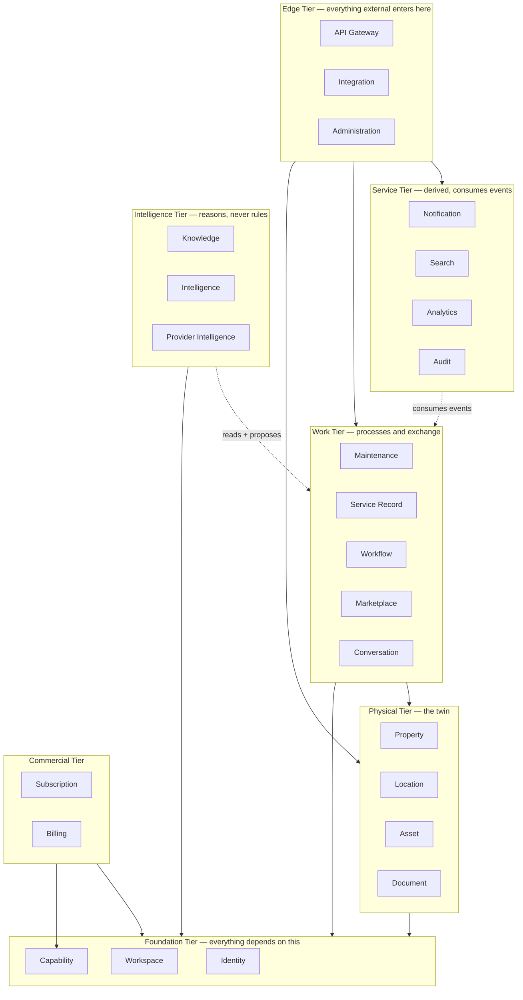
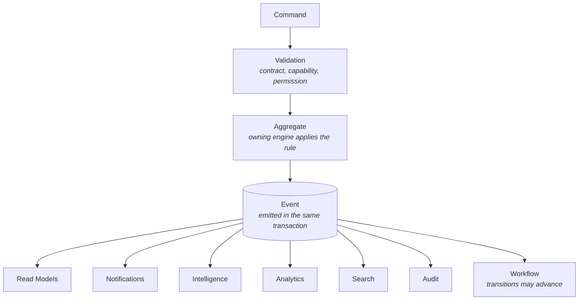
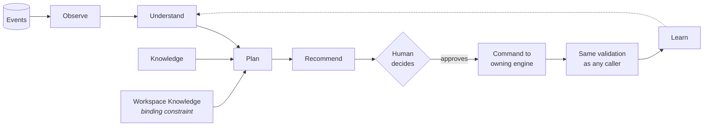
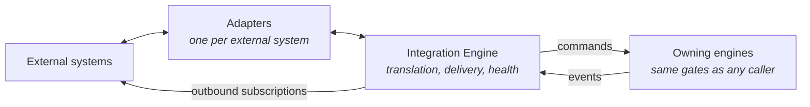

# Klussie — System Architecture

**This document owns:** the logical software architecture of Klussie —
what modules exist, what each is responsible for, what each owns, how
they communicate, and the rules that keep them from growing into each
other. It is the blueprint backend, frontend, mobile and AI engineers
build against.

It does **not** own: what the platform *is*
([`PLATFORM_DOMAIN_MODEL.md`](./PLATFORM_DOMAIN_MODEL.md), frozen), how
it is represented in data
([`DATABASE_ARCHITECTURE.md`](./DATABASE_ARCHITECTURE.md), frozen), what
is currently built ([`ARCHITECTURE.md`](./ARCHITECTURE.md)), or anything
about infrastructure.

> **Out of scope by design.** No code. No API definitions. No deployment
> topology. No cloud provider. No infrastructure. No framework, language
> or library choices. This document decides *what the software is*; every
> one of those decisions is downstream and reversible, and this document
> is deliberately written so they stay that way.

**Relationship to the frozen documents.** Both are authoritative and
neither is modified here. Where this document appears to disagree with
either, this document is wrong. §22 records a full consistency audit.

---

## Table of contents

**Part I — Foundations**
1. [What an Engine Is](#1--what-an-engine-is)
2. [The Engine Map](#2--the-engine-map)
3. [Aggregate Ownership](#3--aggregate-ownership)
4. [Engine Communication](#4--engine-communication)
5. [The Event Backbone](#5--the-event-backbone)

**Part II — The Engines**
6. [Foundation Tier](#6--foundation-tier) — Identity · Workspace · Capability
7. [Physical Tier](#7--physical-tier) — Property · Location · Asset · Document
8. [Work Tier](#8--work-tier) — Maintenance · Service Record · Workflow · Marketplace · Conversation
9. [Intelligence Tier](#9--intelligence-tier) — Knowledge · Intelligence · Provider Intelligence
10. [Service Tier](#10--service-tier) — Notification · Search · Analytics · Audit
11. [Commercial Tier](#11--commercial-tier) — Subscription · Billing
12. [Edge Tier](#12--edge-tier) — API Gateway · Integration · Administration

**Part III — Runtimes**
13. [AI Runtime](#13--ai-runtime)
14. [Workflow Runtime](#14--workflow-runtime)
15. [Search Architecture](#15--search-architecture)
16. [Analytics Architecture](#16--analytics-architecture)
17. [Integration Architecture](#17--integration-architecture)

**Part IV — Cross-Cutting**
18. [The Engine Independence Principle](#18--the-engine-independence-principle)
19. [Security Architecture](#19--security-architecture)
20. [Scalability](#20--scalability)

**Part V — Review**
21. [Architectural Review](#21--architectural-review)
22. [Consistency Audit](#22--consistency-audit)
23. [What Implementers Inherit](#23--what-implementers-inherit)

---

# Part I — Foundations

## 1 · What an Engine Is

This section exists because the word "engine" is dangerous, and getting
it wrong here would waste years.

> **An engine is a logical module with one responsibility, one owned set
> of aggregates, and one public contract. It is not a service, not a
> process, not a repository, and not a deployment unit.**

**What follows from that definition:**

| An engine **is** | An engine **is not** |
|---|---|
| A boundary of responsibility | A boundary of deployment |
| The single owner of certain aggregates | A database of its own |
| Addressable through a contract | Necessarily remote |
| Independently testable | Necessarily independently released |
| Independently replaceable | Necessarily independently scaled |

**Why this framing is the most important decision in the document.**
Twenty-four named engines is an invitation to build twenty-four services,
and a platform that distributes before it has load acquires every cost of
distribution — network failure, partial writes, latency, operational
surface, debugging across boundaries — while its actual bottleneck is
still a single database. That is the failure mode this framing prevents.

**The commitment instead:**

> Engines are **modular in the code and colocated by default.** The
> architecture is designed so that any engine *could* be separated later
> without redesign, and none is separated until measurement says it
> should be.

Because engines communicate only through contracts and events (§4), the
choice of whether a call is local or remote is an implementation
decision — reversible, made per engine, made late, made on evidence. That
optionality is the entire return on the discipline this document imposes.

**The three rules that make an engine an engine:**

1. **Single ownership.** Every aggregate has exactly one owning engine.
   No aggregate is written by two.
2. **No reaching in.** An engine never reads or writes another engine's
   aggregates directly. It asks, or it listens.
3. **No business logic tourism.** An engine never implements a rule that
   belongs to another engine. If it needs a decision, it asks the owner
   for one.

## 2 · The Engine Map

Twenty-four engines in six tiers. **Dependencies point downward or
sideways within a tier. They never point upward.**



**The tier rule, stated as a prohibition:**

> **No engine may depend on an engine in a higher tier.** In particular,
> nothing in the Foundation, Physical, Work or Commercial tiers may call
> the Intelligence or Service tiers. Those tiers *observe*; they are
> never observed.

This single rule prevents the most common way a platform like this
becomes unmaintainable: a write path that cannot complete because the
recommendation service is down, or a booking that fails because the
search index is rebuilding. **Nothing in a transaction ever waits on
intelligence, search, analytics or notifications.**

**Two engines were added beyond the mission's list**, both because
leaving them out would have violated single ownership:

- **Service Record Engine** (§8). The Service Record is a bilateral
  aggregate with a shared core and private annexes — the highest-risk
  surface in the data architecture. Splitting it between Maintenance and
  Marketplace would give it two owners. It gets its own.
- **Audit Engine** (§10). `DATABASE_ARCHITECTURE.md` classifies audit as
  an *aggregate*, not a projection, precisely so it is independently
  trustworthy. An aggregate needs an owner.

## 3 · Aggregate Ownership

The rule "one owner per aggregate" is only enforceable if ownership is
written down. This table is the enforcement.

| Aggregate (from `DATABASE_ARCHITECTURE.md` §3) | Owning engine |
|---|---|
| Identity | Identity |
| Workspace, stewardship of workspace lifecycle | Workspace |
| Membership | Workspace |
| Capability grant | Capability |
| Property, stewardship periods | Property |
| Location | Location |
| Asset, placements, facets | Asset |
| Document (metadata and sharing state) | Document |
| Maintenance obligations | Maintenance |
| Service Record core and annexes | **Service Record** |
| Workflow definition, workflow instance, transitions | Workflow |
| Marketplace request, quote, engagement | Marketplace |
| Conversation, message | Conversation |
| Workspace Knowledge, graph asserted edges, world graph | Knowledge |
| Provider decisions, recommendations, overrides | Provider Intelligence |
| Published memory versions | Intelligence |
| Subscription | Subscription |
| Financial records | Billing |
| Audit records | **Audit** |
| Event records | Event Backbone (§5) |
| Notification delivery receipts | Notification |

**Projections have owners too**, and the owner is whoever is responsible
for rebuilding them:

| Projection | Owning engine |
|---|---|
| Timeline | Property |
| Current property memory | Intelligence |
| Digital twin composition | Property |
| Workspace graph derived edges | Knowledge |
| Provider scores | Provider Intelligence |
| Search indexes (all eight domains) | Search |
| Analytics (all six domains) | Analytics |
| Notification inbox | Notification |
| Reputation | Marketplace |

**How to use this table.** Any time a change requires writing an
aggregate, exactly one engine may make that write. If a feature seems to
need two, the feature has been decomposed wrongly — the correct shape is
one engine writing and emitting, and another reacting.

## 4 · Engine Communication

**Three channels. There is no fourth.**

### Commands — "do this"

An imperative instruction sent to the engine that owns the affected
aggregate. Synchronous. May be rejected. Returns success or a reason.

**Rules.** A command is addressed to exactly one engine. Only the owning
engine may execute it. The sender does not know how it will be carried
out. A command that would require two engines to write atomically is a
modelling error, resolved by splitting it into one command plus an event
the second engine reacts to.

### Queries — "tell me"

A read. May be served from an aggregate when freshness is required, or
from a read model when it is not.

**Rules.** Queries never mutate. A query that must be perfectly fresh —
an access decision, a financial check — reads the aggregate. Everything
else may read a projection and must tolerate lag.

### Events — "this happened"

A statement of fact, published after the change, consumed by anyone
interested. Asynchronous. Fan-out. The publisher does not know or care
who listens.

**Rules.** Events are past tense and immutable. They are emitted in the
same transaction as the change they describe. Publishers never wait for
consumers. Consumers never write back to the publisher's aggregates.

### Why this prevents tight coupling

| Coupling risk | How the three channels prevent it |
|---|---|
| Engine A knows Engine B's internals | A can only send commands and read contracts. B's storage is invisible. |
| A change in B breaks A | Contracts are versioned; internals are free to change behind them. |
| A must know who cares about its changes | It emits an event and does not know. New consumers require no change to A. |
| A transaction spans engines | Prohibited by design — one command writes one engine's aggregates. |
| A write path depends on a derived service | Derived engines consume events; nothing waits on them (§2). |
| Everything depends on one shared model | Each engine owns its own representation; contracts carry only what is agreed. |

**The read-model rule.** Any engine may build a read model from events it
consumes, shaped for its own questions. This is the mechanism that lets
engines answer questions about data they do not own **without querying
the owner on the hot path** — and it is why the architecture does not
degenerate into a call graph.

## 5 · The Event Backbone

**Not an engine.** A shared contract and delivery mechanism every engine
uses. It owns no business logic and makes no decisions.

**The canonical flow**, which every state change in the platform follows:



**The critical property: the transaction ends at the event.** Everything
to the right of the event happens afterwards, asynchronously, and may
fail and retry without affecting the change that already succeeded. A
customer accepting a quote does not wait for a search index, a
recommendation or a push notification.

**Validation happens in a fixed order**, and the order is not arbitrary:

1. **Contract** — is this a well-formed command?
2. **Capability** — does this workspace have the capability this
   behaviour belongs to? (§6, Capability Engine)
3. **Permission** — may this member, in this workspace, with this role
   and scope, do this? (§6, Workspace Engine)
4. **Domain rule** — is this valid given current state? (owning engine)

Capability precedes permission because a behaviour that does not exist in
a workspace cannot be permitted in it, and checking in this order means
the cheaper, context-resolved check runs first.

**Delivery guarantees.** At-least-once. Consumers must be idempotent.
Events are ordered **per subject, not per workspace**
(`DATABASE_ARCHITECTURE.md` §23) — no consumer may depend on cross-subject
ordering.

**Asynchronous processing is the default posture, not a future upgrade.**
Every consumer in the diagram above is already asynchronous. Adding
queued work, deferred processing or scheduled reasoning later requires no
architectural change, because nothing was ever synchronous that did not
have to be.

---

# Part II — The Engines

Each engine follows the same template. **"Does not own" is the most
important line in each** — boundaries are defined by what is excluded.

# 6 · Foundation Tier

Everything depends on this tier. It depends on nothing.

## 6.1 · Identity Engine

**Why it exists.** One permanent representation per person, carrying no
role, no reputation, no property and no subscription (domain model §4).
Separating it from everything else is what makes one person able to hold
many workspaces without duplication.

**Owns.** Identity aggregate. Authentication factors. Personal
attributes and preferences.

**Responsibilities.** Establishing who someone is. Managing
authentication factors. Holding verified attributes presented to
workspaces. Executing erasure by redacting personal data while leaving
durable references intact.

**Does not own.** Roles. Permissions. Membership. Anything about what a
person may do — all of that belongs to Workspace. It does not know which
workspaces an identity belongs to; it is asked, never asks.

**Inputs.** Registration, authentication, invitation acceptance,
federated assertions, erasure requests.
**Outputs.** An authenticated principal. Resolution of an internal
reference to a person, where still permitted.
**Dependencies.** None. This is the root.

**Events produced.** `IdentityRegistered`, `IdentityAttributesChanged`,
`AuthenticationFactorChanged`, `IdentityVerified`, `IdentityErased`.
**Events consumed.** None. The root tier does not react.

**Public contract.** Authenticate a principal. Resolve an internal
person-reference to display information, subject to erasure. Assert a
verified attribute.

**Scale.** The most-read, least-written thing in the platform — small
records, consulted per request, highly cacheable.

**Future expansion.** Additional factors, passwordless, federated
identity providers, portable verified credentials, identity merge (an
open question in the domain model).

## 6.2 · Workspace Engine

**Why it exists.** The workspace is the boundary for isolation,
permission, billing, intelligence, marketplace participation and
residency. Something must own that boundary and the memberships that
cross it.

**Owns.** Workspace aggregate. Membership aggregate, including roles,
scopes, states and expiry. Invitations. Stewardship of workspace
lifecycle including archival.

**Responsibilities.** Creating and archiving workspaces. Managing
membership through every route — invitation, request, domain
verification, directory sync, marketplace-derived grant. **Evaluating
permissions.** Resolving scope against the location tree. Recording
jurisdiction and residency.

**Does not own.** Capabilities — a workspace's *plan* is Capability's,
and conflating the two would collapse the two-gate rule. It does not own
anything a workspace *contains*.

**Inputs.** Workspace lifecycle commands, membership commands,
invitations, directory synchronisation, engagement-derived grants.
**Outputs.** Permission decisions. Resolved workspace context. Membership
state.
**Dependencies.** Identity (to resolve who a member is). Location (to
resolve subtree scope — a query, never a write).

**Events produced.** `WorkspaceCreated`, `WorkspaceArchived`,
`WorkspaceJurisdictionChanged`, `MemberInvited`, `MemberJoined`,
`MemberRoleChanged`, `MemberScopeChanged`, `MemberAccessRevoked`,
`MembershipExpired`.
**Events consumed.** `EngagementAccepted` (to create a scoped, expiring
grant). `LocationTreeChanged` (to invalidate scope resolution —
`DATABASE_ARCHITECTURE.md` finding 16). `IdentityErased`.

**Public contract.** Resolve the workspace context for a principal.
Decide a permission. Grant, narrow, expire or revoke membership. Report
who has access to what, and why — the explainability the domain model
requires.

**Ownership boundary worth stating.** **Permission evaluation lives here
and nowhere else.** No engine implements its own access logic. An engine
that finds itself checking roles has taken on another engine's
responsibility.

**Scale.** The hottest read path in the platform. Resolved once per
request into an immutable context (§19), cached, with revocation bounded
by an explicit propagation window.

**Future expansion.** Custom roles, approval-as-permission, delegation
with expiry, workspace groups, shared stewardship.

## 6.3 · Capability Engine

**Why it exists.** A workspace is defined by its capabilities, not its
type (domain model Principle 1). This engine is the first of the two
gates and the structural guarantee of One Engine.

**Owns.** Capability grants per workspace. The capability catalogue and
its dependency graph. Preset definitions.

**Responsibilities.** Resolving which capabilities a workspace holds.
Enforcing dependencies when granting and withdrawing. Answering the
capability gate. Applying presets as defaults.

**Does not own.** Permissions. Subscriptions — Subscription decides
*what was bought*; Capability decides *what is enabled*, and keeping them
separate is what lets a capability be granted for a trial, a pilot, a
negotiation or an operator decision with no commercial event at all.

**Inputs.** Grant and withdrawal commands. Subscription events. Preset
configuration.
**Outputs.** The resolved capability set for a workspace context. Gate
decisions.
**Dependencies.** Workspace (to know the workspace exists).

**Events produced.** `CapabilityGranted`, `CapabilityWithdrawn`,
`CapabilityCatalogueChanged`.
**Events consumed.** `SubscriptionActivated`, `SubscriptionChanged`,
`SubscriptionLapsed`, `WorkspaceCreated`.

**Public contract.** Does this workspace hold this capability? What is
its full capability set? Grant, withdraw, list.

**Two rules this engine enforces on everyone else.** Withdrawal removes
behaviour and never data — no engine may store data such that losing a
capability makes it unreachable. And no engine may branch on workspace
type; if a behaviour needs to vary, it varies on a capability.

**Scale.** Tiny and slow-changing — tens of grants per workspace.
Resolved into the request context once (§19), never queried per
operation.

**Future expansion.** Capability versioning, time-limited grants, scoped
capabilities (deliberately deferred — domain model §30).

# 7 · Physical Tier

The digital twin's constituent engines. They depend only on Foundation.

## 7.1 · Property Engine

**Why it exists.** The property is what accumulates value and outlives
the arrangements that manage it. Stewardship — the relationship between a
workspace and a property over a period — needs an owner.

**Owns.** Property aggregate. **Stewardship periods**, append-only. The
Timeline projection. The digital twin composition.

**Responsibilities.** Property lifecycle. Beginning and ending
stewardship. Recording property jurisdiction, which is distinct from the
workspace's. Assembling the twin on demand. Serving timeline segments
scoped to stewardship periods.

**Does not own.** Locations, assets or documents — it is their root, not
their owner. It does not own memory or knowledge.

**Inputs.** Property commands. Stewardship transfer. Timeline queries.
**Outputs.** Property state. Timeline segments. Twin compositions.
**Dependencies.** Workspace. Location, Asset, Document, Service Record
(read-only, for twin assembly).

**Events produced.** `PropertyCreated`, `PropertyAttributesChanged`,
`StewardshipBegan`, `StewardshipEnded`, `PropertyJurisdictionChanged`.
**Events consumed.** Everything property-scoped, for the timeline —
asset, maintenance, service record, document and conversation events.

**Public contract.** Property state. Who stewards it now, and who did
when. The timeline for a property, location or asset, scoped to the
caller's stewardship window. The twin composition.

**Ownership boundary worth stating.** **The twin is assembled, never
stored** (`DATABASE_ARCHITECTURE.md` §28). This engine composes it from
parts other engines own. It must never accumulate its own copy of asset
or document state beyond narrow summary projections that name their
sources.

**Scale.** Tens of millions of properties; small records, deeply
referenced. Timelines are bounded per property, which keeps even a large
enterprise's individual timelines small.

**Future expansion.** Shared stewardship, portfolios, spatial attributes,
plan and model references.

## 7.2 · Location Engine

**Why it exists.** Space within a property, nesting recursively to
whatever depth the customer's world requires — a kitchen and a
cold-storage aisle are the same concept.

**Owns.** Location aggregate and the location tree. Location taxonomy
application.

**Responsibilities.** Tree structure and re-parenting. **Answering
subtree containment**, which is a first-class operation
(`DATABASE_ARCHITECTURE.md` §13) used by permission scoping, knowledge
scoping, search and reporting. Retiring locations that history
references.

**Does not own.** Assets placed in locations. Permissions scoped to
locations — it answers containment; Workspace decides access.

**Inputs.** Location commands. Containment queries.
**Outputs.** Tree structure. Containment answers. Ancestor and descendant
sets.
**Dependencies.** Property. Workspace.

**Events produced.** `LocationCreated`, `LocationChanged`,
`LocationRetired`, **`LocationTreeChanged`**.
**Events consumed.** `PropertyCreated`.

**Public contract.** Tree read. Is X within subtree Y? Ancestors and
descendants of a location.

**The event that matters most.** `LocationTreeChanged` is a
**scope-affecting event**: re-parenting a subtree silently changes what a
scoped membership covers and what a search index entry means, with no
change to either record. Workspace and Search both consume it and must
react. This is the single easiest place to implement a correct
architecture incorrectly.

**Scale.** Five locations for a household; a hundred thousand across six
levels for a hospital campus. Containment must not degrade with depth.

**Future expansion.** Spatial coordinates, floor plans, BIM import,
occupancy and use periods.

## 7.3 · Asset Engine

**Why it exists.** The asset anchors maintenance history and prediction.
One engine serves a dishwasher and a production line — the platform's
clearest test of One Engine.

**Owns.** Asset aggregate. **Facets** and their declared attribute
definitions. **Placements**, append-only. Asset nesting. Condition and
lifecycle state.

**Responsibilities.** Asset lifecycle from creation through disposal.
Applying and populating facets. Recording placement over time so an asset
keeps one identity across moves. Maintaining replacement chains.
Distinguishing machine-proposed values from human-confirmed ones.

**Does not own.** Maintenance obligations. Service records. Documents.
The interpretation of an asset's behaviour — that is Intelligence.

**Inputs.** Asset commands. Recognition proposals from Intelligence.
Bulk provision. Facet definitions.
**Outputs.** Asset state including facets. Placement history. Nesting.
**Dependencies.** Location, Property, Workspace, Capability (facet
behaviour gating).

**Events produced.** `AssetRegistered`, `AssetAttributesChanged`,
`AssetPlaced`, `AssetMoved`, `FacetAdded`, `FacetUpdated`,
`AssetConditionChanged`, `AssetRetired`, `AssetReplaced`,
`ObservationRecorded`.
**Events consumed.** `ServiceRecordCompleted` (to update condition and
infer assets), `LocationRetired`.

**Public contract.** Asset state with facets. Placement at a point in
time. What was in this location then. Nesting. Register, move, retire,
replace.

**How facets keep One Engine.** A facet **extends** an asset; it never
replaces one. Capabilities gate a facet's *behaviour*, never the asset's
existence — a workspace losing Fleet Management keeps its vehicles and
their history. Facet attributes are **declared** as configuration, so
every asset in the platform stays reachable by search, analytics and the
graph.

**Scale.** The largest core aggregate; hundreds of thousands per
enterprise workspace. Naturally partitioned by workspace.

**Future expansion.** Telemetry association, component-level tracking,
cost-of-ownership accumulation, actuation for building automation.

## 7.4 · Document Engine

**Why it exists.** Evidence that outlives what it was attached to and is
needed from more than one direction.

**Owns.** Document metadata. **Sharing state.** Attachment to subjects.
Validity periods. Version chains. Content references.

**Responsibilities.** Document lifecycle. Managing attachment to many
subjects. **Managing sharing separately from attachment.** Tracking
validity and emitting expiry warnings. Versioning reissued documents.
Separating metadata from content.

**Does not own.** Content storage itself — it holds a reference and the
storage adapter is replaceable (§18). It does not own extraction, which
is Intelligence proposing metadata this engine records.

**Inputs.** Document commands. Extraction proposals. Attachment and
sharing commands.
**Outputs.** Metadata, validity state, attachments, sharing state,
content references.
**Dependencies.** Workspace, Capability.

**Events produced.** `DocumentAdded`, `DocumentAttached`,
`DocumentShared`, `DocumentVersioned`, `DocumentValidityChanged`,
`DocumentExpiring`, `DocumentExpired`, `DocumentDeleted`.
**Events consumed.** `ServiceRecordCompleted`, `WorkflowStageCompleted`
(both may produce documents), `IdentityErased`.

**Public contract.** Document metadata and validity. What is attached to
this subject. What is expiring. Attach, share, version.

**The rule this engine enforces.** **Attachment is not a sharing grant.**
A document attached to a shared Service Record core does not thereby
become visible to both parties. Sharing is explicit, with defaults set by
document *type* in configuration — never by whoever is holding the phone.
Getting this wrong discloses a firm's cost base to its customer,
silently and irreversibly.

**Scale.** The largest data volume by an order of magnitude and the least
frequently accessed — which is why metadata and content are separate.

**Future expansion.** Deeper extraction, signature and verification,
retention policy by jurisdiction.

# 8 · Work Tier

Where things happen. Depends on Physical and Foundation.

## 8.1 · Maintenance Engine

**Why it exists.** What is due, overdue and predicted — the
forward-looking half of the platform's value, decoupled from who performs
it.

**Owns.** Maintenance obligations. Schedules. Compliance-driven
intervals.

**Responsibilities.** Creating obligations manually, by schedule, by
compliance rule, or from an accepted prediction. Tracking what is due and
overdue. Starting workflow instances when an obligation needs a process.
Closing obligations when work completes.

**Does not own.** How work gets done — that is Workflow and the execution
strategies. Predictions themselves, which are Intelligence's
interpretation; this engine owns only obligations, including those
*promoted* from a prediction a human accepted.

**Inputs.** Obligation commands. Schedule definitions. Accepted
predictions. Compliance rules.
**Outputs.** Due and overdue state. Obligation lifecycle.
**Dependencies.** Asset, Location, Property, Workspace, Capability,
Workflow.

**Events produced.** `ObligationCreated`, `ObligationDue`,
`ObligationOverdue`, `ObligationClosed`, `ObligationCancelled`,
`ScheduleChanged`.
**Events consumed.** `ServiceRecordCompleted` (closes obligations),
`AssetRegistered`, `AssetRetired`, `PredictionAccepted`,
`DocumentExpiring` (compliance obligations).

**Public contract.** What is due for this asset, location, property or
workspace. Create, close, cancel, reschedule.

**Boundary worth stating.** Maintenance is **decoupled from the
marketplace**. An obligation may be resolved internally, by warranty, by
a contracted provider, by the marketplace, or by a decision to defer.
This engine knows an obligation was resolved; it does not know or care
which strategy resolved it.

**Scale.** Tens of thousands per enterprise workspace per year; generated
schedules dominate.

**Future expansion.** Condition-based triggering, cost forecasting,
warranty-aware obligation routing.

## 8.2 · Service Record Engine

*Not in the mission's list; added because this aggregate cannot share an
owner (§2).*

**Why it exists.** The permanent record of work performed — one shared
object belonging to both the property's history and the performing
workspace's operational history. It is the bridge between work and
memory, and the highest-risk visibility surface in the platform.

**Owns.** Service Record **shared core**. Per-workspace **private
annexes**. Amendment chains.

**Responsibilities.** Creating records on completion of work — **by any
execution strategy, including those earning the platform nothing.**
Enforcing the authorship split: the performing workspace authors the
work, the property's workspace authors approval and its own annotations.
**Enforcing the visibility classification.** Appending amendments with
authorship and reason. Never permitting deletion or overwrite.

**Does not own.** Maintenance obligations. Engagements. Documents
attached to it. The interpretation of what a record means — that is
Intelligence.

**Inputs.** Completion commands from any strategy. Amendments. Approvals.
**Outputs.** The core, filtered to the caller's classification. Each
party's own annex. Amendment history.
**Dependencies.** Property (home partition), Asset, Workspace, Document,
Capability.

**Events produced.** `ServiceRecordCreated`, `ServiceRecordCompleted`,
`ServiceRecordAmended`, `WarrantyArising`, `ApprovalRecorded`.
**Events consumed.** `EngagementCompleted`, `WorkflowCompleted`,
`ObligationClosed`.

**Public contract.** Read a record, filtered by the caller's
relationship to it. Author work content. Author an annex. Record
approval. Amend. **There is no delete.**

**The classification this engine enforces**, from
`PLATFORM_DOMAIN_MODEL.md` §13.2 and binding:

| Shared core | Performing annex | Property annex |
|---|---|---|
| Diagnosis, work performed, technicians, labour and travel time, materials, quantities, part numbers, manufacturer, measurements, photos and video, documents, warranties, approval, agreed price, recommendations, AI summary | Internal cost and margin, supplier used and their price, internal scheduling notes, internal commentary | Internal approvals, budget context, private annotations and assessments |

*Facts about the work are shared; commercial and internal context is
not.* The manufacturer of a part is a fact about the building; which
distributor supplied it at what price is a fact about the business.

**Scale.** The highest-volume Historical aggregate. Homed with the
property's workspace; the performing workspace reads across its grants
via a projection this engine maintains.

**Future expansion.** Structured trendable measurements, verified
completion, parts genealogy, warranty and insurance claim support — all
of which are reads over what this engine already holds.

## 8.3 · Workflow Engine

**Why it exists.** Every process is configuration, not code. This is
where the platform's business rules live.

**Owns.** Workflow definitions and their versions. Workflow instances.
**Transition logs**, append-only. Approval steps.

**Responsibilities.** Publishing and versioning definitions. Starting
instances pinned to a definition version. Evaluating permitted
transitions. Enforcing required evidence and approvals before a
transition. Tracking timing expectations and escalating lapses. Emitting
an event per transition. Recovering an instance's state from its
transition log.

**Does not own.** What any stage *means* to the business — an inspection
stage does not know about inspections. It executes definitions; it does
not encode domain knowledge. It does not own notifications; it emits
events Notification consumes.

**Inputs.** Definition publication. Instance start commands. Transition
commands. Approvals. Timer expiry.
**Outputs.** Instance state, derived from transitions. Available
transitions for a caller. Blocked-and-why.
**Dependencies.** Workspace (permissions on transitions), Capability
(definition availability), Document (evidence), Knowledge (conditional
branching inputs).

**Events produced.** `DefinitionPublished`, `DefinitionDeprecated`,
`WorkflowStarted`, `WorkflowTransitioned`, `WorkflowStageCompleted`,
`ApprovalRequested`, `ApprovalGranted`, `ApprovalDenied`,
`WorkflowStalled`, `WorkflowCompleted`, `WorkflowCancelled`.
**Events consumed.** `ObligationCreated`, `EngagementAccepted`,
`ServiceRecordCompleted`, `CapabilityWithdrawn`.

**Public contract.** Start an instance. What transitions are available to
me now. Perform a transition. Instance history. Publish and deprecate
definitions.

**Rules that are non-negotiable.** A definition is **immutable once
published**; a change is a new version. An instance **pins its definition
version permanently** — a workflow changed today never retroactively
alters a claim that started last month. **Transitions are authoritative;
current stage is derived**, so a corrupted stage is recomputed rather
than guessed.

**Scale.** Millions of concurrent instances, some open for years.
Transitions are a dominant write volume. Partitioned by workspace.

**Future expansion.** Customer-authored definitions, conditional
branching from Workspace Knowledge, cross-workspace workflows (claims
involving customer, provider, insurer and manufacturer), a workflow
editor — which is a product surface over existing structure, not a new
subsystem.

## 8.4 · Marketplace Engine

**Why it exists.** The mechanism by which one workspace obtains work from
another — one execution strategy among several, never the platform's
entry point.

**Owns.** Requests. Quotes. Engagements. The reputation projection.

**Responsibilities.** Request lifecycle. Quoting. Creating engagements on
acceptance, and **instructing Workspace to create the scoped, expiring
grant** the engagement implies. Managing the bilateral relationship.
Computing reputation from service records and reviews.

**Does not own.** **Provider selection** — that is Provider Intelligence.
This engine executes an engagement with whichever provider was chosen; it
does not choose. It does not own payments, service records or
conversations.

**Inputs.** Request commands. Quotes. Acceptance. Completion.
**Outputs.** Request and quote state. Engagement state. Reputation.
**Dependencies.** Workspace, Capability, Property, Asset, Billing.

**Events produced.** `RequestCreated`, `RequestWithdrawn`,
`QuoteSubmitted`, `QuoteAccepted`, `QuoteDeclined`, `EngagementCreated`,
`EngagementCompleted`, `EngagementCancelled`, `ReviewSubmitted`.
**Events consumed.** `ServiceRecordCompleted`, `PaymentSettled`,
`MemberAccessRevoked`.

**Public contract.** Create a request. Quote. Accept. Complete.
Engagement state. Reputation for a providing workspace.

**Boundary worth stating.** Because Provider Intelligence chooses and
this engine executes, **a need resolved by warranty, DIY, an internal
team or watch-and-wait never touches this engine at all** — and still
produces a Service Record. That asymmetry is the architectural expression
of Outcome Over Activity.

**Scale.** High volume, strongly skewed to recent data.

**Future expansion.** Framework agreements, preferred-supplier lists,
tendering, recurring service contracts, marketplaces of things other than
labour.

## 8.5 · Conversation Engine

**Why it exists.** Communication bound to a subject, so what was decided
is part of the record rather than a side channel.

**Owns.** Conversations. Messages. Participation. Translation cache.

**Responsibilities.** Binding threads to subjects. Managing participation
across workspace boundaries. Preserving originals and original language
permanently. Caching translations as derived renderings. Recording
structured moments — a quote, a schedule change, an approval — as
readable and machine-usable.

**Does not own.** Translation itself, which it requests from
Intelligence and caches. Notifications about messages.

**Inputs.** Message commands. Participation changes. Translation results.
**Outputs.** Threads, filtered to participation. Messages in a requested
language with the original always available.
**Dependencies.** Workspace, Identity, Capability, Intelligence
(translation), and the subject's owning engine.

**Events produced.** `ConversationOpened`, `MessageSent`,
`MessageTranslated`, `ParticipantAdded`, `ParticipantRemoved`,
`ConversationClosed`.
**Events consumed.** `EngagementCreated`, `EngagementCompleted`,
`MemberAccessRevoked`, `IdentityErased`.

**Public contract.** Open a thread on a subject. Send. Read, in a chosen
language. Manage participation.

**Rules.** Messages are **immutable**; the original and its language are
permanent, and a translation is a rendering, never a substitute.
Participants see the thread and exactly the context their grant allows —
never each other's workspaces.

**Scale.** The highest raw write volume after events and telemetry.

**Future expansion.** Additional channels reaching the same thread,
richer structured moments, the assistant as an explicit labelled
participant.

# 9 · Intelligence Tier

**This tier observes and proposes. Nothing in a write path waits on it.**

## 9.1 · Knowledge Engine

**Why it exists.** Workspace Knowledge is *declared policy* and binding;
the graph is *connections*. Both need a custodian distinct from the thing
that reasons over them.

**Owns.** Workspace Knowledge rules and their versions. Graph asserted
edges. The **world graph** of manufacturers, models, parts, compatibility
and regulations. The derived workspace-graph projection.

**Responsibilities.** Recording declared rules. Recording rules promoted
from a confirmed inference. Resolving rule scope and precedence, and
**surfacing conflicts rather than resolving them silently**. Maintaining
the graph. **Executing promotion to the world graph as an explicit,
audited operation.**

**Does not own.** Reasoning. It stores, curates, scopes and traverses; it
draws no conclusions. Nor does it own Property Memory, which is
interpretation.

**Inputs.** Rule commands. Confirmation of proposed rules. Curated world
data. Aggregate promotions. Graph queries.
**Outputs.** Rules in force for a scope. Conflicts. Graph traversals.
World facts.
**Dependencies.** Workspace, Location (scope resolution), Capability.

**Events produced.** `KnowledgeRuleDeclared`, `KnowledgeRuleSuperseded`,
`KnowledgeRuleRetired`, `KnowledgeConflictDetected`, `EdgeAsserted`,
`WorldFactPublished`, **`FactPromoted`**.
**Events consumed.** Effectively everything, to derive graph edges.

**Public contract.** What rules apply to this scope, in precedence order.
Traverse the graph from here. World facts about this model or part.
Declare, confirm, retire.

**The rules this engine enforces.** Workspace Knowledge is **binding, not
advisory** — the platform honours a rule or asks for an exception; it
never routes around one. **Asserted and inferred edges stay permanently
distinguishable.** And promotion happens only when a fact **remains true
once every reference to its origin is removed** — recorded and audited,
never as an ambient background job.

**Scale.** Small, hot, deeply traversed. A workspace graph never spans
workspaces; the world graph is small, read-mostly and replicable.

**Future expansion.** Ingested manufacturer and regulatory data,
inherited group policy, review cycles, compatibility from service
records.

## 9.2 · Intelligence Engine

**Why it exists.** One reasoning engine for the whole platform. Not a
consumer assistant and an enterprise assistant — one engine whose reach
is bounded by capability and permission.

**Owns.** Current Property Memory projection. **Published memory
versions** (append-only). Prediction proposals. Reasoning capability
adapters.

**Responsibilities.** The six-stage loop — observe, understand, plan,
recommend, execute, learn. Building and revising memory. Proposing assets
from recognition, metadata from documents, and rules from observed
patterns. Translating on request. Assembling context within a bounded
scope. **Recording what it recommended and why.**

**Does not own.** **Any business rule.** It does not decide permissions,
enforce capabilities, execute workflows or mutate another engine's
aggregates. Everything it does that changes state is a **command to the
owning engine, issued under a person's authority**.

**Inputs.** The event stream. Aggregates within scope, read-only.
Knowledge. Explicit requests.
**Outputs.** Memory. Predictions. Proposals. Recommendations with
reasoning. Translations. Summaries.
**Dependencies.** Knowledge, Property, Asset, Service Record, Document,
Maintenance (all read-only), Capability, Workspace.

**Events produced.** `MemoryRevised`, `MemoryVersionPublished`,
`PredictionProposed`, `AssetProposed`, `RuleProposed`,
`RecommendationMade`, `SummaryGenerated`.
**Events consumed.** Everything.

**Public contract.** What do you know about this property, asset or
location? What do you expect? What do you recommend, and why? Summarise.
Translate. Extract.

**Ownership boundaries — the most important in the document.**

| Concern | Owner | Intelligence's role |
|---|---|---|
| Business rules | The owning engine | May not implement any |
| Workflow execution | Workflow | May start or advance an instance by command, under authority |
| Capability enforcement | Capability | Subject to it; never exempt |
| Permissions | Workspace | Scoped identically to the member it acts for |
| Policy | Knowledge | Must honour; may propose changes |

**Scale.** Entirely asynchronous. Reasoning cost is bounded per request
by assembled scope, and no transaction waits on it.

**Future expansion.** Proactive behaviour, population-scale reasoning
within a workspace, longer horizons, wider delegated execution — safe
only because capability, permission, events and audit already constrain
it.

## 9.3 · Provider Intelligence Engine

**Why it exists.** Choosing who should do the work, across every supply
source — internal teams, contracted providers, trusted providers,
manufacturer networks, marketplace supply and future external
directories. Selection is a judgement, not a search, and it is separate
from the marketplace that executes it.

**Owns.** Provider scores (projection). **Decisions, recommendations
shown, and customer overrides** (append-only aggregate).

**Responsibilities.** Evaluating candidates across all sources. Applying
Workspace Knowledge as a constraint, not a signal. Checking compliance,
certification and insurance validity. **Producing a recommendation with
its reasoning captured at decision time.** Recording overrides.

**Does not own.** Engagements — Marketplace executes. Knowledge — it
consumes. Whether to dispatch at all, which is an execution-strategy
question the Intelligence Engine's plan answers.

**Inputs.** A need with its context. Knowledge. Service records.
Documents. Availability. World graph facts.
**Outputs.** A ranked recommendation with reasoning. A recorded decision.
**Dependencies.** Knowledge, Service Record, Document, Asset, Workspace,
Marketplace (published supply only).

**Events produced.** `RecommendationProduced`, `ProviderSelected`,
`RecommendationOverridden`.
**Events consumed.** `ServiceRecordCompleted`, `ReviewSubmitted`,
`KnowledgeRuleDeclared`, `DocumentValidityChanged`.

**Public contract.** Who should do this, and why? Record a decision.
Record an override.

**Rules.** **Explainability is structural** — the inputs to a
recommendation are captured *with* it, because recomputing an explanation
later against changed data yields a different explanation, which is worse
than none. Scoring **never reads another customer's service records**;
cross-customer quality arrives only as promoted aggregates. Customer
instructions override everything.

**Scale.** Invoked per need, asynchronously, never on a write path.

**Future expansion.** Predictive dispatch, capacity-aware selection,
multi-provider coordination, external directory federation. The recorded
decisions are also what makes the domain model's unresolved
liquidity-versus-outcome conflict *measurable* rather than assumed.

# 10 · Service Tier

Derived. Consumes events. Depended upon by nobody.

## 10.1 · Notification Engine

**Why it exists.** Notifications belong to workspaces but are delivered
to an identity, and a person must not have to switch workspaces to
discover something needs them.

**Owns.** Notification records (workspace-scoped). **Delivery receipts**
(aggregate). The identity-scoped inbox projection. Per-membership
preferences.

**Responsibilities.** Deciding what warrants attention. Composing the
inbox at read time across live memberships. Delivering across channels
via replaceable adapters. Recording delivery, seen and acted-upon.
Escalating when urgent items go unacknowledged.

**Does not own.** Why something matters — that is the emitting engine's
event. It does not own channel providers, which are adapters (§18).

**Inputs.** Events. Preference commands. Delivery callbacks.
**Outputs.** The inbox. Delivery state.
**Dependencies.** Workspace (live membership), Identity (channels),
Capability.

**Events produced.** `NotificationRaised`, `NotificationDelivered`,
`NotificationSeen`, `NotificationEscalated`.
**Events consumed.** Broadly — obligations, workflows, engagements,
messages, documents expiring, approvals.

**Public contract.** My inbox. Mark seen. Set preferences per membership.

**Why the inbox is not a boundary crossing.** It composes only what the
identity is already entitled to see, filtered by live membership **at
read time**. Revoking a membership removes its items. It is a convenience
projection over existing entitlements, not a widening of them.

**Scale.** Fan-out is bounded by workspace membership rather than
platform size. The inbox is composed on read, never materialised as
copies outside the workspace boundary.

**Future expansion.** More channels, digesting, on-call rotas.

## 10.2 · Search Engine

**Why it exists.** Eight search domains, one engine, one rule. See §15
for the full architecture.

**Owns.** All search index projections.

**Responsibilities.** Indexing from events. **Indexing scope alongside
content.** Serving queries with scope applied at retrieval. Rebuilding
per workspace, incrementally. Reacting to scope-affecting changes.

**Does not own.** Any authoritative data. Every index is rebuildable and
may be discarded.

**Dependencies.** Workspace (scope semantics), Location (tree position),
Capability.

**Events produced.** `IndexRebuilt`, `IndexLagDetected`.
**Events consumed.** Everything indexable, plus `LocationTreeChanged`,
`MemberScopeChanged` and `MemberAccessRevoked`.

**Public contract.** Search within a domain, with the caller's scope
applied. Request a rebuild.

**The rule.** **Scope is indexed, never post-filtered.** Post-filtering
is slow and its failure mode is disclosure rather than error.

**Scale.** Rebuild is a routine per-workspace operation, not an
emergency.

## 10.3 · Analytics Engine

**Why it exists.** Six analytics domains whose separation is
architectural, not organisational. See §16.

**Owns.** All analytics projections, in physically separate
workspace-scoped and platform-scoped stores.

**Responsibilities.** Building each domain from events and Historical
data. **Keeping platform-scoped and workspace-scoped analytics
separate.** Serving reporting.

**Does not own.** Any authoritative data. It never writes back.

**Dependencies.** Workspace, Capability, Knowledge (for promotion when
platform-scoped aggregates are produced).

**Events produced.** `AnalyticsRefreshed`.
**Events consumed.** Everything.

**Public contract.** Query a domain, scoped to the caller's entitlement.

**Scale.** Isolated from transactional load by construction — a five-year
enterprise report never competes with a customer accepting a quote.

## 10.4 · Audit Engine

*Not in the mission's list as an engine; added because audit is an
aggregate, not a projection, and an aggregate needs an owner (§2).*

**Why it exists.** Who did what, in which workspace, when, under what
authority. Enterprise procurement requires it; regulated industries
cannot buy without it.

**Owns.** Audit records, append-only and permanent.

**Responsibilities.** Recording every permission and membership change,
capability change, access grant and revocation, commercial change, export
or erasure, administrative action, **fact promotion**, and **every action
taken by the intelligence on a person's behalf, marked as
machine-originated.** Recording *denied* attempts, which no domain event
captures.

**Does not own.** The event stream. Audit is deliberately **not derived
from it**: it records things events do not, must be independently
trustworthy rather than inheriting another record's weaknesses, and has
different retention and different readers.

**Inputs.** Direct audit commands from engines at security-relevant
moments. Events.
**Outputs.** The trail, and the ability to answer *why* an access
decision went the way it did.
**Dependencies.** Workspace, Identity.

**Events produced.** `AuditRecorded` (rarely consumed; audit is a sink).
**Events consumed.** Security-relevant events across all engines.

**Public contract.** Query the trail for a workspace, subject or actor.
Export for a customer's own compliance systems.

**Scale.** Append-only, high volume, rarely read, read seriously.

**Future expansion.** Retention by jurisdiction, tamper-evidence, export.

# 11 · Commercial Tier

## 11.1 · Subscription Engine

**Why it exists.** A subscription is a commercial wrapper around a
capability bundle, belonging to a workspace and never to a person.

**Owns.** Subscriptions. Plan definitions and their capability bundles.
Trials. The payer reference.

**Responsibilities.** Subscription lifecycle. Translating a plan into the
capability set Capability should grant. Trials and their expiry.
Supporting a payer distinct from the workspace, for future consolidated
billing.

**Does not own.** Capability grants themselves — it *requests* them, and
Capability decides. It does not own money.

**Inputs.** Subscription commands. Plan configuration. Payment outcomes.
**Outputs.** Subscription state. Requested capability sets.
**Dependencies.** Workspace, Billing.

**Events produced.** `SubscriptionActivated`, `SubscriptionChanged`,
`SubscriptionRenewed`, `SubscriptionLapsed`, `TrialStarted`,
`TrialExpired`.
**Events consumed.** `PaymentFailed`, `PaymentSettled`,
`WorkspaceArchived`.

**Public contract.** Current subscription. Change plan. Start a trial.

**Boundary worth stating.** Keeping Subscription separate from Capability
is what allows a capability to be granted with **no commercial event at
all** — a pilot, a negotiation, a goodwill gesture, an operator decision.
Merging them would make every such grant a fake sale.

**Scale.** Modest volume, high correctness requirements.

**Future expansion.** Consolidated billing across workspace groups,
usage-based components, per-jurisdiction pricing, reseller arrangements.

## 11.2 · Billing Engine

**Why it exists.** Money. Immutable, statutory, multi-currency and
multi-jurisdiction from the first record.

**Owns.** Invoices. Charges. Payments. Payouts. Commission records. All
immutable.

**Responsibilities.** Issuing invoices with jurisdiction-correct content.
Collecting and settling. Paying out to providing workspaces. Recording
currency and governing jurisdiction **at the time of the record**.
Corrections by credit-and-reissue, never edit.

**Does not own.** Payment providers, which are adapters (§18).
Subscriptions. Commission *policy*, which is configuration it applies.

**Inputs.** Charge commands. Engagement completion. Subscription events.
Provider callbacks.
**Outputs.** Financial records. Settlement state.
**Dependencies.** Workspace, Subscription, Marketplace.

**Events produced.** `InvoiceIssued`, `PaymentAuthorized`,
`PaymentSettled`, `PaymentFailed`, `PayoutInitiated`, `PayoutSettled`,
`CreditIssued`.
**Events consumed.** `EngagementCompleted`, `SubscriptionActivated`,
`SubscriptionLapsed`.

**Public contract.** Issue. Charge. Settle. Pay out. Financial history.

**Scale.** Low volume, disproportionate correctness and retention
requirements.

**Future expansion.** Purchase orders, payment terms, account invoicing,
consolidated settlement.

# 12 · Edge Tier

Everything external enters here. No engine below this tier is reachable
from outside.

## 12.1 · API Gateway

**Why it exists.** One place where external callers are authenticated,
their context resolved, and their requests dispatched. Its existence is
what allows every engine below to assume it is being called legitimately.

**Owns.** No aggregates. It is a boundary, not a domain.

**Responsibilities.** Terminating external requests. Authenticating via
Identity. **Resolving the request context once** — identity, workspace,
membership, scope, capabilities — and passing it immutably inward.
Dispatching commands and queries. Rate limiting. Protocol translation.
Contract versioning.

**Does not own.** Any business rule. It performs no domain validation, no
permission logic of its own, and no orchestration of multi-engine
workflows. **A gateway that starts making decisions has become a hidden
engine.**

**Inputs.** External requests from every client — web, mobile,
integrations, future public API.
**Outputs.** Dispatched commands and queries carrying a resolved context.
**Dependencies.** Identity, Workspace, Capability.

**Public contract.** The platform's external surface, versioned.

**The context-resolution rule.** Context is resolved **once per request**
and passed inward as an immutable value. Engines do not re-resolve it and
do not call Capability or Workspace per operation. This is what keeps a
gate on every operation from becoming a cost on every operation — and it
is why cache invalidation on membership, capability and **location tree**
changes is a first-order concern (§19).

**Scale.** Stateless and horizontally scalable by construction.

**Future expansion.** The public API is this surface with a capability
gate and a different contract tier — not a new subsystem.

## 12.2 · Integration Engine

**Why it exists.** External systems must connect through stable contracts
rather than into platform engines. See §17.

**Owns.** Integration configurations. Connection state and credentials
references. Outbound subscriptions. Adapter registry.

**Responsibilities.** Translating between external formats and platform
contracts. Delivering outbound event subscriptions. Ingesting external
data as **commands to owning engines**, never as direct writes. Managing
connection health, retries and backpressure.

**Does not own.** Any domain data. **Every ingested fact becomes a
command to the engine that owns the concept**, subject to the same
validation, capability and permission checks as any other caller.

**Inputs.** External system data. Webhooks. Device observations.
Subscription configuration.
**Outputs.** Commands inward. Events outward.
**Dependencies.** All engines it routes to, through contracts only.

**Events produced.** `IntegrationConnected`, `IntegrationFailed`,
`ExternalDataReceived`, `SubscriptionDelivered`.
**Events consumed.** Whatever a customer subscribes to.

**Public contract.** Configure an integration. Subscribe to events.
Deliver external data.

**The rule that keeps integrations from becoming a back door.** An
integration is **an external caller with a different protocol**, not a
privileged path. Data arriving from a manufacturer, an ERP or a sensor
enters through the same gates as data arriving from a person.

**Scale.** Independently scalable; failure is isolated per integration
and never propagates inward.

**Future expansion.** Every integration in §17, added as an adapter.

## 12.3 · Administration Engine

**Why it exists.** The operator needs to configure the platform, support
customers, and manage the catalogues everything else depends on.

**Owns.** Platform configuration: the capability catalogue's operator
view, plan definitions, jurisdiction rules, taxonomies, the workflow
definition catalogue, feature rollout.

**Responsibilities.** Operator configuration. Customer support
operations. Onboarding and provisioning. Managing platform-scoped
reference data.

**Does not own.** **Any customer data whatsoever.** This is the boundary
that matters most for this engine.

**The rule that prevents this becoming a god engine:**

> **Administration issues commands to owning engines exactly like any
> other caller.** It has no privileged write path, no direct access to
> aggregates it does not own, and every action it takes is audited as an
> administrative action. Support access to a customer workspace is a
> time-bounded, audited, consent-governed membership — the same mechanism
> as contractor access, not a parallel one.

**Inputs.** Operator commands. Configuration.
**Outputs.** Configuration state. Support actions.
**Dependencies.** All engines, through contracts.

**Events produced.** `ConfigurationChanged`, `PlanDefined`,
`SupportAccessGranted`, `SupportAccessEnded`.
**Events consumed.** Operational and health events.

**Scale.** Low volume, high privilege — which is exactly why it is
constrained rather than trusted.

**Future expansion.** Customer-facing administration for enterprises,
delegated operator roles, white-label operator portals.

---

# Part III — Runtimes

## 13 · AI Runtime

**The separation this section exists to enforce.** The most likely way
this platform becomes unmaintainable is intelligence acquiring business
logic — because it is convenient, because it seems capable, and because
nobody notices until the rules exist in two places and disagree.

**Four layers, permanently distinct:**

| Layer | Nature | Owner | Failure mode if merged |
|---|---|---|---|
| **AI reasoning** | Probabilistic, revisable, improving | Intelligence | Rules become non-deterministic and untestable |
| **Business rules** | Deterministic, versioned, testable | The owning engine | Reasoning becomes unauditable |
| **Workflow execution** | Configured, versioned, replayable | Workflow | Process becomes implicit and unversioned |
| **Capability and permission** | Absolute, binary, enforced | Capability, Workspace | The assistant becomes an access bypass |

> **Business rules are deterministic. AI never becomes one.**

**How Intelligence participates:**



**The four properties that make this safe:**

1. **Intelligence reads broadly and writes nothing directly.** Every
   state change is a command to the owning engine.
2. **It acts under a person's authority**, never its own. Its reach is
   exactly that person's permissions and that workspace's capabilities —
   **one engine, bounded reach.**
3. **Recommend is a gate.** Where a workspace has enabled Workflow
   Automation, execution may proceed within explicitly stated bounds
   — a customer's deliberate, revocable delegation granted in advance,
   never a platform default.
4. **Every action is audited as machine-originated.**

**Where AI may not go, stated as prohibitions.** It may not evaluate a
permission, enforce a capability, define a workflow transition, decide a
price, alter a financial record, or write to any aggregate. It may
*propose* any of these to their owners.

**Provider adapters.** Reasoning capabilities — language, vision,
extraction, translation — are adapters behind the Intelligence Engine's
contract. Swapping a provider for one capability touches one adapter and
nothing else (§18).

## 14 · Workflow Runtime

**Definitions** are versioned configuration describing stages, permitted
transitions, who may act (as permissions, never named people), required
evidence, timing expectations, notifications and events. **Immutable once
published.**

**Instances** are runs of a definition, pinned permanently to the version
they started under.

**The runtime's responsibilities:** evaluate which transitions are
available to a caller now; enforce required evidence and approvals;
enforce permission on each transition via Workspace; run timers and
escalate lapses; emit an event per transition; and derive current stage
from the transition log.

**Approvals** are transitions requiring a permission the acting member
may not hold. The runtime requests, waits, and records the outcome —
which makes approval chains a definition concern rather than code.

**Long-running instances** may be open for years. Nothing in the runtime
assumes completion is prompt; an open instance is ordinary state and its
accumulated transitions demote to Historical.

**Recovery** is the reason transitions are authoritative. An instance's
stage is always recomputable from its log — so a corrupted or
lost derived stage is recovered rather than guessed, and "why is this
stuck?" is answerable by reading what actually happened.

**Capability-aware** — a definition declares what it requires, and a
workspace sees only what it can run. **Jurisdiction-aware** — a Belgian
statutory inspection and a Dutch one are two definitions, not two code
paths.

**Future workflow editor.** Because definitions are validated, versioned
data, an editor is a product surface over existing structure.
Customer-authored definitions are workspace-scoped; the platform
catalogue stays platform-scoped; **the runtime does not distinguish
them.**

## 15 · Search Architecture

One engine, eight domains, one rule.

| Domain | Scope | Sources |
|---|---|---|
| Workspace search | One workspace, everything in it | All workspace aggregates |
| Property search | Properties the caller may see | Property, stewardship, location |
| Asset search | Assets including declared facet attributes | Asset, facets, placements |
| Conversation search | Threads the caller participates in | Messages, originals and translations |
| Document search | Documents and extracted content | Document metadata and content |
| Knowledge search | Rules in force | Workspace Knowledge, versioned |
| Provider search | **Published supply only** | Provider profiles |
| Global search | Platform-scoped facts | World graph, catalogues |

**Indexes are derived, never authoritative.** Three properties enforce
it: no index is ever the only copy of anything; every index names its
sources and is rebuildable per workspace incrementally; and **no user
action writes an index** — indexes change only by consuming events.

**Scope is indexed, never post-filtered.** Every entry carries its
workspace and, where scoped roles apply, its position in the location
tree. Filtering happens at retrieval.

**Two domains are categorically different.** Provider and global search
operate over *published* and *platform-scoped* data. A provider
workspace's own properties, assets and internal maintenance are private
data that happens to live in a workspace that also publishes a profile.
**Nothing enters public indexes implicitly.**

**Scope-affecting events force re-indexing:** `LocationTreeChanged`,
`MemberScopeChanged`, `MemberAccessRevoked`, `StewardshipEnded`.

## 16 · Analytics Architecture

Six domains. Separation is architectural because **privacy boundaries,
retention, consistency requirements and consumers all differ** — any one
of which would justify it.

| Domain | Owner of the question | Scope | Individual detail? |
|---|---|---|---|
| **Operational** | Platform operator | Platform health | None |
| **Business** | The workspace | Its own performance | Its own |
| **Marketplace** | Platform operator | Supply, demand, liquidity | **Aggregate only** |
| **AI** | Platform operator | Prediction accuracy, outcomes | Aggregate + own-workspace |
| **Platform** | Platform operator | Growth, retention, health | **Aggregate only** |
| **Enterprise** | The customer | Cross-site reporting at depth | Its own, at depth |

**Ownership.** The Analytics Engine owns the projections. It does **not**
own the questions — Business and Enterprise analytics answer the
customer's questions about their own data; Marketplace, Platform, AI and
Operational answer the operator's questions about aggregates.

**The separation that matters most.** Workspace-scoped analytics may hold
individual detail. Platform-scoped analytics may hold **only** promoted
aggregates. Keeping them in physically separate stores makes the
dangerous cross-tenant query impossible to write rather than merely
discouraged — and a single analytics store is the most likely tenancy
leak in the whole architecture, because analytical queries are written ad
hoc and aggregation looks safe until it is not.

## 17 · Integration Architecture

**The principle:** integrations connect through **stable contracts at the
edge**, never into engines.



| Integration | What it actually is | New engine? |
|---|---|---|
| Google, Apple, Microsoft | Federated identity adapters | No — Identity |
| Manufacturers | World graph curation; warranty lookup | No — Knowledge |
| ERP | Outbound events; inbound reference data | No |
| Accounting | Billing records outbound | No |
| IoT, Matter | Observations as events against assets | No — Asset |
| Home Automation | Observations plus actuation commands | No — Asset |
| Insurance | Claim workflows over existing evidence | No — Workflow |
| Municipal services | Jurisdiction data; compliance definitions | No — Knowledge, Workflow |

**Not one requires a new engine.** Each is an adapter plus, at most, a
facet, a workflow definition, or new event types.

**Three rules.** Inbound data becomes **commands to owning engines**,
subject to every normal gate — an integration is an external caller with
a different protocol, not a privileged path. Outbound delivery is
**event subscription**, so a customer's systems receive facts rather than
polling. And **failure is isolated**: an integration that is down, slow
or misbehaving never blocks a platform transaction.

---

# Part IV — Cross-Cutting

## 18 · The Engine Independence Principle

> **Every engine must be replaceable without redesigning the platform,
> and every external technology must be replaceable without redesigning
> its engine.**

**Two levels of independence:**

**Engine-level.** Because engines communicate only through contracts and
events, an engine can be rewritten, re-implemented or replaced entirely
provided it honours its contract and continues to emit its events.
Nothing depends on how it works.

**Technology-level.** Every external technology sits behind an adapter
owned by exactly one engine. **The engine owns the concept; the adapter
owns the vendor.**

| Technology | Adapter owned by | Blast radius of replacement |
|---|---|---|
| Database | Every engine's persistence adapter | Storage adapters only — no contract changes |
| AI provider | Intelligence, per reasoning capability | One adapter per capability, independently |
| Maps and geocoding | Location | One adapter |
| Payments | Billing | One adapter |
| Messaging and push | Notification | One adapter per channel |
| Authentication provider | Identity | One adapter |
| Search technology | Search | Rebuild indexes; no other engine notices |
| Content storage | Document | One adapter; references preserved |
| Event transport | Event Backbone | Delivery mechanism only; contracts unchanged |
| Cloud | None — no engine references one | Nothing |

**Why this is achievable rather than aspirational here.** The
capability-based AI Gateway already established by ADR-0001 is exactly
this pattern proven on the hardest case: a provider swap for one
capability never touches another. This section generalises a decision
that has already been made and validated.

**What independence does *not* mean.** It does not mean avoiding
vendor-specific strength — using a database's real capabilities is
correct, and the adapter is where that lives. It means the *concept* is
never expressed in vendor terms in a contract, an event, or another
engine's code.

**The test:** *could this technology be replaced by writing one adapter
and rebuilding derived data, with no contract changing?* If no, the
dependency has leaked and it is an architecture finding.

## 19 · Security Architecture

**Trust boundaries**, from least to most trusted:

```
External callers ─── API Gateway ─── Engines ─── Adapters ─── External systems
   untrusted        authenticate      trusted     boundary       untrusted
                    resolve context
```

**Nothing below the gateway is reachable externally.** Every engine
assumes it is being called with a resolved, validated context — an
assumption the gateway is solely responsible for making true.

**Identity** establishes who. **Authentication** happens at the gateway
via Identity, supporting factors, federation and future directory
integration. Credentials never reach an engine.

**Authorization is two gates, always both, always in this order:**

1. **Capability** — does this behaviour exist in this workspace?
2. **Permission** — may this member, with this role and scope, perform
   it?

Both are resolved into the request context once and passed inward
immutably. **No engine implements its own access logic**; an engine
checking roles has taken on Workspace's responsibility.

**Workspace isolation** is carried in the data, not enforced by query
discipline. Every record carries its workspace; **every projection
carries the tenancy of its sources**; and post-filtering by permission is
prohibited, because it is slow and its failure mode is disclosure.

**The three levels** — workspace-scoped, identity-scoped,
platform-scoped — are exhaustive. A record that fits none is a design
error.

**Cross-boundary access is enumerated and closed.** Bilateral crossings
(engagements, conversations, service records, future shared stewardship)
each have one home and a recorded grant. Platform-level structures (world
graph, platform analytics, workflow catalogue, jurisdiction rules)
contain nothing workspace-specific. **Adding a crossing requires an
ADR.**

**Context invalidation is a first-order security concern.** The request
context is cached to be affordable, so four things must invalidate it
promptly: membership role or state changes, capability changes,
stewardship ending, and **location tree changes** — the last being the
one that does not look like a security event and is therefore most likely
to be missed.

**Secrets** are referenced, never stored in domain data. Adapters hold
references resolved at use. No credential appears in an aggregate, an
event, a projection, a log or an audit record. Integration credentials
are held by Integration as references and are revocable per connection.

**Audit** records what happened *and what was denied* — the second being
what makes an authorization system explainable rather than merely
correct.

## 20 · Scalability

The architecture must serve a household with one boiler and a hospital
group with two hundred thousand assets, without either shape being a
special case.

**Five properties do the work:**

**1 · The workspace is the partition boundary.** Because isolation,
ownership, billing, intelligence scope and residency share one boundary,
that boundary can also be the distribution boundary. Ten million
workspaces is a distribution problem, not a design problem.

**2 · Nothing in a write path waits on a derived engine.** The transaction
ends at the event (§5). Search, analytics, notifications, intelligence
and provider selection are all downstream, all asynchronous, and all able
to fail and retry without affecting what already succeeded.

**3 · Read models absorb read load.** Any engine may build a read model
from events it consumes, which is what prevents the architecture
degenerating into a synchronous call graph under load.

**4 · Events are ordered per subject, not per workspace.** A large
enterprise's writes are not serialised through one ordering point — which
is precisely the mistake that would have made the platform's most
valuable customers its slowest.

**5 · Engines are separable on evidence.** Colocated by default (§1); any
engine can be moved out when measurement justifies it, because the
contract does not change when the call becomes remote.

**The skew that defines the platform.** Most of ten million workspaces
hold one property and a few dozen records; a handful hold hundreds of
thousands of assets and millions of records — four orders of magnitude.
**No uniform per-workspace policy will work for both.** Partitioning,
rebuild, caching and backup each need a large-tenant path, and this is
the operational characteristic most likely to be underestimated.

**Global deployment.** Residency attaches to the workspace, so a
workspace and everything it owns can be placed in a region. Cross-region
bilateral objects are homed by the crossing registry — service records
with the property's workspace, which is the side carrying the legal
obligation. Platform-scoped structures are small, read-mostly and
replicable.

**Future services.** A new capability, vertical, market or integration
adds an adapter, a facet, workflow definitions, event types or
projections. §17 and the frozen documents' future-proofing sections
demonstrate this across twenty-one future capabilities. **None requires
a new engine or a changed contract.**

---

# Part V — Review

## 21 · Architectural Review

A review was run against the mission's criteria: tight coupling, circular
dependencies, leaky abstractions, duplicate responsibilities, engine
overlap, and violations of One Engine or the capability architecture.
**Twelve findings. All resolved in this document.**

### Finding 1 · Circular dependency between Intelligence and Knowledge

**Severity: high.** Intelligence reads Knowledge to reason; Knowledge
gains rules that Intelligence proposed. That is a cycle, and a
synchronous one would deadlock the reasoning path.
**Resolved:** the cycle is broken by asynchrony *and* by a human.
Intelligence emits `RuleProposed`; Knowledge owns confirmation; a rule
becomes binding only when a person accepts it. Intelligence never writes
Knowledge, and Knowledge never calls Intelligence.

### Finding 2 · Capability Engine was becoming a synchronous hub

**Severity: high.** With every operation gated by capability, every
engine calling Capability per operation makes it a fan-in bottleneck and
a single point of failure on every write path.
**Resolved:** capability and permission are resolved **once per request
at the gateway** into an immutable context passed inward (§12.1, §19).
Engines never call Capability per operation. The cost of the gate is paid
once, not per engine.

### Finding 3 · Provider selection overlapped Marketplace

**Severity: high.** Both Marketplace and Provider Intelligence appeared
to answer "who does this work," which is duplicate responsibility and
would have put selection logic in two places.
**Resolved:** **Provider Intelligence chooses; Marketplace executes.**
Marketplace never selects. The consequence is architecturally
significant: a need resolved by warranty, DIY or an internal team never
touches Marketplace and still produces a Service Record.

### Finding 4 · Service Record had no single owner

**Severity: high.** A bilateral aggregate with a shared core and private
annexes was implicitly split between Maintenance and Marketplace, giving
the platform's highest-risk visibility surface two owners.
**Resolved:** a dedicated Service Record Engine (§8.2) added beyond the
mission's list, owning the core, the annexes, the authorship split and
the visibility classification.

### Finding 5 · Audit had no owner and would have been derived

**Severity: high.** Audit appeared only under Security. Deriving it from
events would make it inherit the event stream's weaknesses and would lose
*denied* attempts, which no domain event records.
**Resolved:** a dedicated Audit Engine (§10.4), owning audit as an
aggregate written directly at security-relevant moments.

### Finding 6 · Subscription and Capability overlapped

**Severity: medium.** Both appeared to decide what a workspace may do.
**Resolved:** Subscription decides *what was bought* and requests;
Capability decides *what is enabled* and grants. Separation is what
allows a capability grant with **no commercial event at all** — pilots,
trials, negotiations, goodwill.

### Finding 7 · Administration would have become a god engine

**Severity: high.** An operator engine that writes customer data directly
accumulates every other engine's business logic and bypasses every gate.
**Resolved:** Administration owns **no customer data** and issues
commands like any other caller (§12.3). Support access is a time-bounded,
audited membership — the same mechanism as contractor access.

### Finding 8 · The API Gateway risked owning orchestration

**Severity: medium.** A gateway that composes multi-engine operations
becomes a hidden engine holding business logic nobody assigned it.
**Resolved:** the gateway authenticates, resolves context, dispatches,
and does nothing else (§12.1). Multi-step work is a workflow, owned by
Workflow.

### Finding 9 · Leaky abstraction — Property assembling the twin

**Severity: medium.** Property assembles the digital twin from other
engines' data, which invites it to cache that data and become a second
owner.
**Resolved:** the twin is **assembled, never stored**. Property may hold
only narrow summary projections that name their sources — the same rule
the data architecture already imposes.

### Finding 10 · Write paths could have depended on derived engines

**Severity: high.** Nothing initially prevented a booking from awaiting a
recommendation, or a completion from awaiting a search index.
**Resolved:** the tier rule (§2) — no engine may depend on a higher tier.
Intelligence and Service tiers observe and are never observed. The
transaction ends at the event.

### Finding 11 · Integration was a potential back door

**Severity: high.** Integrations writing directly into engines would
bypass capability, permission and validation — and would be the most
attractive shortcut in the platform.
**Resolved:** ingested data becomes **commands to owning engines**,
subject to every normal gate (§12.2, §17). An integration is an external
caller with a different protocol.

### Finding 12 · Location tree changes had no architectural consumer

**Severity: high.** Re-parenting a subtree changes what scoped
memberships cover and what indexed positions mean, with no change to
either record.
**Resolved:** `LocationTreeChanged` is a **scope-affecting event** with
named consumers — Workspace invalidates scope resolution and cached
contexts; Search re-indexes (§7.2, §19). Carried forward from
`DATABASE_ARCHITECTURE.md` finding 16 and given an owner here.

### What the review did not find

**No One Engine violations.** No engine has a consumer variant and an
enterprise variant; no capability creates a parallel engine; facets and
workflow definitions absorbed every variation tested, across fleet,
compliance, IoT, insurance, municipality and white-label requirements.

**No capability-architecture violations.** No behaviour branches on
workspace type. No engine checks only one gate. No capability makes data
unreachable when withdrawn.

**No remaining circular dependencies** after Finding 1. The tier rule
makes upward dependencies structurally impossible rather than merely
discouraged.

**No aggregate with two owners** after Findings 4 and 5, verified against
the ownership table in §3.

## 22 · Consistency Audit

Full audit against both frozen documents. **No contradictions found.**

| Requirement | Source | Where satisfied |
|---|---|---|
| Capability, not type, determines behaviour | Domain P1 | §6.3, §21 F6 |
| One Engine | Domain P2 | §1, §7.3, §17, §21 |
| One Identity | Domain P3 | §6.1 |
| Context over roles; permission at membership | Domain P4 | §6.2 |
| Everything in a workspace | Domain P5 | §3, §19 |
| Property stewardship | Domain P6 | §7.1 |
| Locations recursive; containment first-class | Domain P7 | §7.2 |
| Assets with facets | Domain P8 | §7.3 |
| Marketplace between workspaces | Domain P9 | §8.4 |
| Intelligence before marketplace | Domain P10 | §8.4, §9.3, §21 F3 |
| Outcome over activity | Domain P11 | §8.2, §8.4 |
| One AI engine, bounded reach | Domain P12 | §9.2, §13 |
| Subscriptions on workspaces | Domain P13 | §11.1 |
| Mirror Test | Domain P14 | §7.3, §17 |
| Two gates always | Domain Rule 2 | §5, §19 |
| Withdrawal removes behaviour not data | Domain Rule 3 | §6.3 |
| Service Record one shared object | Domain Rule 14 | §8.2 |
| Workflows versioned configuration | Domain Rule 15 | §8.3, §14 |
| Facts and interpretations separate | Domain Rule 16 | §9.1, §9.2 |
| Events single source of what happened | Domain Rule 17 | §5 |
| Knowledge binding | Domain Rule 19 | §9.1 |
| Promotion rule | Domain Rule 20 | §9.1 |
| Intelligence acts under authority | Domain Rule 21 | §9.2, §13 |
| One owner per aggregate | Database §3 | §3 |
| Event-first, not event-sourced | Database §23 | §5 |
| Events ordered per subject | Database §23 | §5, §20 |
| Crossing registry closed | Database §6 | §19 |
| Scope indexed, never post-filtered | Database §30 | §10.2, §15 |
| Analytics domains physically separate | Database §31 | §10.3, §16 |
| Attachment is not sharing | Database §15 | §7.4 |
| Facet attributes declared | Database §14 | §7.3 |
| Promotion is audited | Database §6 | §9.1, §10.4 |
| Location changes invalidate scope | Database §34 | §7.2, §19, §21 F12 |
| Personal data separable from durable records | Database §8 | §6.1 |

**Two engines added beyond the mission's list**, both to satisfy the
one-owner rule rather than to expand scope: Service Record (§8.2) and
Audit (§10.4). Both are justified at their definitions and in §21.

**One clarification.** The mission lists Billing and Subscription
separately, which this document preserves — and Finding 6 explains why
the separation is load-bearing rather than cosmetic.

## 23 · What Implementers Inherit

Sufficient to let backend, frontend, mobile and AI engineers work
independently while staying aligned.

**Everyone:**

1. **Engines are modules, not services.** Colocate by default; separate
   on measurement (§1).
2. **One owner per aggregate** (§3). If your change writes someone else's
   aggregate, the design is wrong.
3. **Three communication channels only** — command, query, event (§4).
4. **Never branch on workspace type.** Branch on capability (§6.3).
5. **Both gates, always** — capability then permission (§5, §19).

**Backend:**

6. Emit an event in the same transaction as every change. A change
   without an event must be impossible (§5).
7. The transaction ends at the event. Nothing downstream is awaited (§5).
8. Never depend on a higher tier (§2).
9. Consumers are idempotent; never rely on cross-subject ordering (§5).
10. Every external technology sits behind an adapter your engine owns
    (§18).

**Frontend and mobile:**

11. The active workspace is part of every request context, and the
    single-workspace experience must be free of the concept (domain model
    §27).
12. Read models may lag. Design for eventual consistency everywhere
    except access decisions and financial checks (§4).
13. Capability determines what exists; permission determines what is
    permitted. A missing capability means the feature is *absent*, not
    *denied* — they read differently to a user and must be presented
    differently.
14. Never reconstruct business rules client-side to predict an outcome.
    Ask.

**AI:**

15. Intelligence reads broadly and writes nothing directly. Every change
    is a command to an owning engine, under a person's authority (§13).
16. Recommend is a gate. Delegated execution is a customer's explicit,
    bounded, revocable grant — never a default (§13).
17. Workspace Knowledge is a **constraint**, not a signal. Honour it or
    ask for an exception (§9.1).
18. Capture a recommendation's inputs *with* it. Explanations recomputed
    later against changed data are worse than none (§9.3).
19. Never read across a workspace boundary. Cross-customer learning
    arrives only as promoted aggregates (§9.1).

**Anything that cannot be built within these constraints is a finding
against this document** — to be raised and recorded as an ADR, not
designed around.

---

Version 1.0 — 2026-08-11 (Milestone 3 — the logical software architecture
implementing `PLATFORM_DOMAIN_MODEL.md` and `DATABASE_ARCHITECTURE.md`,
reviewed in §21 and audited for consistency in §22)
